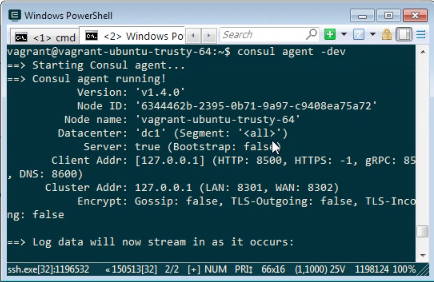
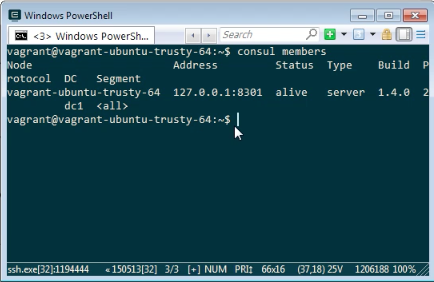
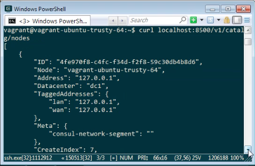
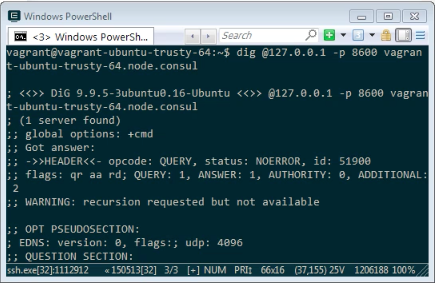

要簡單的將 Consul agent 跑起來玩玩，可以用 development 模式將 Consul agent 跑起來。

consul agent -dev

跑起來後可用 members 指令查閱節點。

consul members

或是用 HTTP API 查閱。

curl /v1/catalog/nodes

抑或是用 DNS 去查詢。

dig @ -p

要停止 Consul agent 的話用熱鍵 Ctrl + C 即可。

Link
----
* [Run the Consul Agent | Consul - HashiCorp Learn](https://learn.hashicorp.com/consul/getting-started/agent)