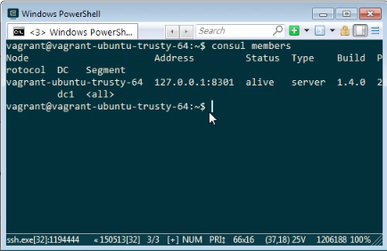

要簡單的將 Consul agent 跑起來玩玩，可以用 development 模式將 Consul agent 跑起來。  

<!-- More -->

    consul agent -dev

 

跑起來後可用 members 指令查閱節點。  

    consul members

 

或是用 HTTP API 查閱。  

    curl <IP>/v1/catalog/nodes

 

抑或是用 DNS 去查詢。  

    dig @<IP> -p <Port> <DNSEntries>

 

要停止 Consul agent 的話用熱鍵 Ctrl + C 即可。  

 

Link
----
* [Run the Consul Agent | Consul - HashiCorp Learn](https://learn.hashicorp.com/consul/getting-started/agent)
