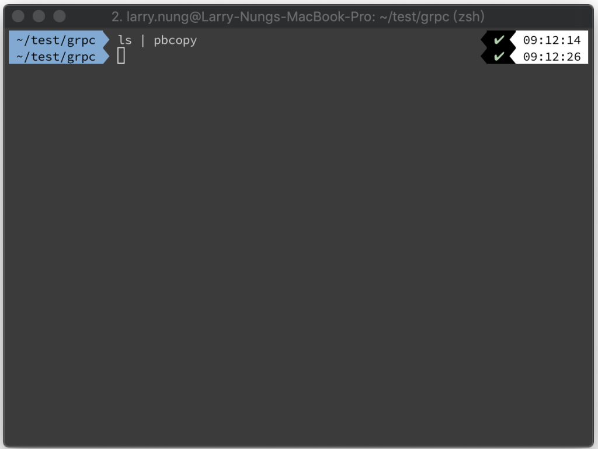
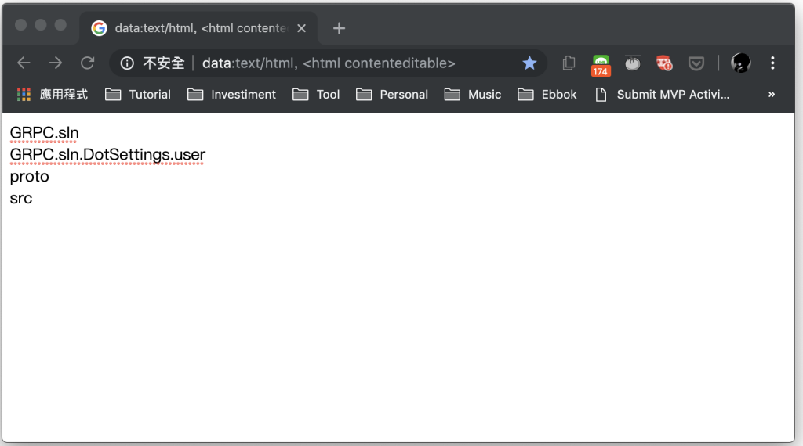
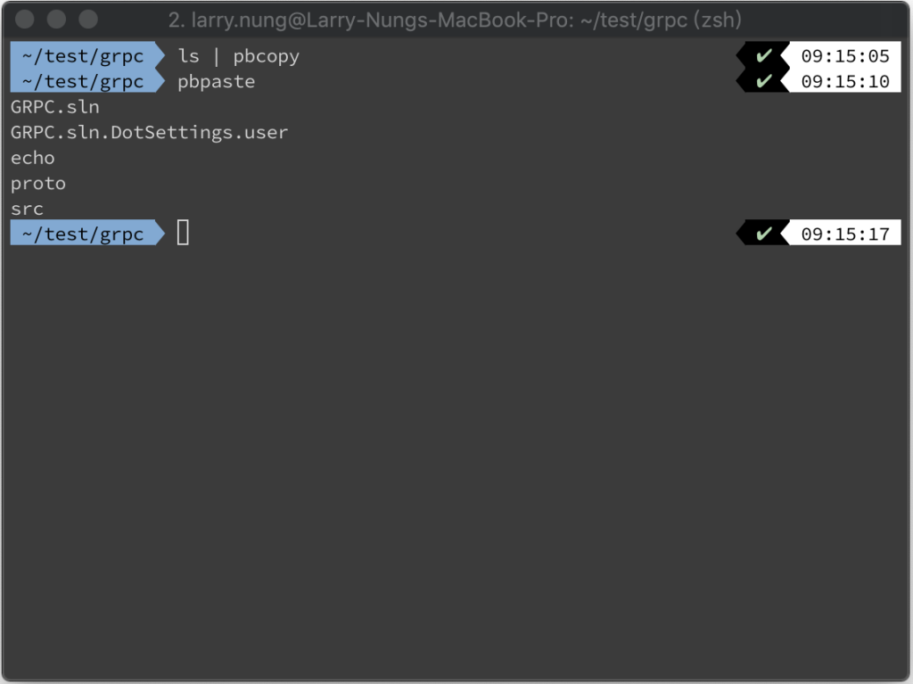

要將終端機命令的輸出送到剪貼簿，我們可以使用 pbcopy 命令。只要在調用命令時用 pipeline 將命令輸出送給 pbcopy 即可。  

<!-- More -->

    ${Command} | pbcopy

 

調用完可找個記事本貼上試試，應該可以看到調用命令後的輸出內容。  

 

也可以透過 pbpaste 命令將剪貼簿的內容貼入終端機內。  

 

Link
----
* [Copy terminal output to clipboard Mac OS X](https://www.garron.me/en/bits/mac-os-x-copy-terminal-output-to-clipboard.html)
