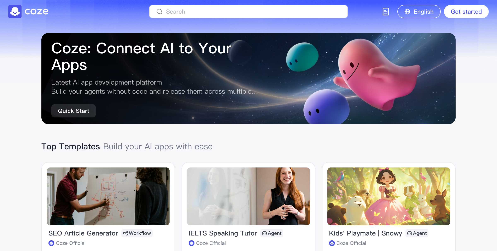
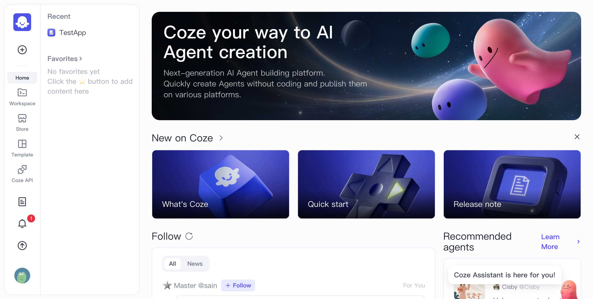
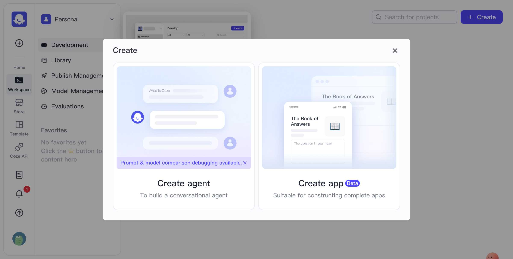
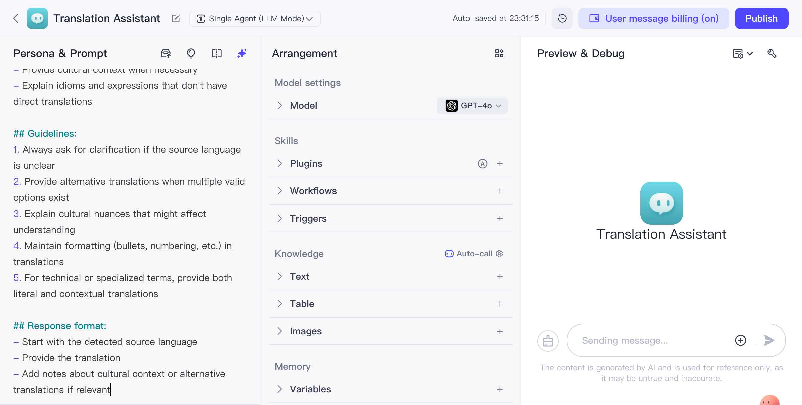
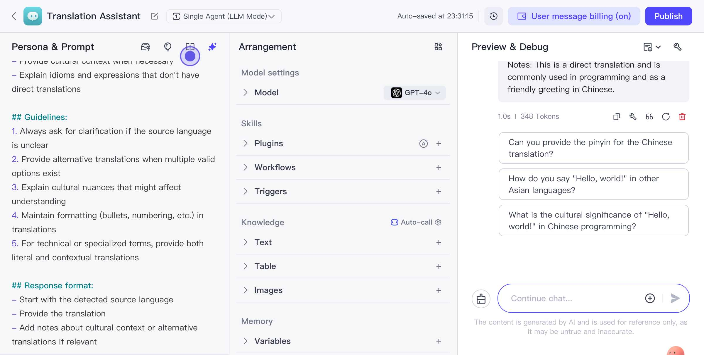

Coze 是一個創新的 AI 應用開發平台，它讓開發者可以輕鬆建立 AI 代理（Agents）並無縫整合到應用中。在這篇帖子中，我們將專注於如何使用 Coze 平台創建一個 Translator Agent，這是平台提供的眾多功能之一。

## 開始使用 Coze
首先，您需要訪問 [Coze 的網站](https://www.coze.com/) 並登錄。首頁展示了許多 Coze 的強大功能，這些功能將在創建代理時提供幫助。

在登入之後，您可以訪問 Coze 的工作區。這裡是管理和創建 Agent 的地方。在導航欄中選擇「Workspace」以查看您的項目及其狀態。從這裡，您可以輕鬆開始創建新的 Agent。

當您準備好開始創建時，點擊右上角的「Create」按鈕。
## 創建 Translator Agent
創建新項目時，選擇「Create Agent」。然後，您需要根據您想要的功能設置代理資訊。這裡，我們將創建一個名為"Translation Assistant"的代理。

### 基本設置
- **名稱**：Translation Assistant
- **功能描述**：可翻譯多種語言、提供文化背景資訊的翻譯助手。
- **支援語言**：英語、中文、日語、韓語、西班牙語、法語和德語。

這些基本設置完成後，點擊「Confirm」來創建您的代理。

## 設定和測試 Prompt
創建成功後，您可以設置代理的 Prompt 來定義其行為模式。例如，指定代理應該如何處理翻譯請求及必要時給予的詳盡說明。

## 測試您的 Agent
完成設置後，最終步驟是對新創建的 Translator Agent 進行測試，確保其有效運作。嘗試用多種語言向其發出請求，檢查翻譯的準確性和完整性。

測試範例：當我們輸入 "Hello, world! Please translate this to Chinese." 時，Agent 會提供：
- **來源語言識別**：English
- **翻譯結果**：你好，世界！
- **補充說明**：This is a direct translation and is commonly used in programming and as a friendly greeting in Chinese.

此外，Agent 還會智能提供相關建議，如詢問是否需要拼音、其他亞洲語言的說法，或是了解「Hello, world!」在中文編程中的文化意義。

## 享受更多功能
Coze 在提供基本創建功能的同時，還提供了豐富的選項來調整和擴展 Agent 的能力，您可以自由探索其插件、工作流以及知識庫來滿足不同使用場景。

歡迎您在這篇博客下留言分享您的創作經驗，看看您的 Translator Agent 如何幫助解決實際的翻譯問題！
