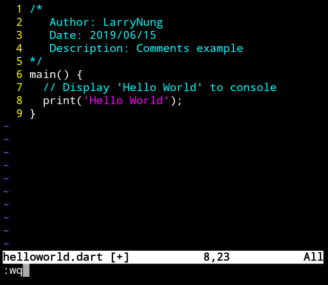

Dart 內的註解分為單行註解與多行註解。  

<!-- More -->

</br>


單行註解用 // 。  

```dart
...
// Display 'Hello World' to console
...
```

</br>


多行註解用 /* */ 。  

```dart
/*
  Author: LarryNung                 
  Date: 2019/06/15
  Description: Comments example
*/
```

</br>


程式撰寫起來會像下面這樣。  

```dart
/*
  Author: LarryNung                   
  Date: 2019/06/15
  Description: Comments example
*/
main() {
  // Display 'Hello World' to console
  print('Hello World');
}
```



</br>


註解不會影響程式的運行。  


