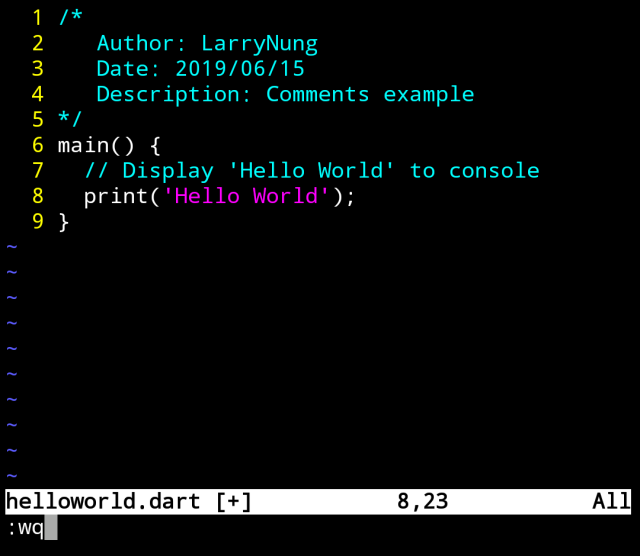

Dart 內的註解分為單行註解與多行註解。

單行註解用 // 。

```dart
...
// Display 'Hello World' to console
...
```

多行註解用 /* */ 。

```dart
/*
Author: LarryNung
Date: 2019/06/15
Description: Comments example
*/
```

程式撰寫起來會像下面這樣。

```dart
/*
Author: LarryNung
Date: 2019/06/15
Description: Comments example
*/
main() {
// Display 'Hello World' to console
print('Hello World');
}
```



註解不會影響程式的運行。

