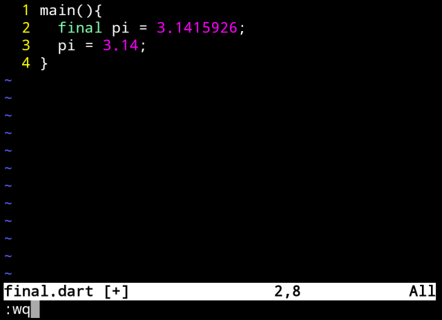
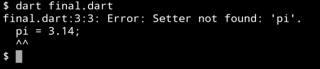
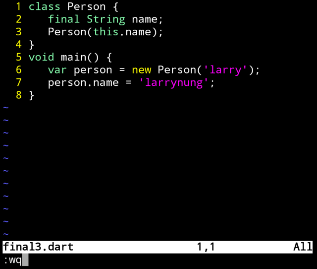
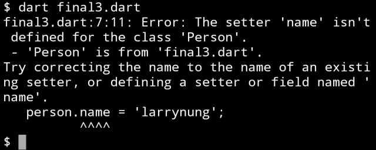

Dart 的 final 關鍵字可用來指定運行時常數，指定其運行時值不允許變更。  

<!-- More -->

</br>


使用時只要在變數宣告前面加上 final 關鍵字即可。  

```dart
final pi = 3.1415926;
```

</br>


像是下面這樣的程式:

```dart
main(){
  final pi = 3.1415926;
  pi = 3.14;
}
```



</br>


運行起來就會發生錯誤，因為透過 final 宣告的是常數，沒有 Setter 可以改變它的值。  



</br>


接著來看複雜一點的例子，物件會透過建構子將值塞給 final 常數，物件初始後會嘗試變更其值。

```dart
class Person {
   final String name;
   Person(this.name);
}
void main() {
   var person = new Person('larry');
   person.name = 'larrynung';
}
```



</br>


運行起來一樣會出錯，因為透過 final 宣告的常數在物件初始化塞完值後就不能再去變更了。  


