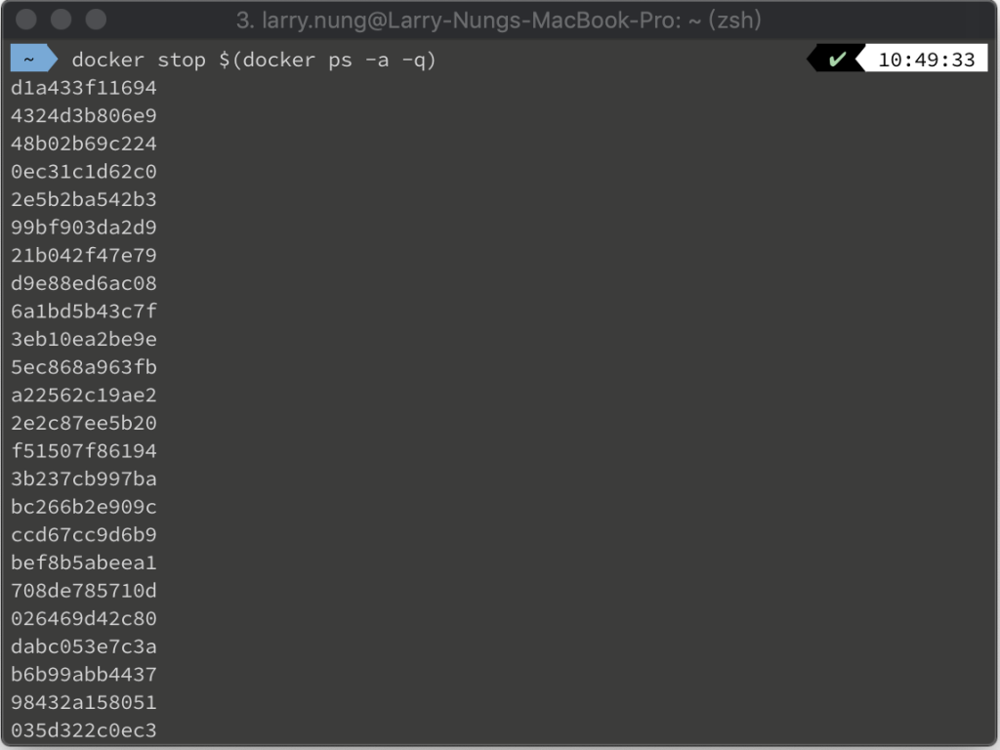
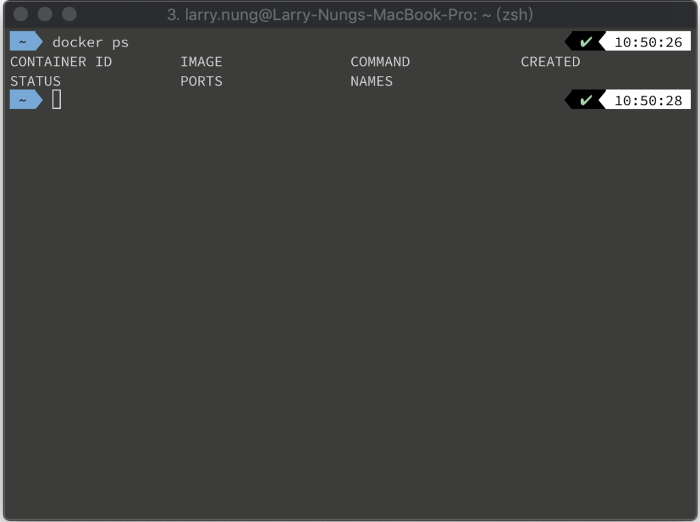
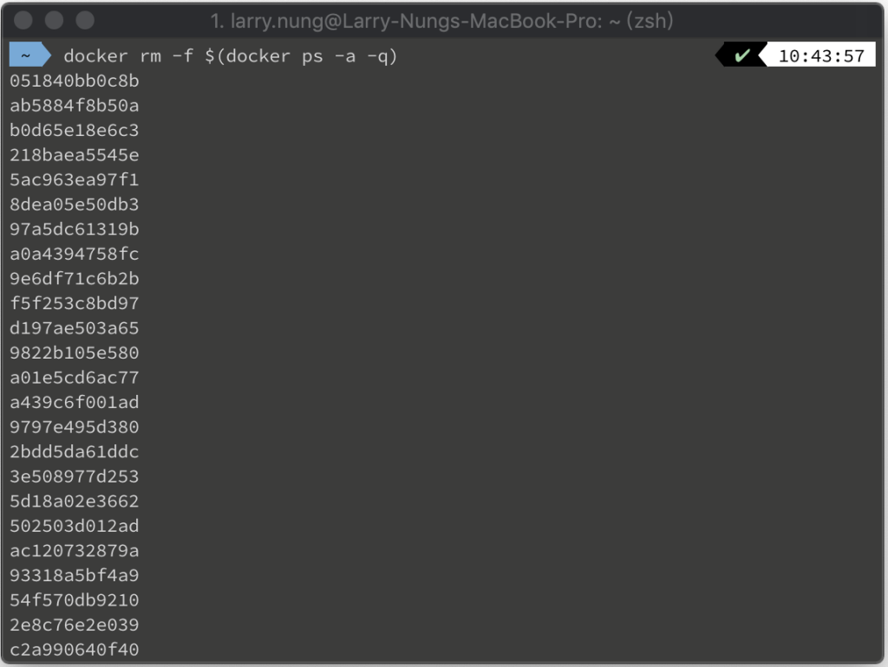
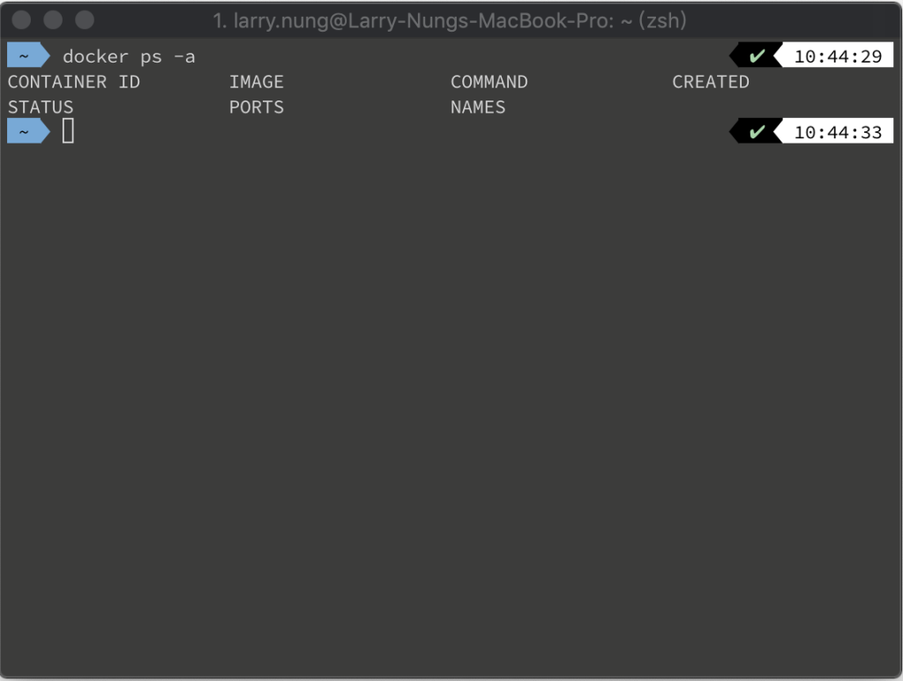

Docker 容器開多了沒關，要一次停掉可以用 docker ps 命令查閱所有容器，將容器資訊帶給 docker stop，一次停掉。

docker stop $(docker ps -a -q)

docker ps

要一次殺掉可以用 docker ps 命令查閱所有容器，將容器資訊帶給 docker rm，一次殺掉。

docker rm -f $(docker ps -a -q)

docker ps -a

Link
=====
* [Stop / remove all Docker containers (Example)](https://coderwall.com/p/ewk0mq/stop-remove-all-docker-containers)