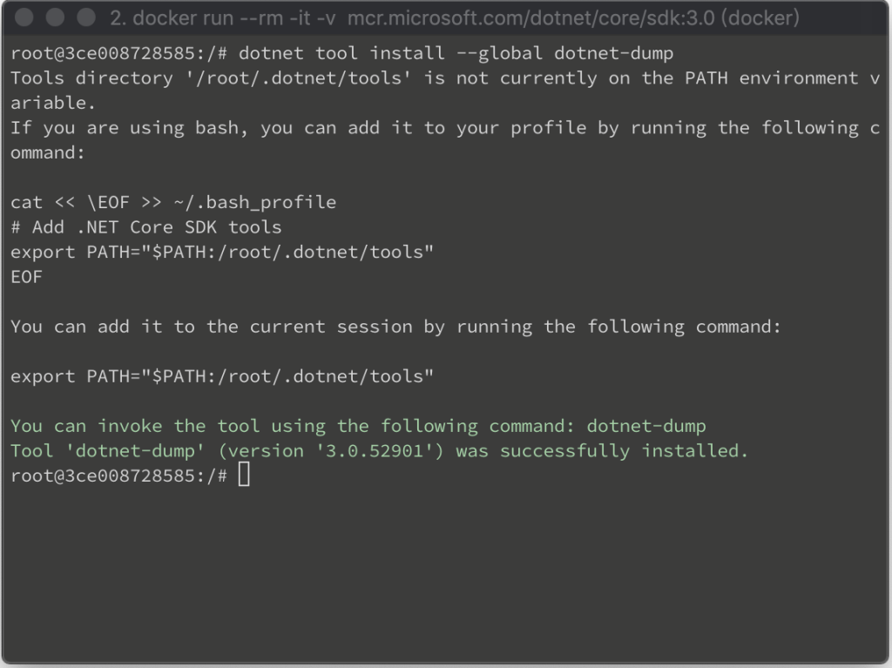
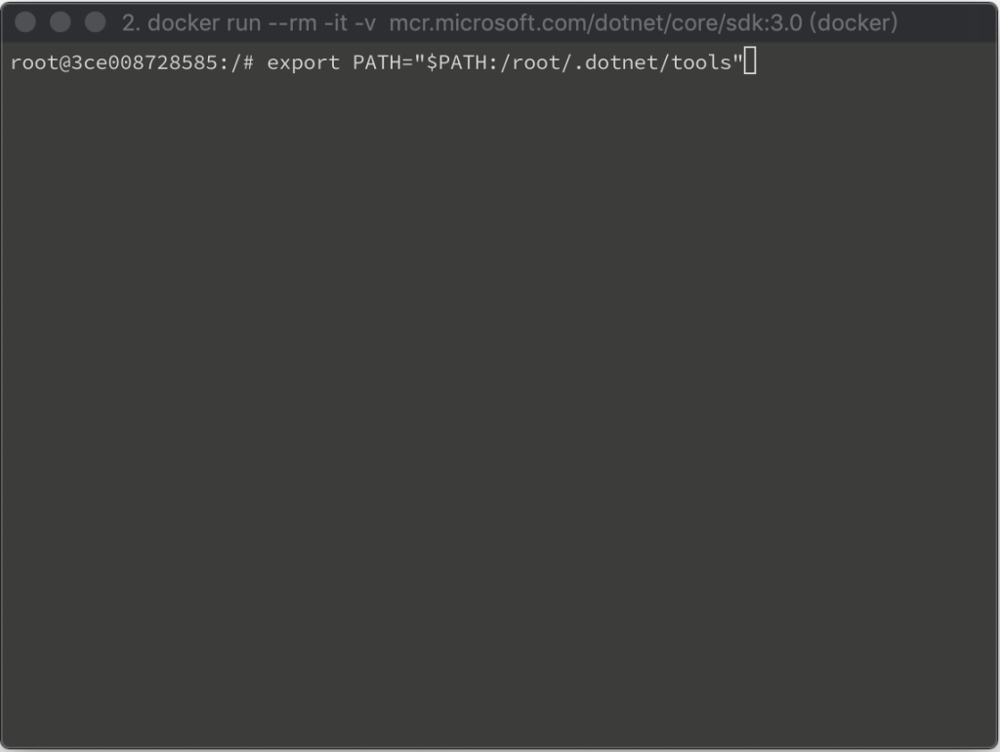
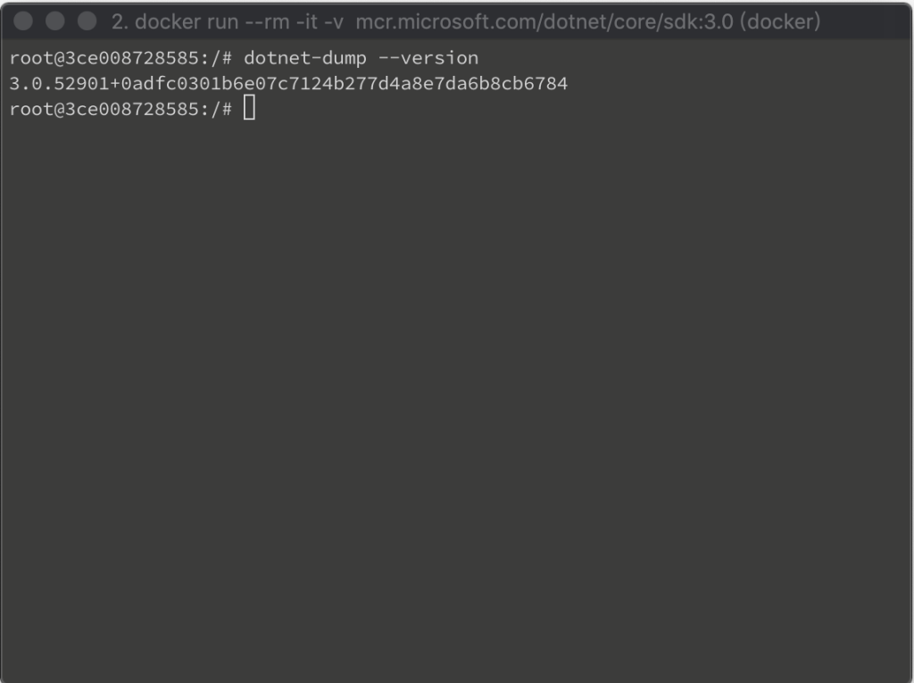

要安裝 dotnet-dump 可使用 dotnet tool install --global 將 dotnet-dump 安裝到全域。  

<!-- More -->

    dotnet tool install --global dotnet-dump

 

安裝完設定路徑。  

    export PATH="$PATH:/root/.dotnet/tools"

 

查驗版本確認安裝無誤即可。  

    dotnet-dump --version

