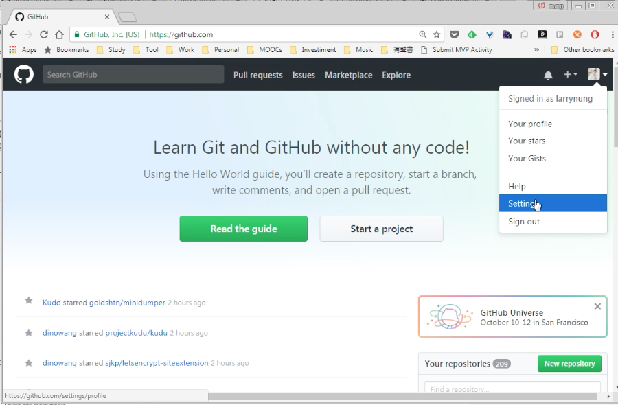
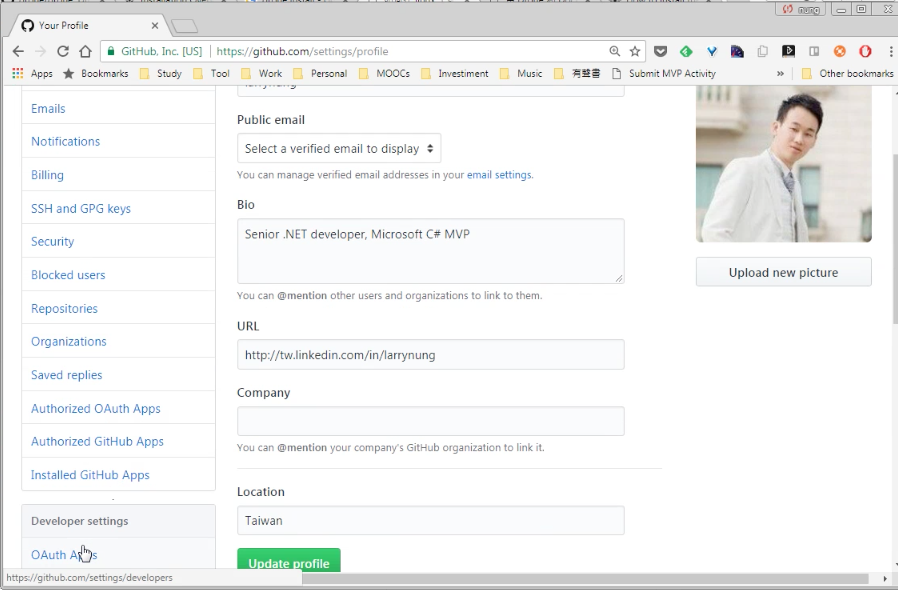
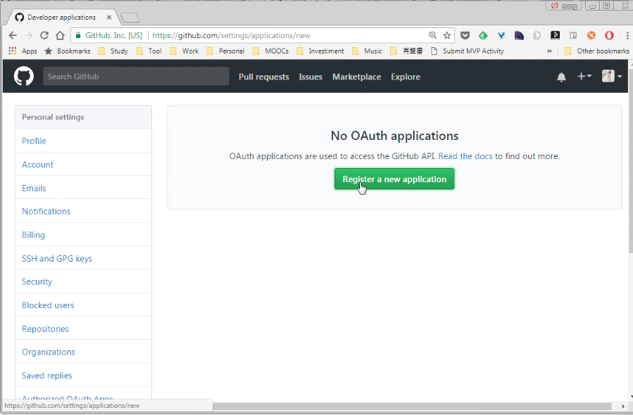
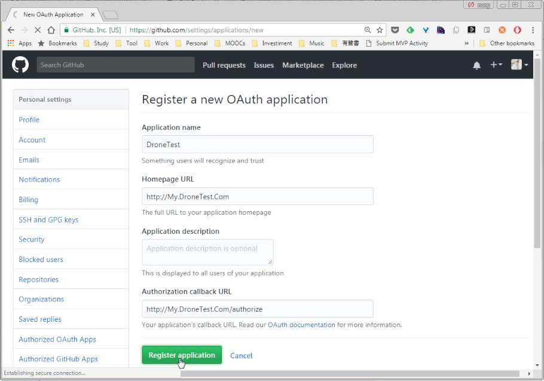
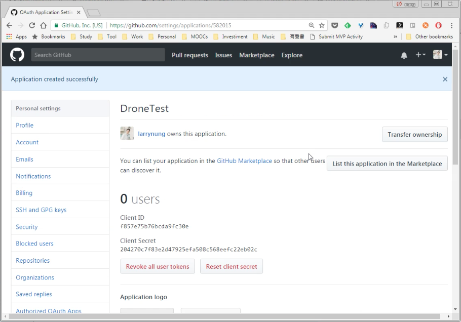
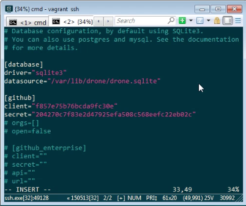
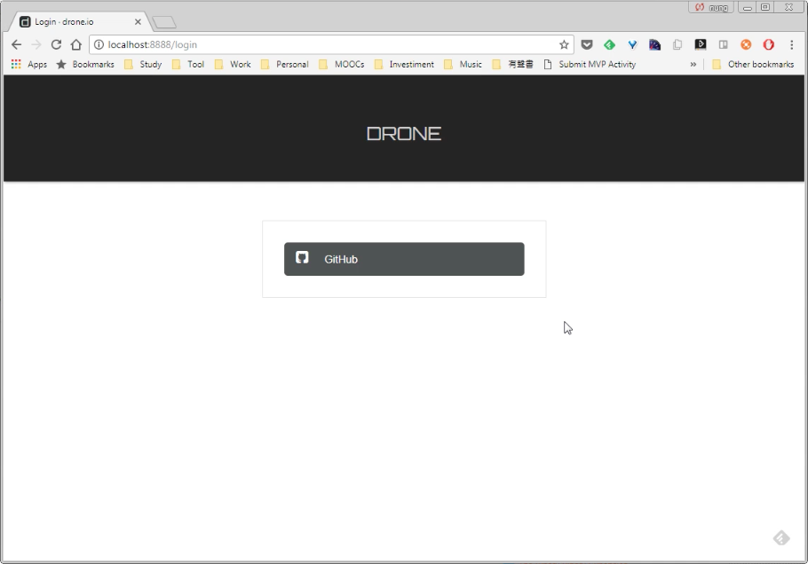

要將 GitHub 與 GitHub 整合，需要先在 GitHub 建立 Application。

切到 GitHub 設定頁面。

切到 [Developer settings | OAuth Apps]。

創建新的 Applcation。

填寫 Application 的名稱、Drone 的位置、Application 的描述、Drone 的認證位置 （http://[DroneUrl]/api/auth/github.com），按下 Register application 按鈕繼續。

指定的 Application 即會建立。

開啟 Drone 的配置文件，設定連接 GitHub Application 需要的 client 與 secret。

vi /etc/drone/drone.toml

重啟 Drone 服務再次瀏覽 Drone 服務頁面即可。

Link
----
* [How to Setup Drone on Ubuntu/Debian - FoxuTech](https://foxutech.com/how-to-setup-drone/)
* [如何在 linux 上配置持續集成服務 - Drone - 壹讀](https://read01.com/4ARPAo.html#.WbB7aNMjHVo)