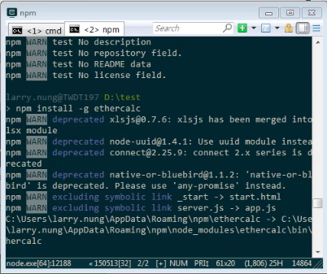
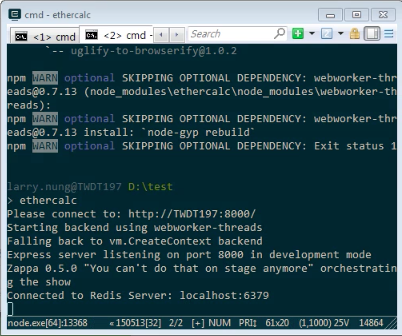
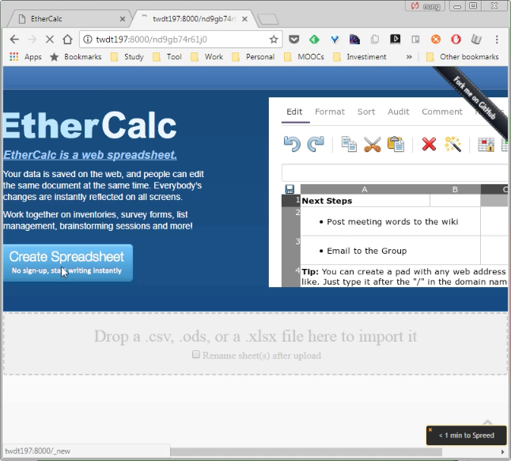
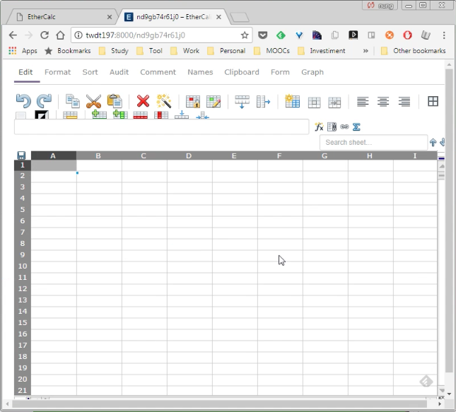

ethercalc 可透過 npm install 進行全域安裝。  

<!-- More -->

    npm install -g ethercalc

 

安裝完後調用 ethercalc 啟動服務。  

    ethercalc

 

瀏覽器開啟服務網址，即可開始使用 EtherCalc。  

 

 

Link
----
* [EtherCalc](https://ethercalc.net/)
