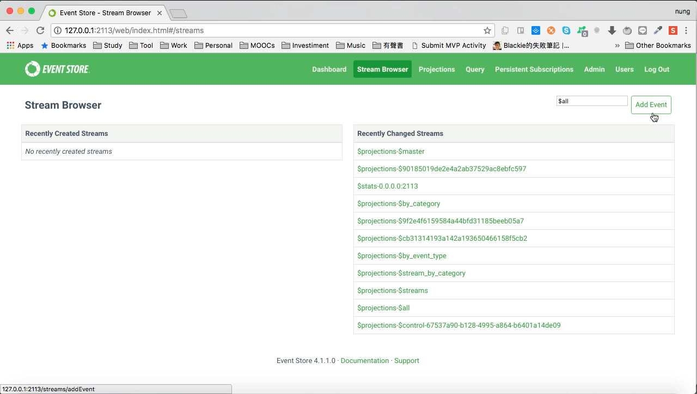

$by_category 是 Event Store 預設提供的 Projection，可以將 Event 依 Stream ID 去拆分成不同 Category 的 Stream。  

<!-- More -->

 

使用前需先將 $by_category projection 開啟。  

 
 

 
 

開啟後切到 Stream Browser 頁面，點選 Add Event 按鈕發送 Event。  

 
 

Event 的 Stream ID 可依 [Category]-[ID] 這樣的格式下去定義。  

 
 

 
 

 
 

這邊可一次發送了多個 Event 做個測試。  

 
 

發送完切回 Stream Browser 頁面，會看到 $by_category projection 會幫我們產生 $ce-[Category] 這樣的 Stream。  

 
 

裡面都是相同 Category 的 Event 。  

 
 

$by_category projection 若有需要也可以做些調動，只要點選 Edit 按鈕。  

 
 

對 Source 部份做些調動，Source 中的 first 是指第一個分隔符號，- 是指用來分隔的符號，這邊可以試著把 first 改為 last。  

 
 

按下 Save 按鈕儲存。  

 
 

$by_category project 就會依最後一個分隔符號下去切割 Category。  

 
 

 
 

Link
