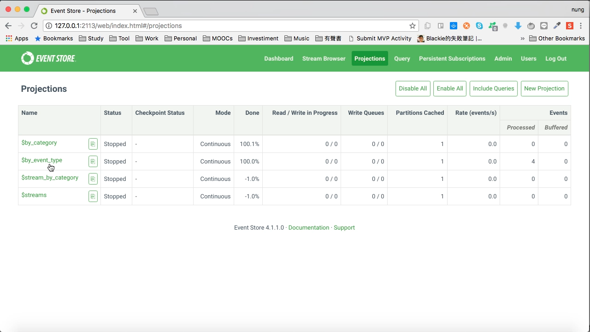
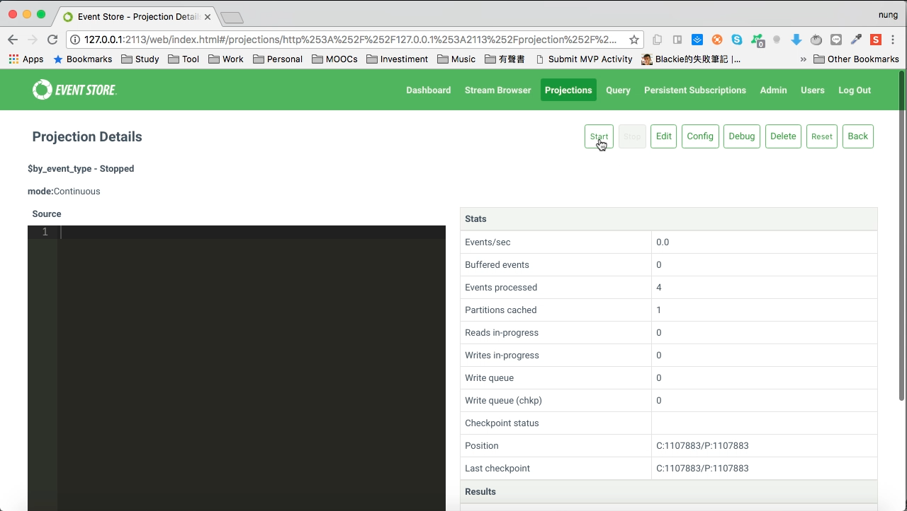
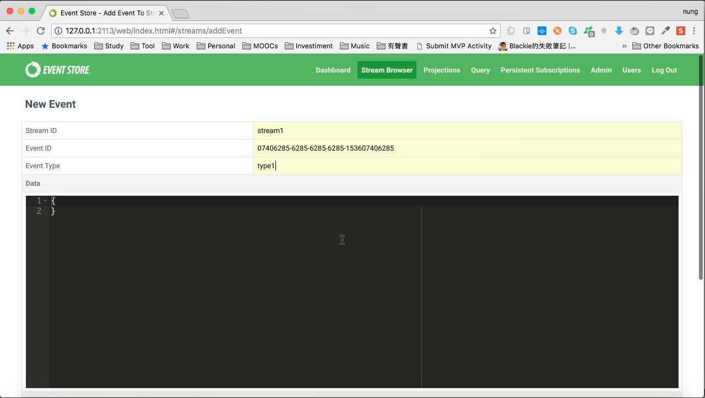
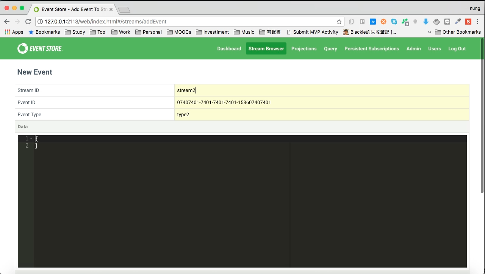
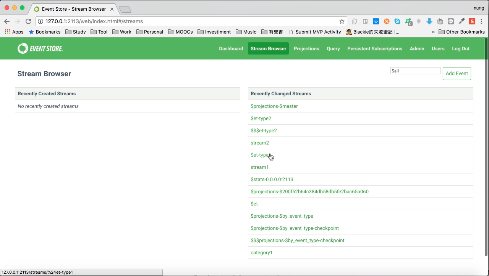
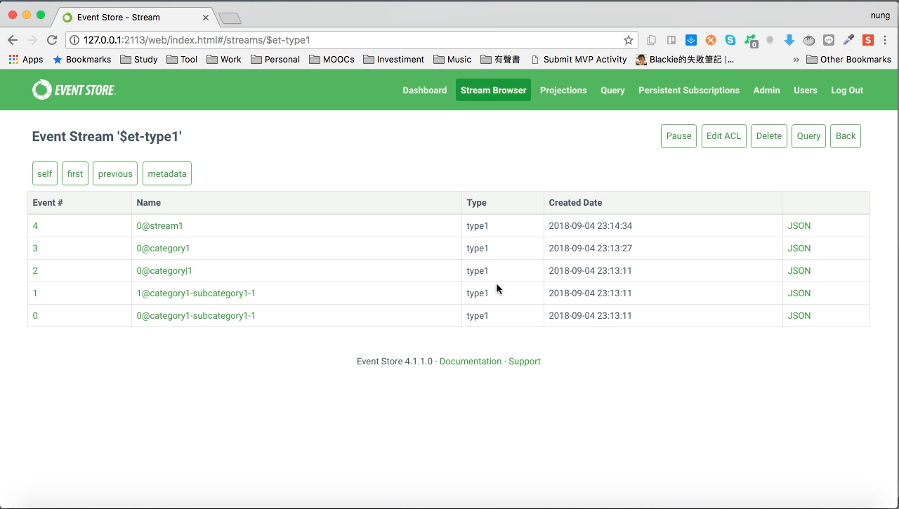

$by_event_type 是 Event Store 預設提供的 Projection，可以將 Event 依 Event Type 拆分成到對應的 Stream。

<!-- More -->

 

使用前需先將 $by_event_type projection 開啟。  

 
 

 
 

開啟後切到 Stream Browser 頁面，點選 Add Event 按鈕發送 Event。  

 
 

這邊可一次發送了多個 Event 做個測試。  

 
 

發送完切回 Stream Browser 頁面，會看到 $by_event_type projection 會幫我們產生 $et-[EventType] 這樣的 Stream。  

 
 

 
 

Link
