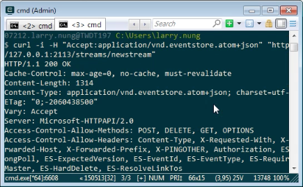
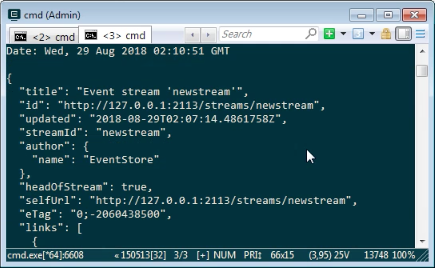

要透過 HTTP API 去讀取 Stream 下的所有 Event，可以像下面這樣向 Event Store 查詢。  

<!-- More -->

    http://<URL>/streams/<STREAM_ID> 

 

Accept 可以指定回傳的格式是 JSON。  

    application/vnd.eventstore.atom+json

 

或是 XML。  

    application/atom+xml

 

像是如果要讀取 newstream Stream 下的所有 Event，就可以像下面這樣透過 CURL 發送請求給 Event Store。  

    curl -i -H "Accept:application/vnd.eventstore.atom+json" "http://127.0.0.1:2113/streams/newstream"

 
 

 
 

Link
----
* [Step 2 - Read events from a stream and subscribe to changes | Event Store](https://eventstore.org/docs/getting-started/reading-subscribing-events/index.html?tabs=tabid-6%2Ctabid-8%2Ctabid-create-sub-http)
