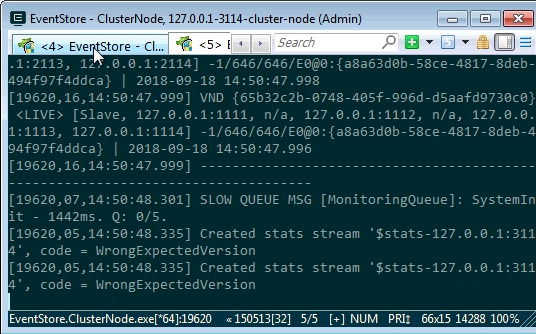
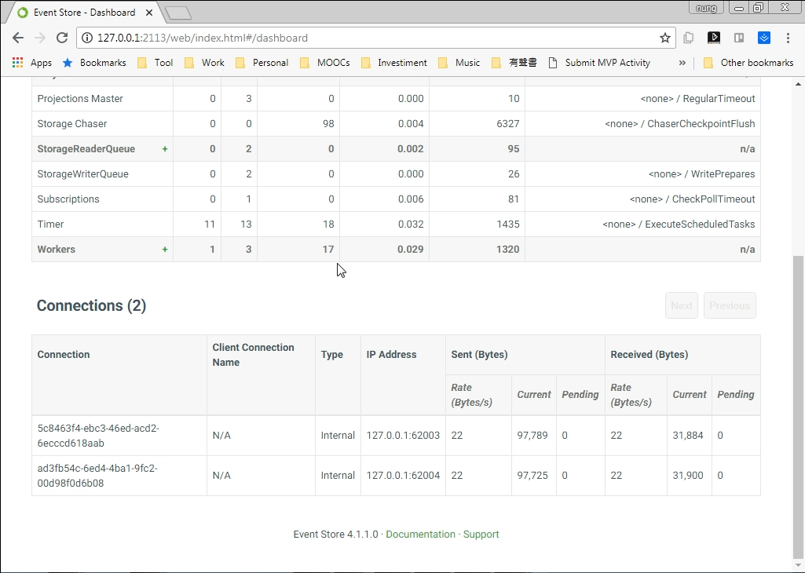
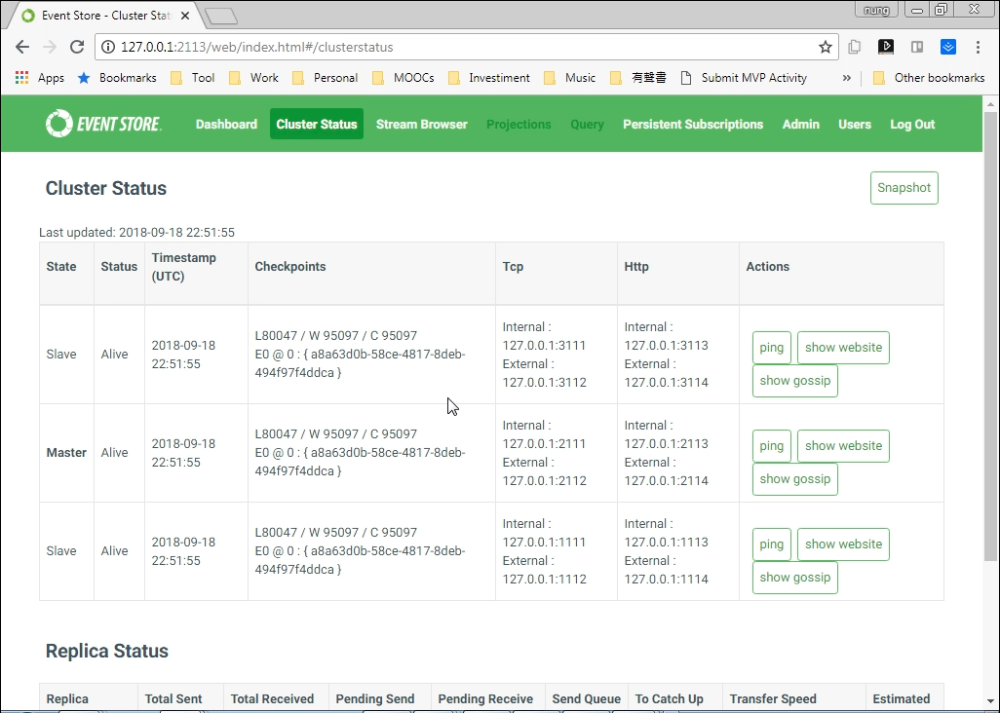
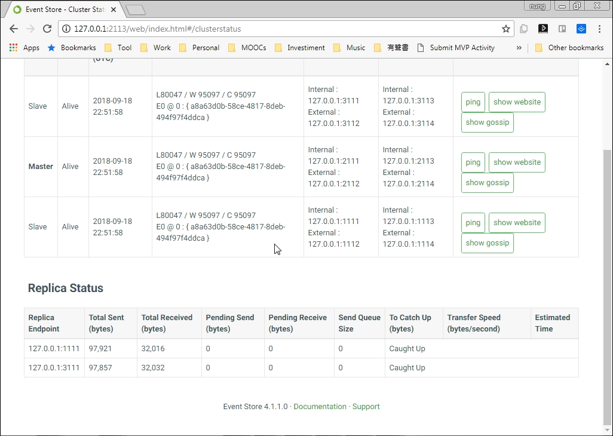
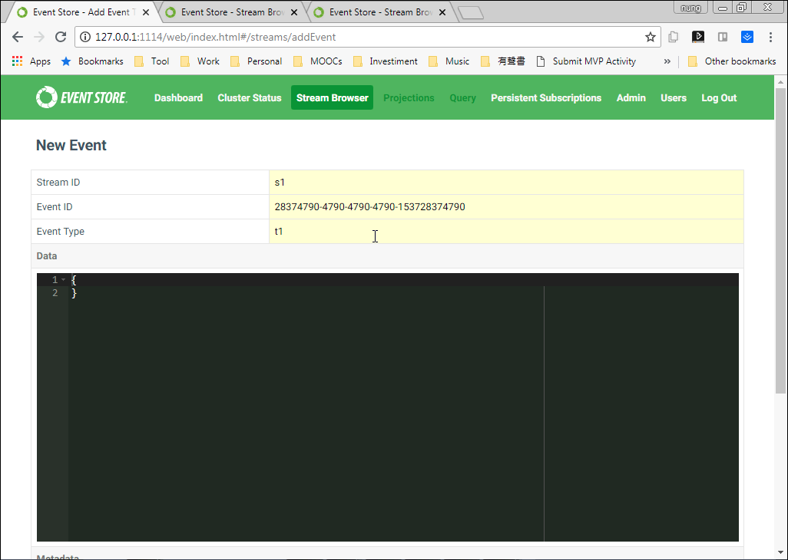
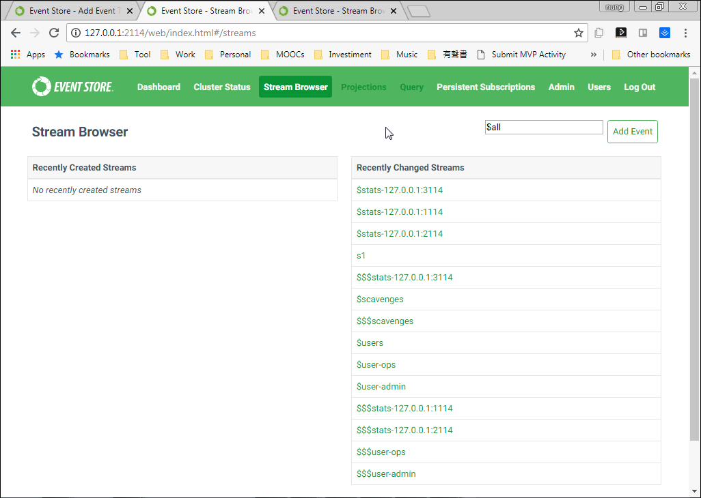
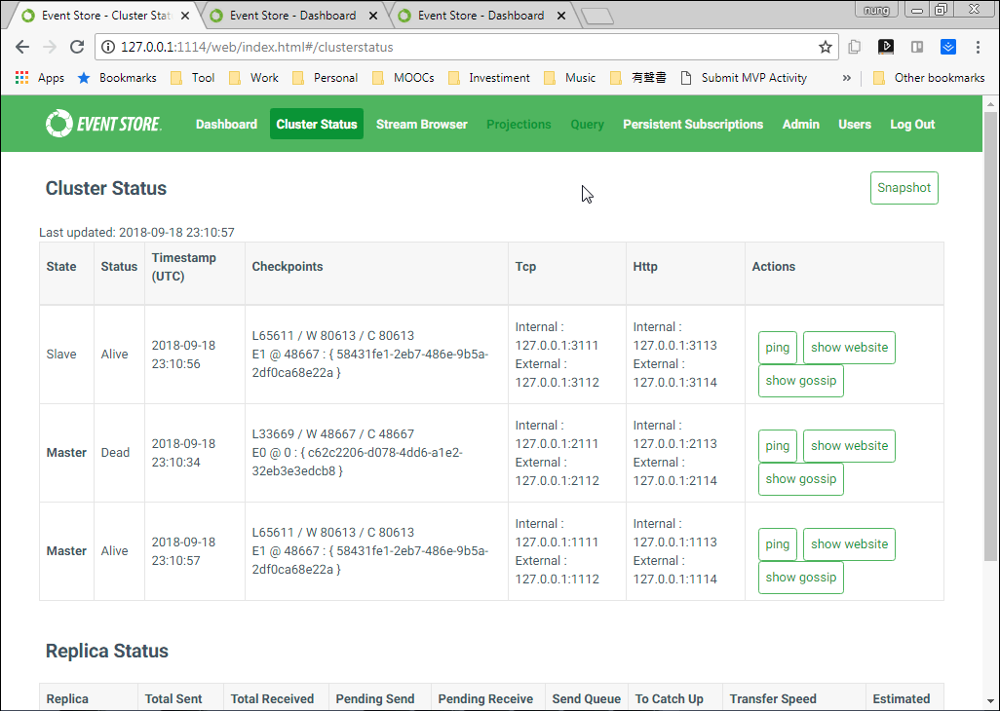

要啟用 Event Store 的 Cluster 功能，可以開啟 Event Store，設定 IP、Port、與 gossip-seed。  

<!-- More -->

<br/>


像是下面這邊就在本機起了三個 Event Store 服務，服務的 Log、IP、Post 都錯開，並互設 gossip-seed。    

```batch
start EventStore.ClusterNode.exe --mem-db --log .\logs\log1 --int-ip 127.0.0.1 --ext-ip 127.0.0.1 --int-tcp-port=1111 --ext-tcp-port=1112 --int-http-port=1113 --ext-http-port=1114 --cluster-size=3 --discover-via-dns=false --gossip-seed=127.0.0.1:2113,127.0.0.1:3113
start EventStore.ClusterNode.exe --mem-db --log .\logs\log2 --int-ip 127.0.0.1 --ext-ip 127.0.0.1 --int-tcp-port=2111 --ext-tcp-port=2112 --int-http-port=2113 --ext-http-port=2114 --cluster-size=3 --discover-via-dns=false --gossip-seed=127.0.0.1:1113,127.0.0.1:3113
start EventStore.ClusterNode.exe --mem-db --log .\logs\log3 --int-ip 127.0.0.1 --ext-ip 127.0.0.1 --int-tcp-port=3111 --ext-tcp-port=3112 --int-http-port=3113 --ext-http-port=3114 --cluster-size=3 --discover-via-dns=false --gossip-seed=127.0.0.1:1113,127.0.0.1:2113
```


 
<br/>


服務啟用後，因為 Cluster 會互相抄寫，所以可在 Web interface 的 Dashboard 頁面下面看到來自其它 Event Store 服務的連線。  


 
<br/>


Web interface 也多了個 Cluster status 頁面，可查閱 Cluster 的狀態。  


 
<br/>


與 Replica 狀態。  


 
<br/>


這邊發送個訊息實際做個測試。  


 
<br/>


可以看到其它 Event Store 服務也有收到對應的訊息。  


 
<br/>


將主要的 Event Store 服務關掉，也可以看到其它 Event Store 服務會接手處理。  


 
<br/>


Link
----
* [Setting up a Cluster using only Database Nodes (OSS) | Event Store](https://eventstore.org/docs/server/cluster-without-manager-nodes/index.html)
