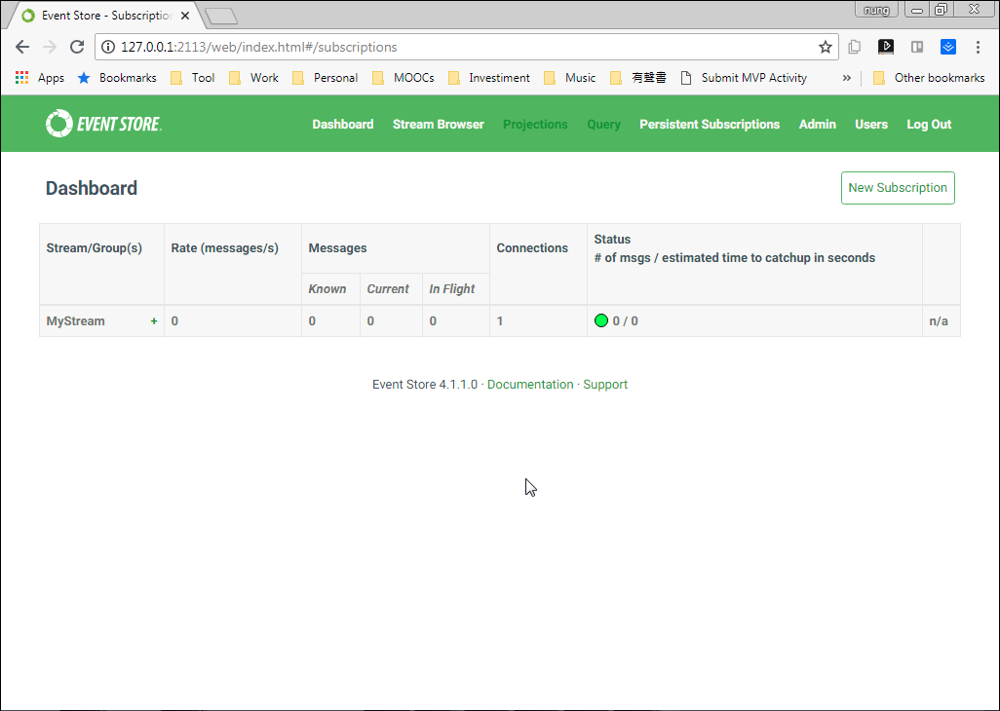

要使用 Event Store .NET API 訂閱並監聽 Stream 的變化，可以使用 PersistentSubscriptionSettings.Create 設定訂閱，然後調用 Connection.CreatePersistentSubscriptionAsync 方法建立 Persistent Subscriptions。   

<!-- More -->

```C#
...
var settings = PersistentSubscriptionSettings.Create()
    .DoNotResolveLinkTos()
    .StartFromCurrent();
...
conn.CreatePersistentSubscriptionAsync(streamName, groupName, settings, credentials).Wait();
...
```

<br/>


建立後可在 Web interface 看到對應的 Persistent Subscriptions。  


 
<br/>


接著透過 Connection.ConnectToPersistentSubscription 訂閱 Persistent Subscriptions，指定 Stream 的名稱、Group 的名稱、收到訂閱要做的處理...等即可。  

```C#
conn.ConnectToPersistentSubscription(streamName, groupName, (_, x) =>
{
    ...
}, (sub, reason, ex) => { }, credentials);
...
```

<br/>


像是下面這邊筆者建立了一個名為 MyGroup 的訂閱，訂閱的來源來自 MyStream，建立訂閱後連結訂閱，然後將收到的訂閱訊息顯示出來。  

```C#
using EventStore.ClientAPI;
using EventStore.ClientAPI.SystemData;
...
using (var conn = EventStoreConnection.Create(connectionString, connectionName))
{
    conn.ConnectAsync().Wait();

    var streamName = "MyStream";
    var settings = PersistentSubscriptionSettings.Create()
        .DoNotResolveLinkTos()
        .StartFromCurrent();

    var credentials = new UserCredentials("admin", "changeit");
    
    conn.CreatePersistentSubscriptionAsync(streamName, "MyGroup", settings, credentials).Wait();

    conn.ConnectToPersistentSubscription(streamName, "MyGroup", (_, x) =>
    {
        var data = Encoding.ASCII.GetString(x.Event.Data);
        Console.WriteLine("Received: " + x.Event.EventStreamId + ":" + x.Event.EventNumber);
        Console.WriteLine(data);
    }, (sub, reason, ex) => { }, credentials);

    Console.WriteLine("waiting for events. press enter to exit");
    Console.ReadLine();
}
```


 
<br/>


這邊可以將程式運行起來。  


 
<br/>


透過 Web interface 發送 Event。   


 
<br/>


就會看到程式這邊收到並顯示了訂閱的訊息。  


 
<br/>


Link
----
* [Step 2 - Read events from a stream and subscribe to changes | Event Store](https://eventstore.org/docs/getting-started/reading-subscribing-events/index.html?tabs=tabid-6%2Ctabid-dotnet-client%2Ctabid-8%2Ctabid-dotnet-read-event%2Ctabid-create-sub-dotnet)
