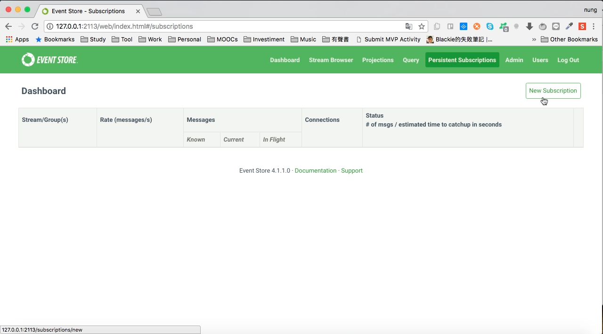
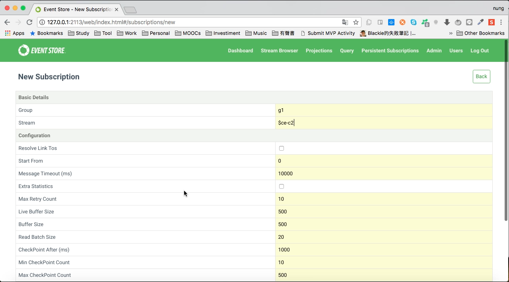
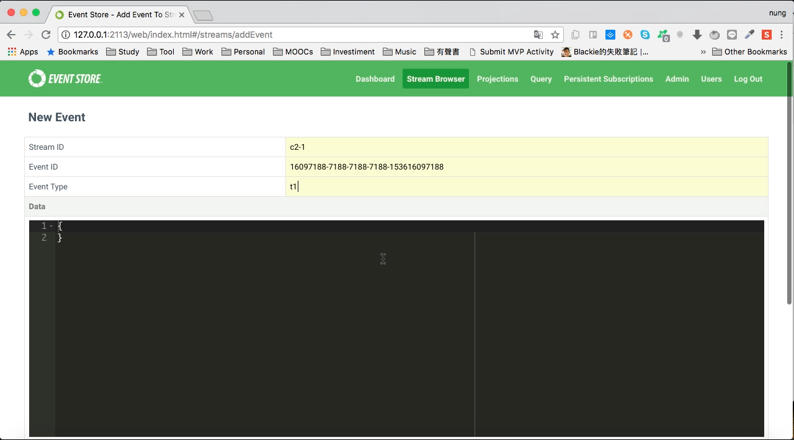
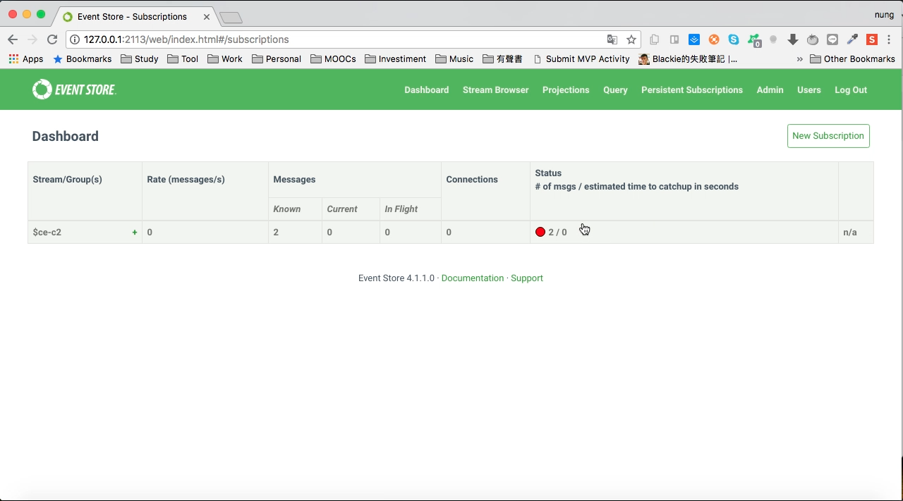

要透過 Web interface 去訂閱事件，可切換至 Persistent Subscriptions 頁面，點選 New Subscription 按鈕。  

<!-- More -->

 
 

填寫 Group、 Stream...等資訊建立 Subscription。  

 
 

切回到 Stream Browser 頁面發送 Event， Stream ID 需符合 Subscription 的 Stream	。  

 
 

再回到 Persistent Subscriptions 頁面，可從 Subscription 的狀態因收到了 Event 而有所變動。  

 
 

Link
----
* [Step 2 - Read events from a stream and subscribe to changes | Event Store](https://eventstore.org/docs/getting-started/reading-subscribing-events/index.html?tabs=tabid-6%2Ctabid-8%2Ctabid-create-sub-http)
