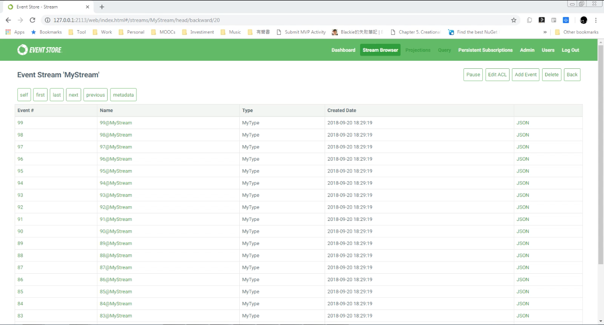
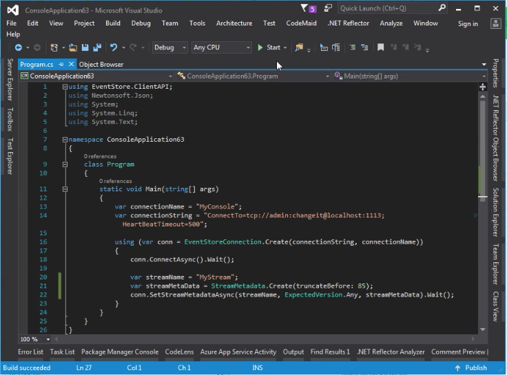
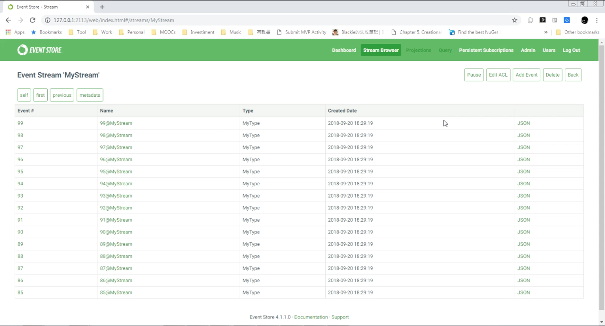

要使用 Event Store 的 Truncate before 刪除指定 Event 編號以前的 Event，可以設定 StreamMetadata。  

<!-- More -->

<bt/>


透過 StreamMetadata 的 truncateBefore 指定編號多少以前的 Event 要被刪除，然後透過 Connection.SetStreamMetadataAsync，帶入 Stream 的名稱、ExpectedVersion、以及剛設定好的 StreamMetadata。  

```C#
...
var streamMetaData = StreamMetadata.Create(truncateBefore: eventID);
    
conn.SetStreamMetadataAsync(streamName, ExpectedVersion.StreamExists, streamMetaData).Wait();
```

<br/>


像是筆者這邊準備了一個內含 100 筆 Event 的 Stream。  


 
<br/>


設定 Stream 的 truncateBefore metadata 為 85。  

```C#
using EventStore.ClientAPI;
...
using (var conn = EventStoreConnection.Create(connectionString, connectionName))
{
    conn.ConnectAsync().Wait();

    var streamName = "MyStream";
    var streamMetaData = StreamMetadata.Create(truncateBefore: 85);

    conn.SetStreamMetadataAsync(streamName, ExpectedVersion.StreamExists, streamMetaData).Wait();
}
```


 
<br/>


運行後重整， Number 85 以下的 Event 就會被刪除。  


 
<br/>


Link
----
* [Deleting streams and events | Event Store](https://eventstore.org/docs/server/deleting-streams-and-events/index.html)
