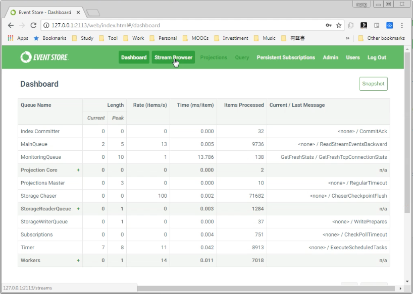
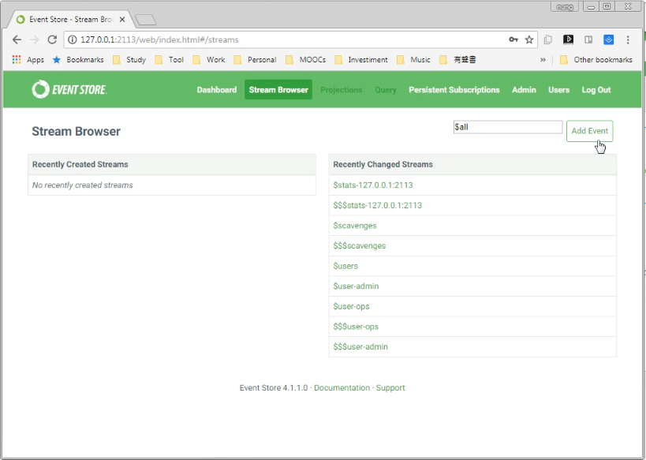
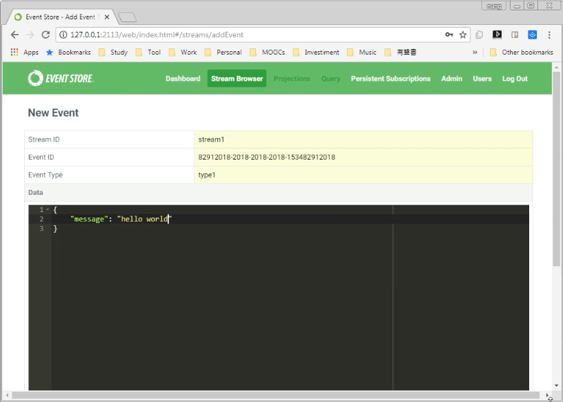
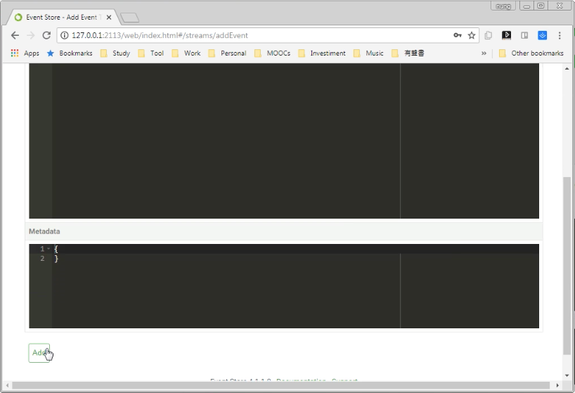
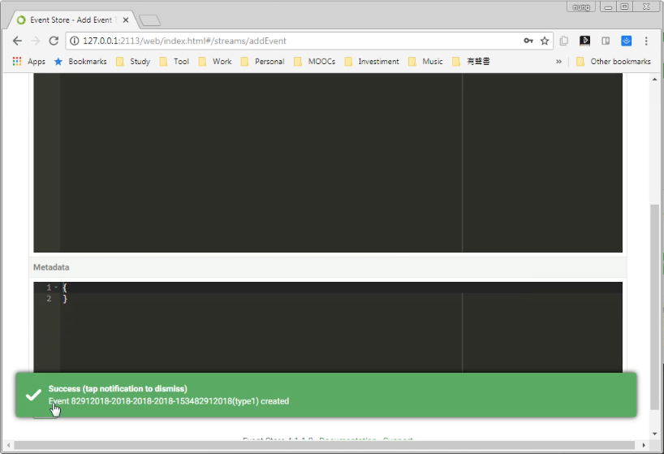
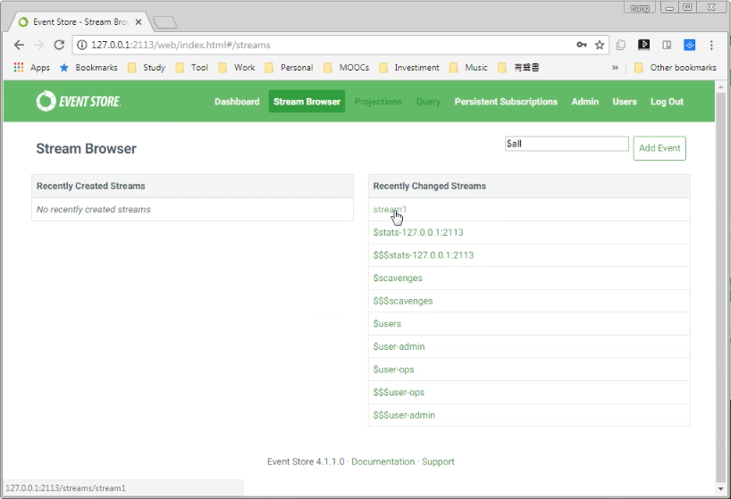
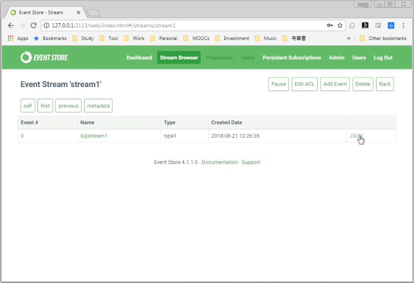
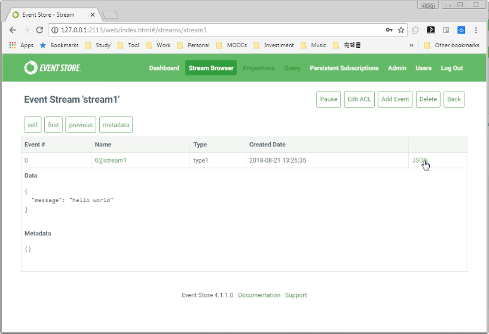
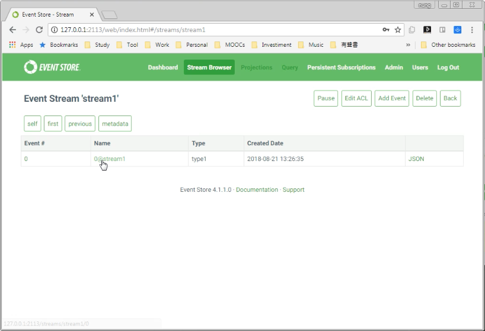
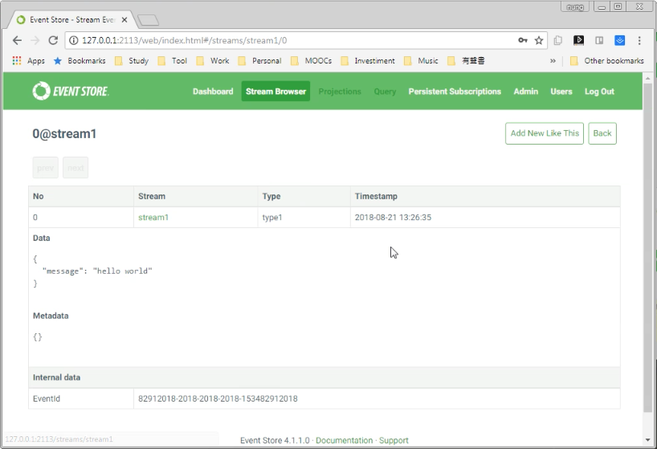

要透過 Web interface 去發送 event，可以將 Web interface 切換至 Stream Browser 頁面。

點擊 Add Event 按鈕。

填入要發送的 Event 資訊。

按下 Add 按鈕發送設定的 Event。

發送完回到 Stream Broser 頁面，可以看到剛剛所發送的 Event，點選即可查閱。

要查閱更為細部的資訊可點選 Event 後方的 JSON 字樣。

即可看到更為細部的資訊。

也可以透過點選 Event name 字樣。

一樣可看到更為細部的資訊。

