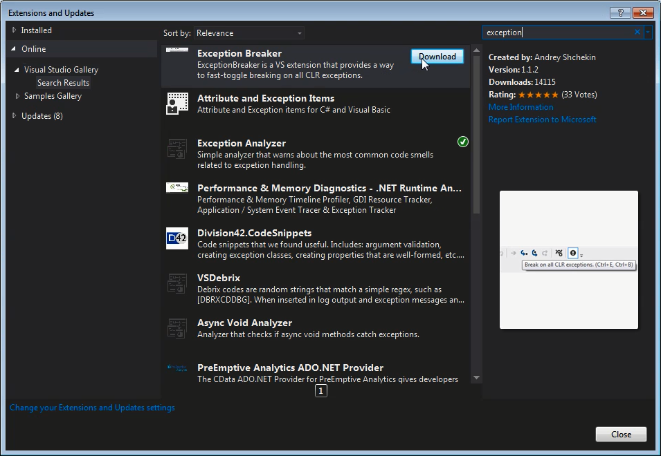
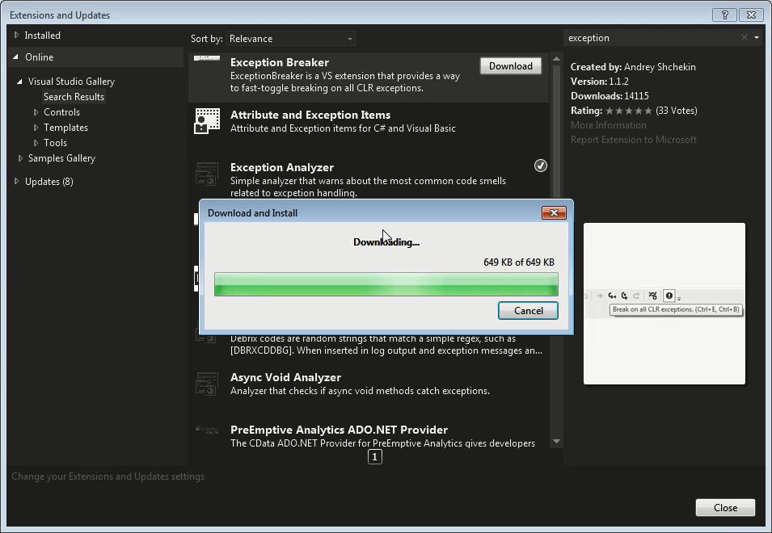
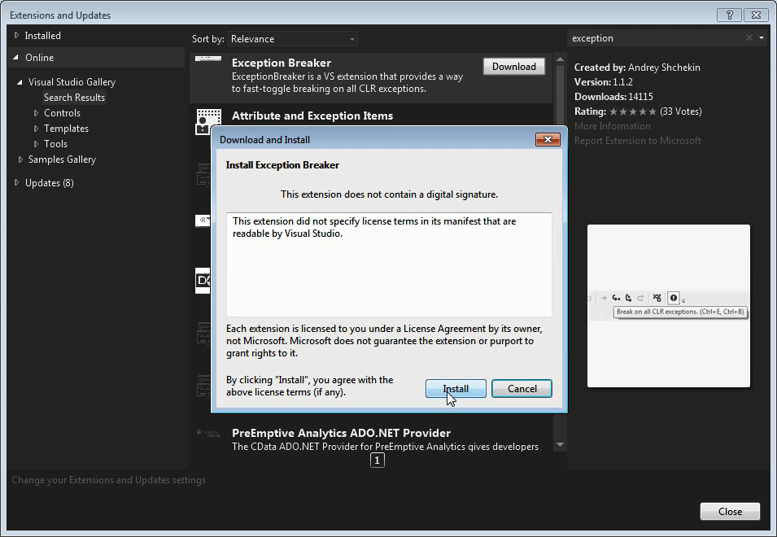
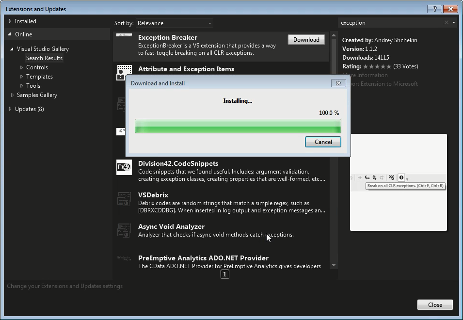
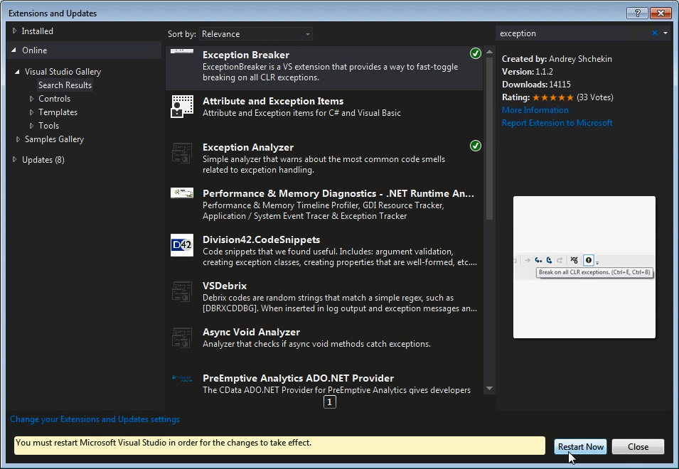
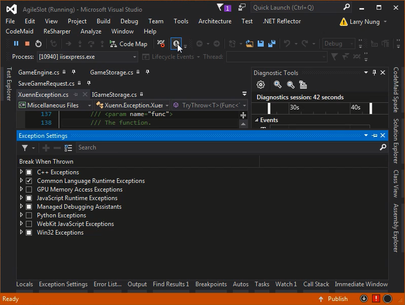
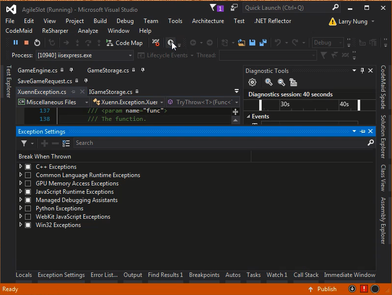

Exception Breaker 是 Visual Studio 的套件，能更方便快速的切換 CLR Exception 是否要中斷。  

<!-- More -->

 

在開發時為了補獲 First chance exception 並中斷，時常要對 CLR Exception 的 Exception Setting 設定做切換，每次都要開啟 Exception Setting 去切換/還原設定十分的麻煩。該套件提供了工具列按鈕與熱鍵，讓切換上更為方便快速。  

 

該套件可透過 Extension Manager 安裝。  

 

 

 

 

套件安裝完需要重啟 Visual Studio。  

 

Visual Studio 重啟後進入除錯模式，即可看到 Exception Breaker 套件的按鈕，按下工具列按鈕或是熱鍵 Ctrl + E, Ctrl + B 即可進行 CLR Exception 中斷設定的切換。  

 

 

Link
----
* [Exception Breaker - Visual Studio Marketplace](https://marketplace.visualstudio.com/items?itemName=AndreyShchekin.ExceptionBreaker)
