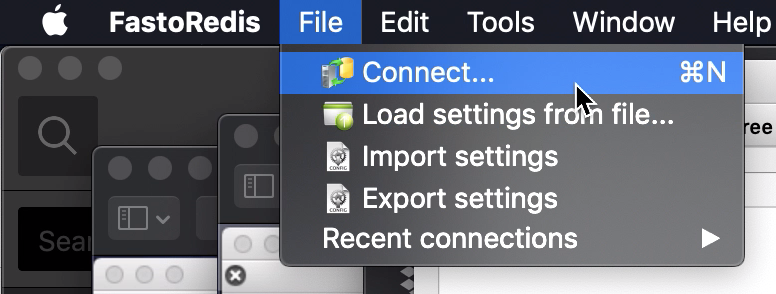
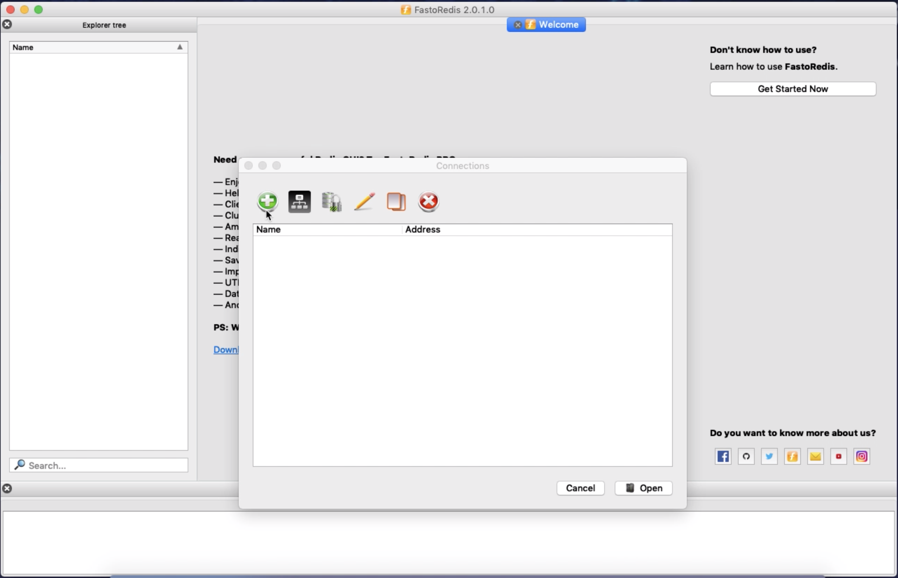
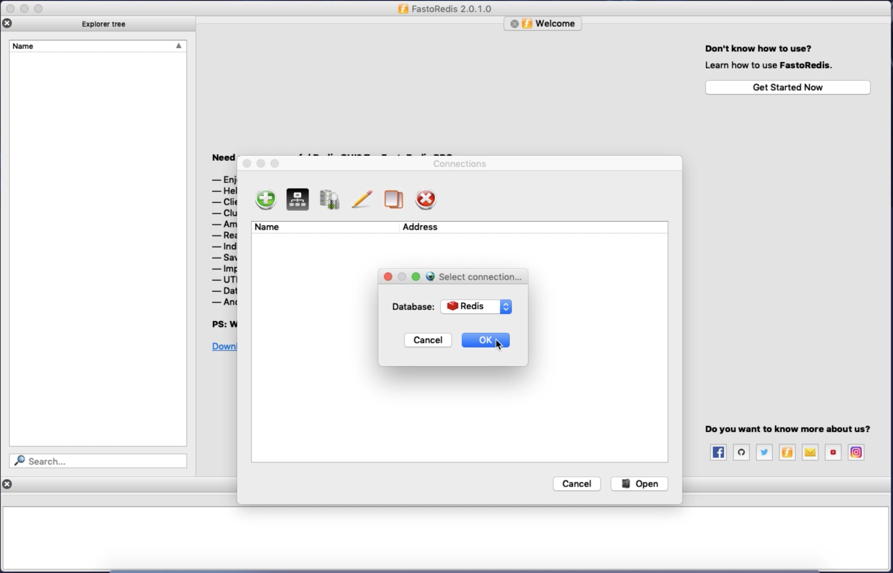
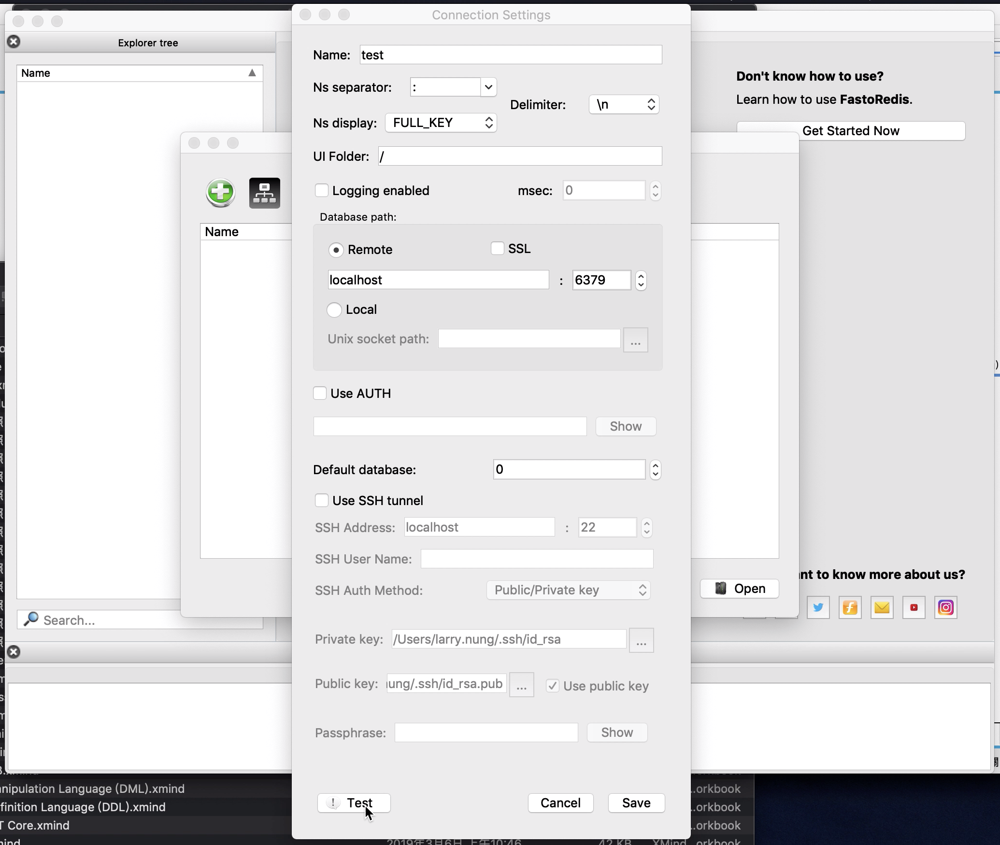
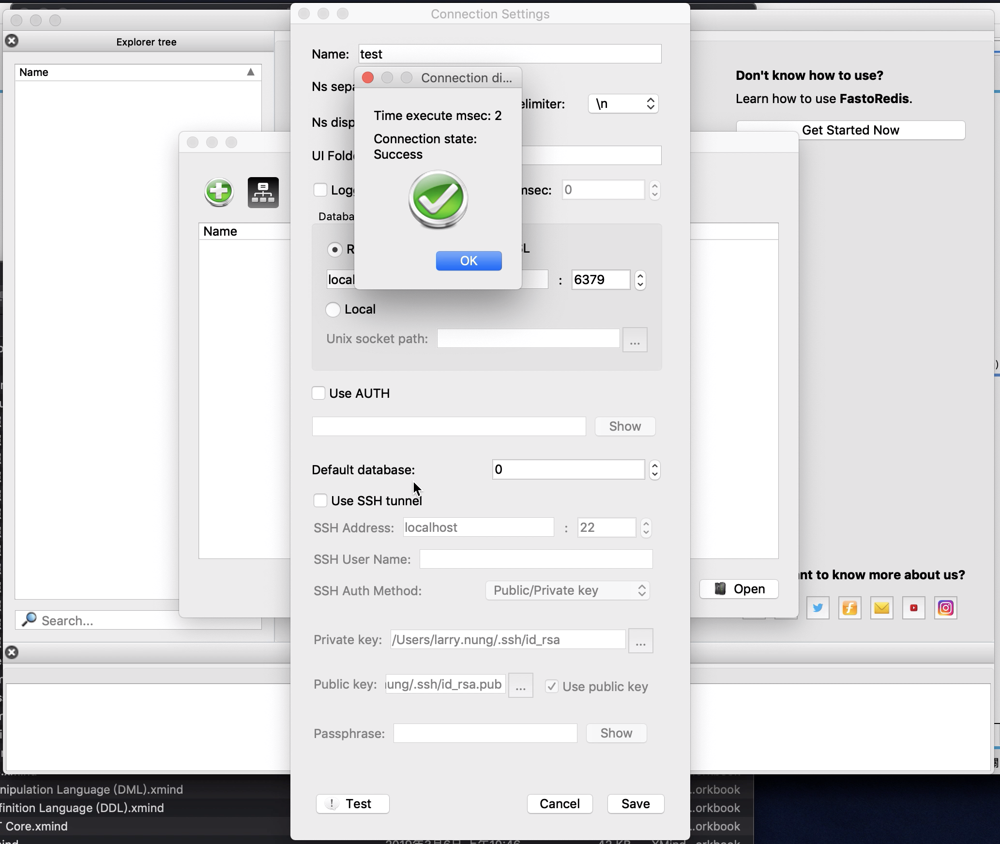
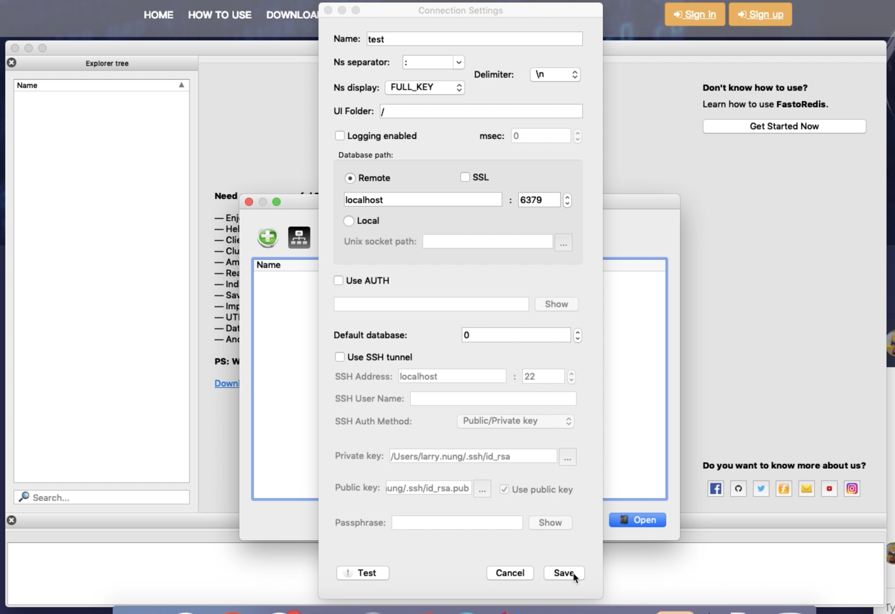
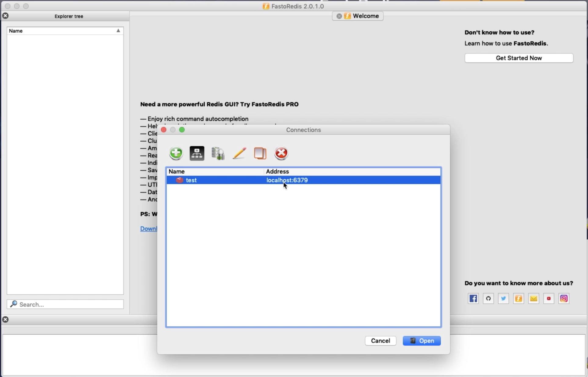
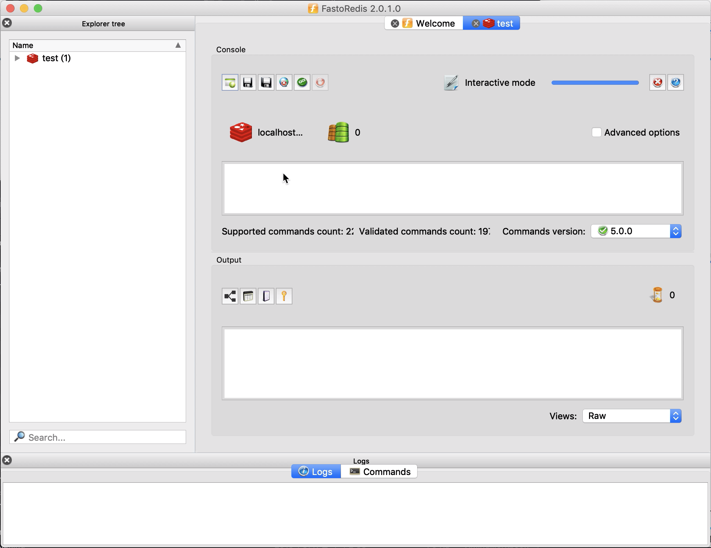

要透過 FastoRedis 連線到 Redis，可點選 [File | Connect...] 主選單選項。  

<!-- More -->

 

在 Connections 視窗中點選 + 按鈕。  

 

在 Select connection... 視窗中確認 Database 為 Redis 後按下 OK 按鈕。  

 

在 Connection Settings 視窗中設定連線名稱、IP、Port，按下 Test 按鈕進行連線測試。  

 

若沒意外的話應該可以正常的連線到 Redis 服務。  

 

按下 Save 按鈕將連線存擋。  

 

Connections 視窗下面的連線清單這邊就會看到剛所加入的連線設定，點選連線設定。  

 

即可連線到 Redis 服務。  

 
