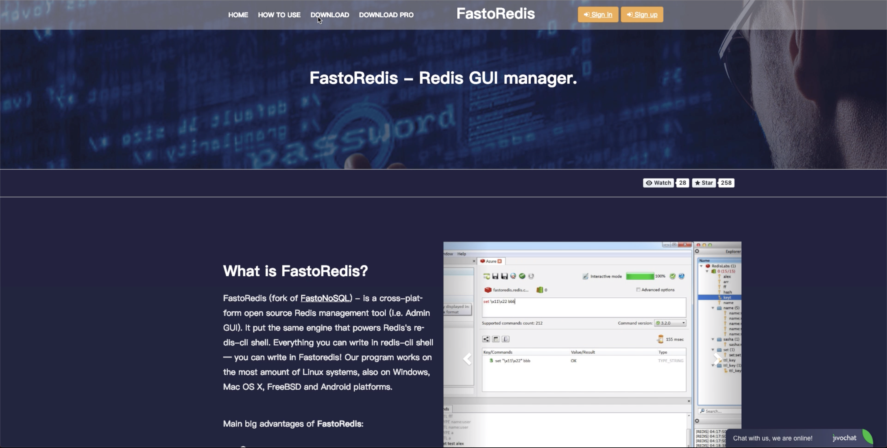
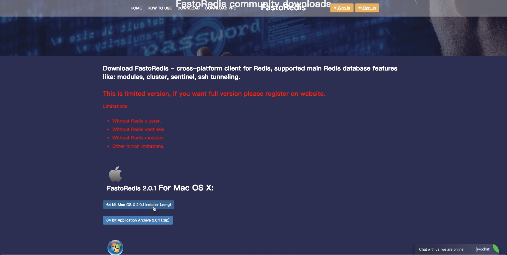
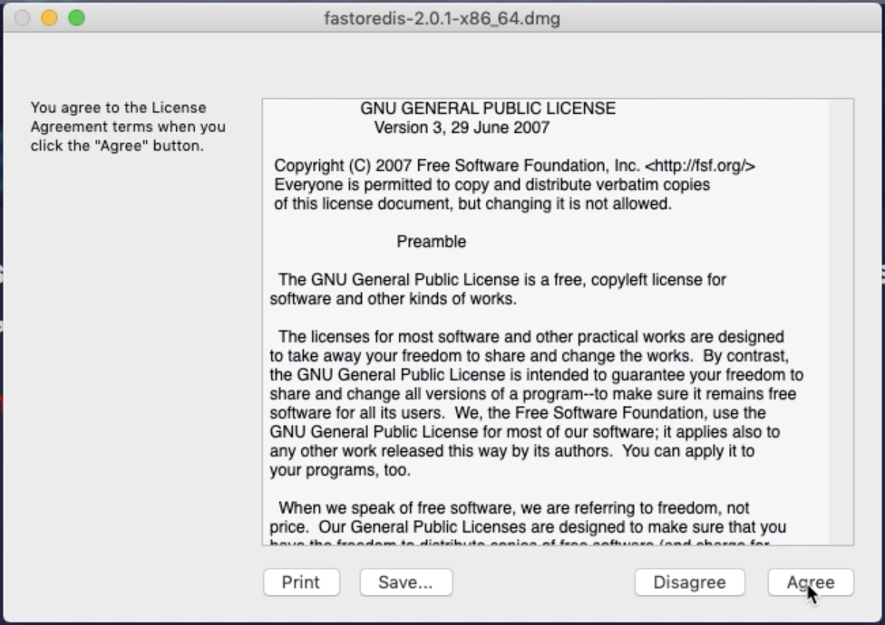
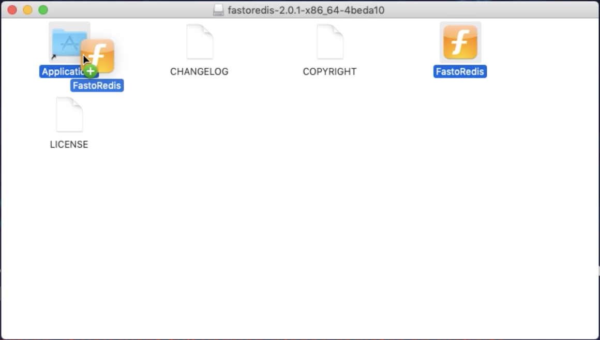
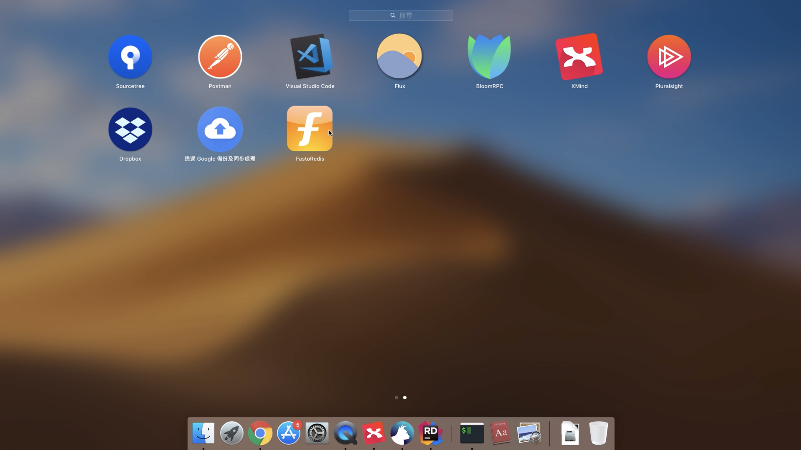

FastoRedis 是一跨平台的 Redis GUI 管理工具，可在 FastoRedis 的下載頁面下載該軟體。

下載要安裝的作業系統版本。

筆者這邊下載的是 MAC 的版本，下載後點選下載下來的 dmg 檔，按下 Agree 按鈕同意 License。

將 FastoRedis 拖進 Application 目錄。

就可以透過啟動台將 FastoRedis 軟體啟動來使用。

Link
----
* [FastoRedis - cross-platform client for Redis, supported main Redis database features like: modules, cluster, sentinel, ssh tunneling.](https://fastoredis.com/)