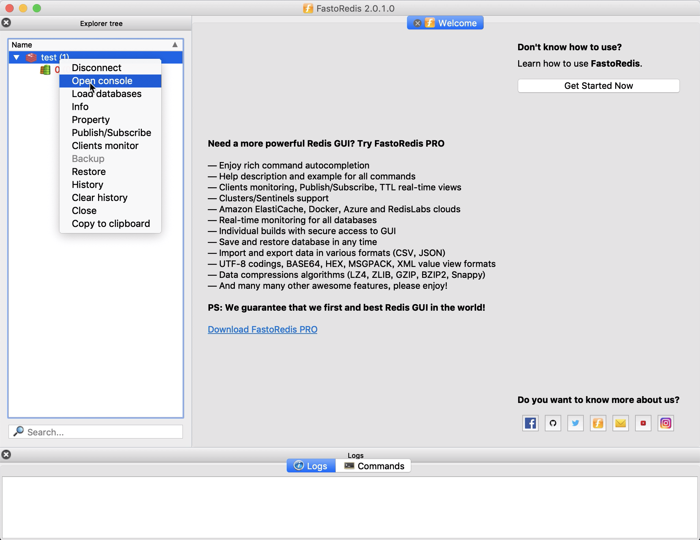
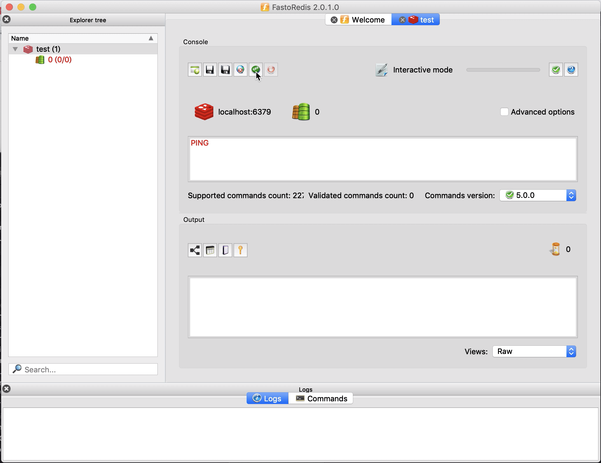
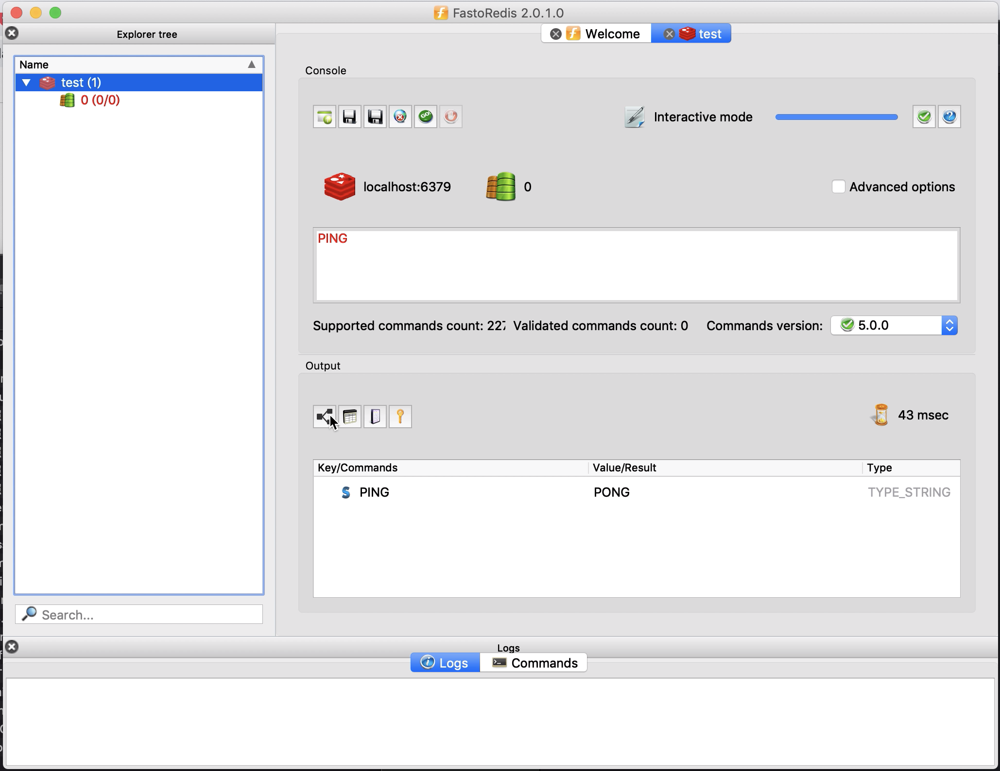
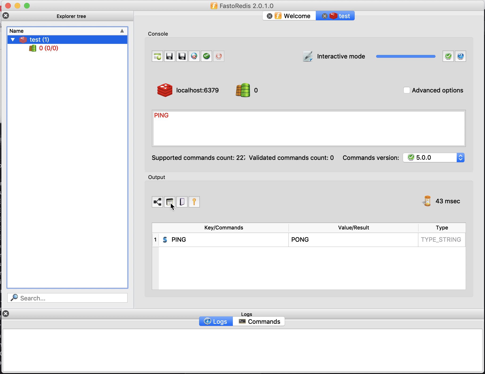
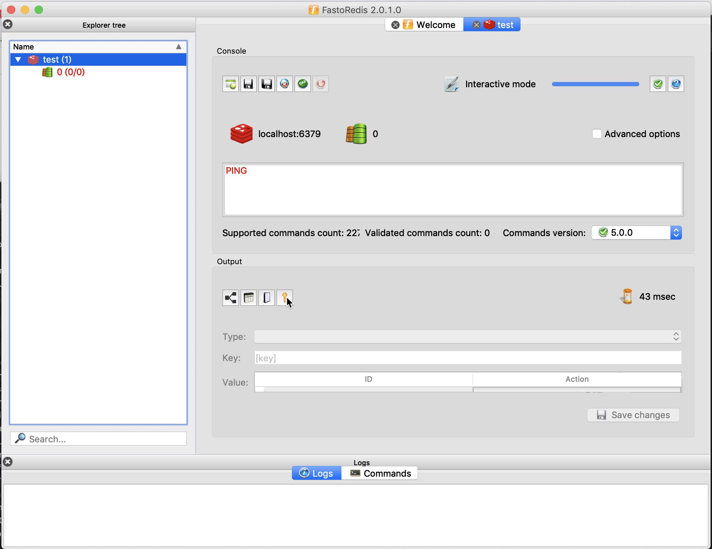
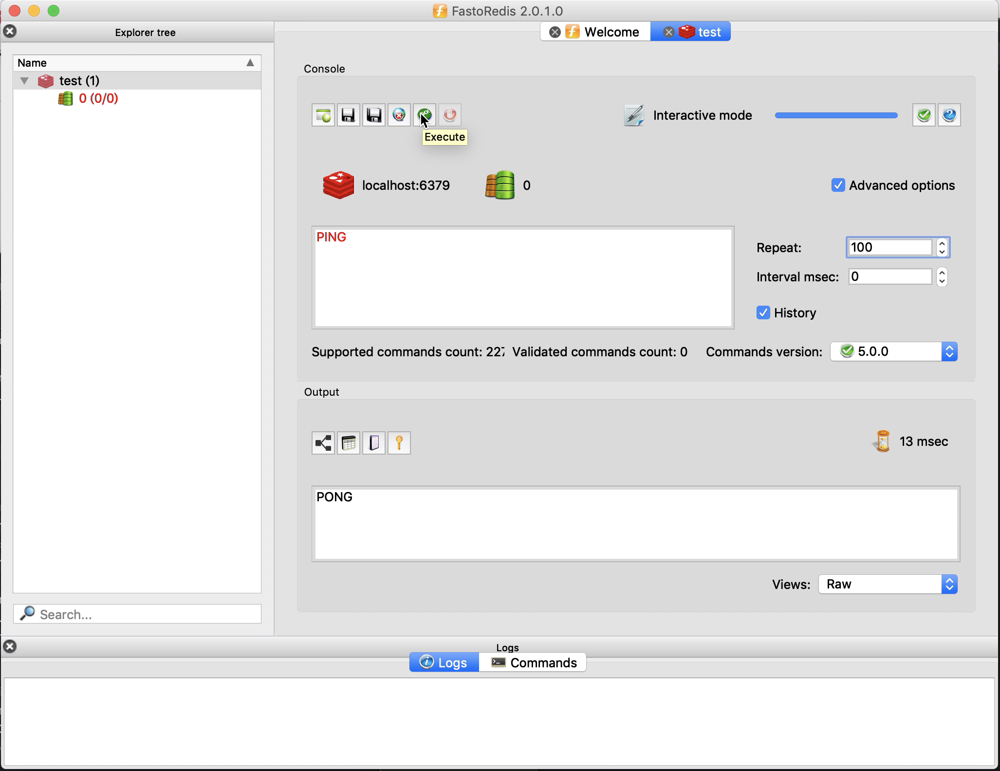
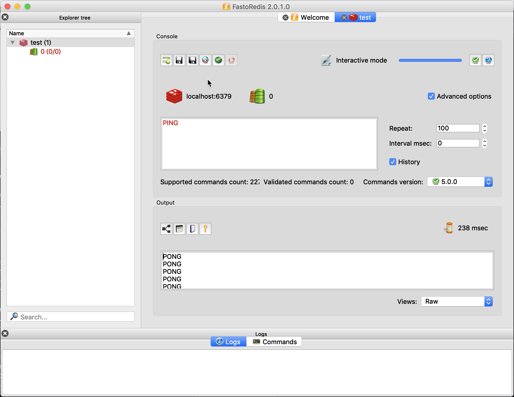

要透過 FastoRedis 以 Console 的方式跟 Redis 互動，我們可在 Redis 連線後在左側的樹狀節點上按下滑鼠右鍵，選取滑鼠右鍵快顯選單中的 Open console 選單選項。  

<!-- More -->

 

輸入要調用的 Redis 命令後按下 Execute 按鈕運行命令。  

 

命令調用結果即會呈現下方的 Output，Fasto Redis 提供不同的輸出格式可供切換。  

 

 

 

若有重複調用的需求，可勾選 Advanced options 選項，然後設定重複次數，以及中間的間隔時間，再按下 Execute 按鈕運行即可。  

 

 

若是命令常會調用，這邊也提供儲存與讀取的功能，可將常用命令存起來需要時再載入調用。  
