要使用 Firebase 的 Functions，可先切至 Firebase 下的 Functions 頁面。  

<!-- More -->

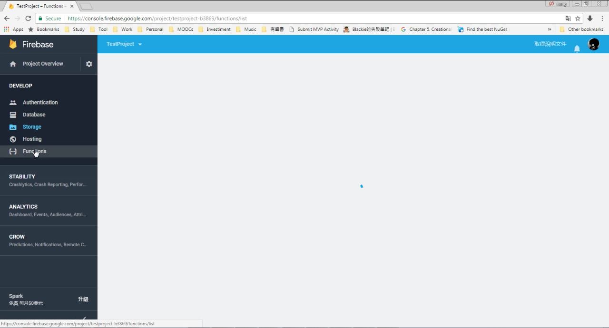
 
 

點選開始使用。  

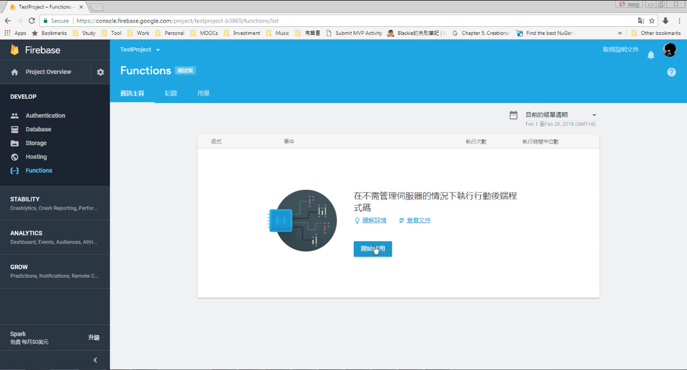
 
 

這邊會提示使用 Firebase Functions 的步驟，首先要有 Firebase 指令列工具。  

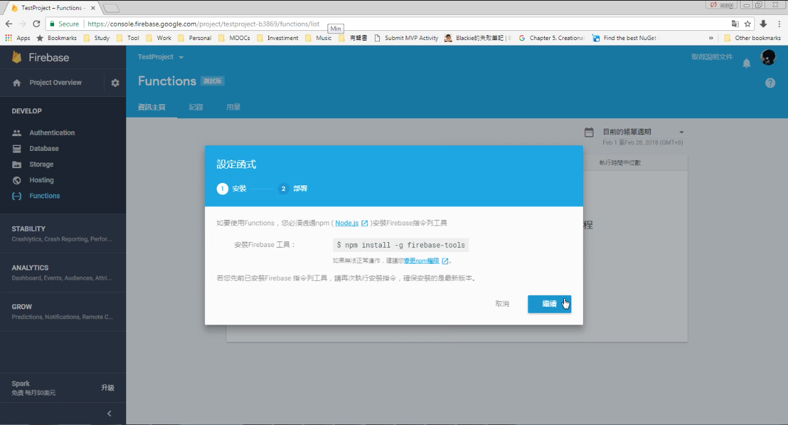
 
 

接著要使用 Firebase 指令列工具初始專案，撰寫專案後再次透過 Firebase 指令列工具部屬專案即可。  

 
 

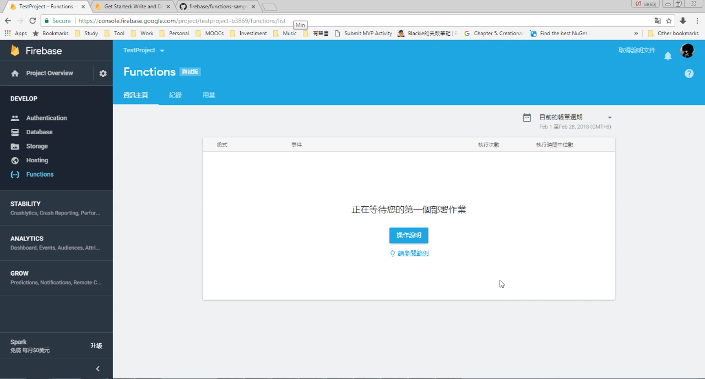
 
 

這邊跟著提示簡單的操作一次，先用 Firebase 指令列初始專案。  

    firebase init

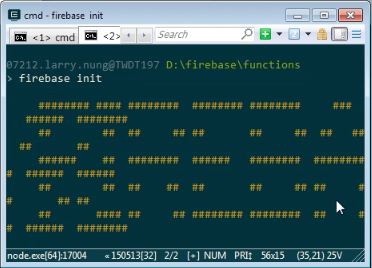
 
 

 
 

選取使用 Functions 設定。  

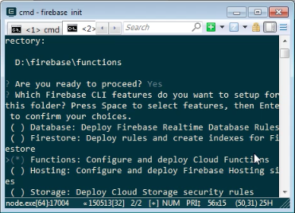
 
 

選取要使用的 Firebase 專案。  

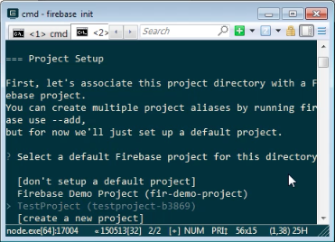
 
 

選取要使用的程式語言。  

 
 

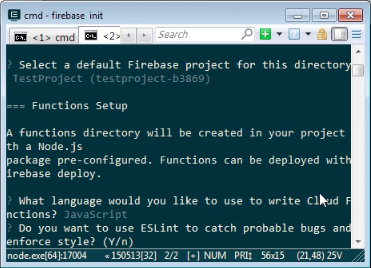
 
 

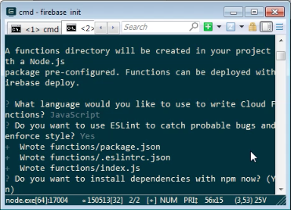
 
 

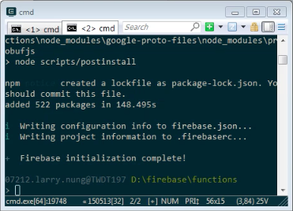
 
 

初始完後開啟專案進行修改，撰寫 Firebase Functions。  

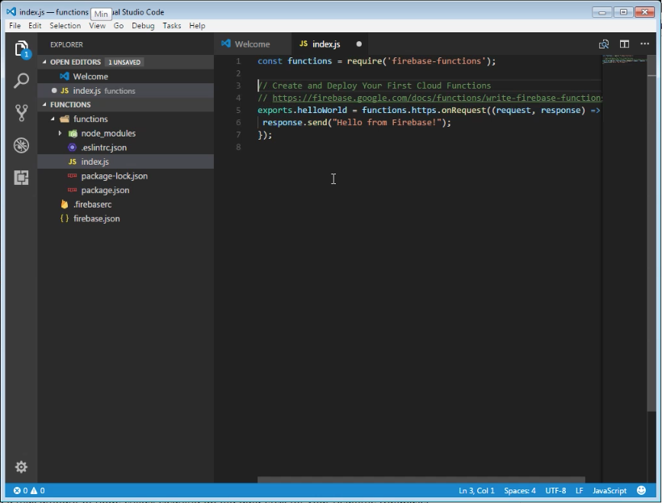
 
 

撰寫完使用 Firebase 指令列工具進行專案的部屬。  

    firebase deploy

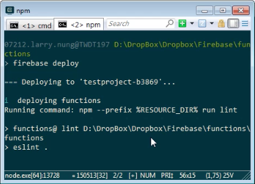
 
 

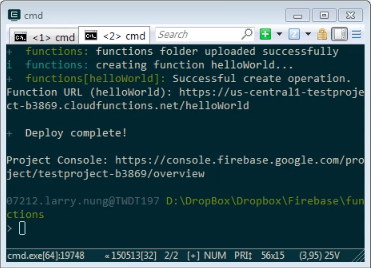
 
 

部屬完成 Firebase 的 Functions 資訊主頁會看到我們發布上去的 Firebase Functions。  

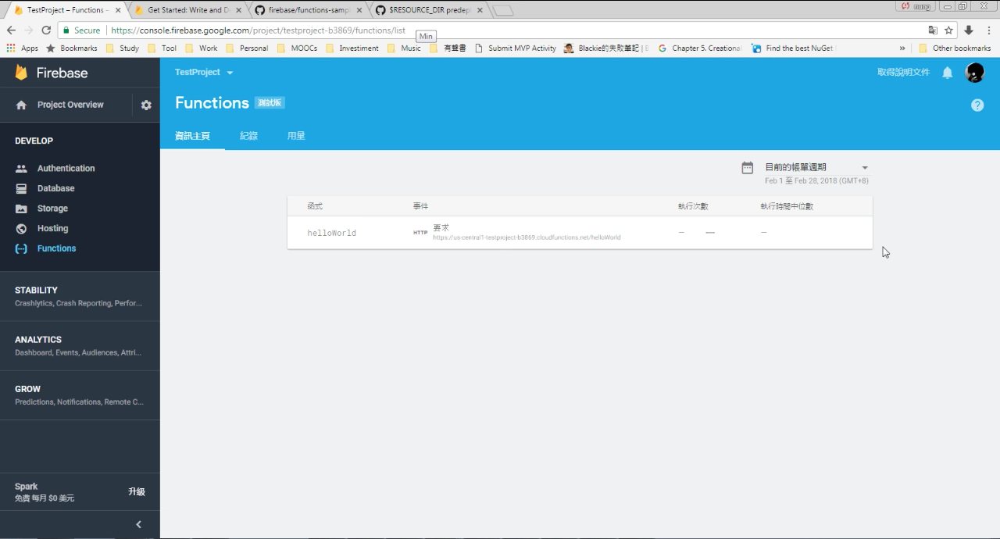
 
 

訪問 Firebase Functions 對應的網址，可看到 Firebase Functions 正確的運作。  

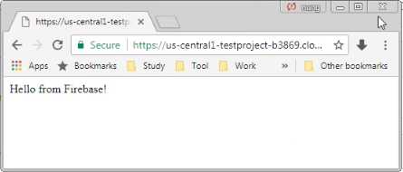
 
 

Link
----
* [使用Firebase Functions前的環境準備與開發工具安裝，Serverless真的來了 - 綠豆湯](https://litotom.com/2017/04/11/firebase-functions-nodejs/)
* [firebase/functions-samples: Collection of sample apps showcasing popular use cases using Cloud Functions for Firebase](https://github.com/firebase/functions-samples)
* [使用Firebase Functions的HTTP Triggers設計簡易的Android網路登入驗證功能，連PHP、ASP、Servlet都不用了 - 綠豆湯](https://litotom.com/2017/05/01/firebase-functions-http-login/)
* [Getting Started with Cloud Functions for Firebase - Firecasts - YouTube](https://www.youtube.com/watch?v=EvV9Vk9iOCQ)
