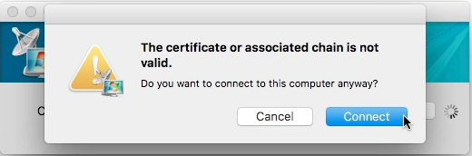
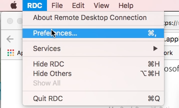
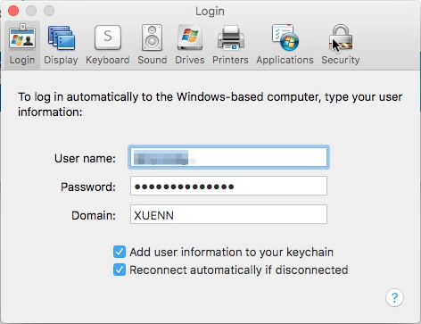
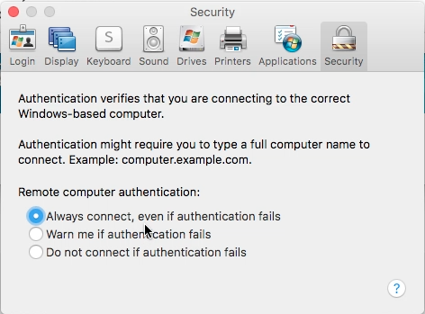

MAC 電腦升級到 MacOS Sierra 後，使用 Remote Desktop Connection 進行遠端連線時，會出現 The certificate or associated chain is not valid. 這個視窗，怎麼按 Connect 按鈕都會一直出現。

這時可以點選 [RDC | Perferences...] 主選單選項，或是按下熱鍵 Command + ,，開啟 Perferences 對話框。

切至 Security 頁面。

將設定調成 Always connect, even if authentication fails 即可。

Link
----
* [Fix Mac Remote Desktop Connection Client "The certificate or associated chain is not valid." | Next of Windows](https://www.nextofwindows.com/fix-mac-remote-desktop-the-certificate-or-associated-chain-is-not-valid)