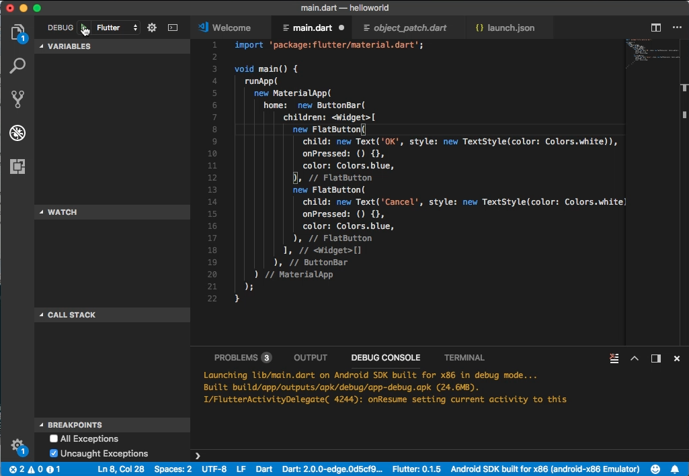
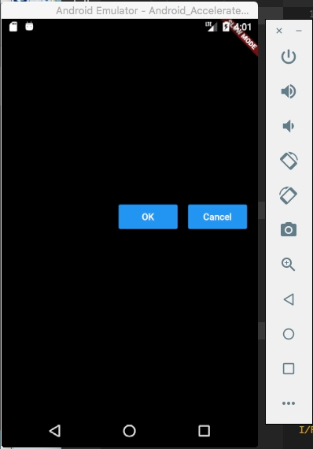

Flutter 的 ButtonBar widget 可以用來做按鈕的水平排列。  

<!-- More -->

<br/>


其建構子如下：  

    ButtonBar({Key key, MainAxisAlignment alignment: MainAxisAlignment.end, MainAxisSize mainAxisSize: MainAxisSize.max, List<Widget> children: const [] })

<br/>


屬性如下：  

| Name | Type | Description |
|:-------------:|:-------------:|:-----:|
| alignment | MainAxisAlignment | How the children should be placed along the horizontal axis. |
| children | List<Widget> | The buttons to arrange horizontally. |
| mainAxisSize | MainAxisSize | How much horizontal space is available. See Row.mainAxisSize. |
| hashCode | int | The hash code for this object. |
| key | Key | Controls how one widget replaces another widget in the tree. |
| runtimeType | Type | A representation of the runtime type of the object. |

<br/>


方法如下：

| Name | Return Type | Description |
|:-------------:|:-------------:|:-----:|
| build(BuildContext context) | Widget | Describes the part of the user interface represented by this widget. |
| createElement() | StatelessElement | Creates a StatelessElement to manage this widget's location in the tree. |
| debugDescribeChildren() | List<DiagnosticsNode> | Returns a list of DiagnosticsNode objects describing this node's children. |
| debugFillProperties(DiagnosticPropertiesBuilder properties) | void | Add additional properties associated with the node. |
| noSuchMethod(Invocation invocation) | dynamic | Invoked when a non-existent method or property is accessed. |
| toDiagnosticsNode({String name, DiagnosticsTreeStyle style }) | DiagnosticsNode | Returns a debug representation of the object that is used by debugging tools and by toStringDeep. |
| toString({DiagnosticLevel minLevel: DiagnosticLevel.debug }) | String | Returns a string representation of this object. |
| toStringDeep({String prefixLineOne: '', String prefixOtherLines, DiagnosticLevel minLevel: DiagnosticLevel.debug }) | String | Returns a string representation of this node and its descendants. |
| toStringShallow({String joiner: ', ', DiagnosticLevel minLevel: DiagnosticLevel.debug }) | String | Returns a one-line detailed description of the object. |
| toStringShort() | String | A short, textual description of this widget. |

<br/>


ButtonBar 使用上要將需要水平排列的按鈕設置在 children 屬性，這些按鈕就會依序的水平排列。  

```dart
import 'package:flutter/material.dart';

void main() {
  runApp(
    new MaterialApp(
      home:  new ButtonBar(
          children: <Widget>[
            new FlatButton(
              child: new Text('OK', style: new TextStyle(color: Colors.white)),
              onPressed: () {},
              color: Colors.blue,
            ),
            new FlatButton(
              child: new Text('Cancel', style: new TextStyle(color: Colors.white)),
              onPressed: () {},
              color: Colors.blue,
            ),
          ],
        ),
    )
  );
}
```


 
<br/>


 
<br/>


Link
----
* [ButtonBar class - material library - Dart API](https://docs.flutter.io/flutter/material/ButtonBar-class.html)
