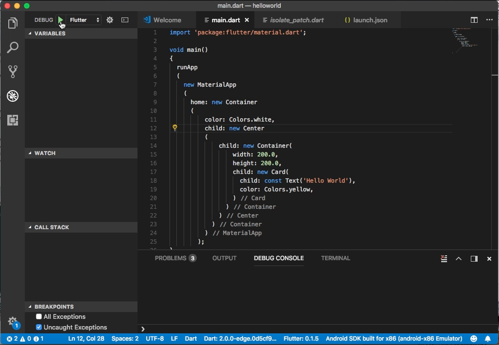
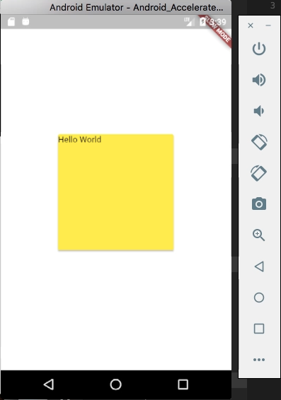

Flutter 的 Card class 提供類似卡片的效果，該元件的四個角落為圓角，並具備有陰影的效果。  

<!-- More -->

<br/>


其建構子如下：  

    Card({Key key, Color color, double elevation: 2.0, Widget child })

<br/>


屬性如下：  

| Name | Type | Description |
|:-------------:|:-------------:|:-----:|
| child | Widget | The widget below this widget in the tree. |
| color | Color | The color of material used for this card. |
| elevation | double | The z-coordinate at which to place this card. This controls the size of the shadow below the card. |
| hashCode | int | The hash code for this object. |
| key | Key | Controls how one widget replaces another widget in the tree. |
| runtimeType | Type | A representation of the runtime type of the object. |

<br/>


方法如下：

| Name | Return Type | Description |
|:-------------:|:-------------:|:-----:|
| build(BuildContext context) | Widget | Describes the part of the user interface represented by this widget. |
| createElement() | StatelessElement | Creates a StatelessElement to manage this widget's location in the tree. |
| debugDescribeChildren() | List<DiagnosticsNode> | Returns a list of DiagnosticsNode objects describing this node's children. |
| debugFillProperties(DiagnosticPropertiesBuilder properties) | void | Add additional properties associated with the node. |
| noSuchMethod(Invocation invocation) | dynamic | Invoked when a non-existent method or property is accessed. |
| toDiagnosticsNode({String name, DiagnosticsTreeStyle style }) | DiagnosticsNode | Returns a debug representation of the object that is used by debugging tools and by toStringDeep. |
| toString({DiagnosticLevel minLevel: DiagnosticLevel.debug }) | String | Returns a string representation of this object. |
| toStringDeep({String prefixLineOne: '', String prefixOtherLines, DiagnosticLevel minLevel: DiagnosticLevel.debug }) | String | Returns a string representation of this node and its descendants. |
| toStringShallow({String joiner: ', ', DiagnosticLevel minLevel: DiagnosticLevel.debug }) | String | Returns a one-line detailed description of the object. |
| toStringShort() | String | A short, textual description of this widget. |

<br/>


Card 元件需在 MaterialApp 下使用，使用上可透過 child 屬性指定內部的元件，color 屬性指定 color 元件的顏色。  

```dart
import 'package:flutter/material.dart';

void main() 
{
  runApp
  (
    new MaterialApp
    (
      home: new Container
      (
          color: Colors.white,
          child: new Center
          (
              child: new Container(
                  width: 200.0,
                  height: 200.0,
                  child: new Card(
                    child: const Text('Hello World'),
                    color: Colors.yellow,
                  )
                )
              )
            )
          )
        );
}
```


 
<br/>


 
<br/>


Link
----
* [Card class - material library - Dart API](https://docs.flutter.io/flutter/material/Card-class.html)
