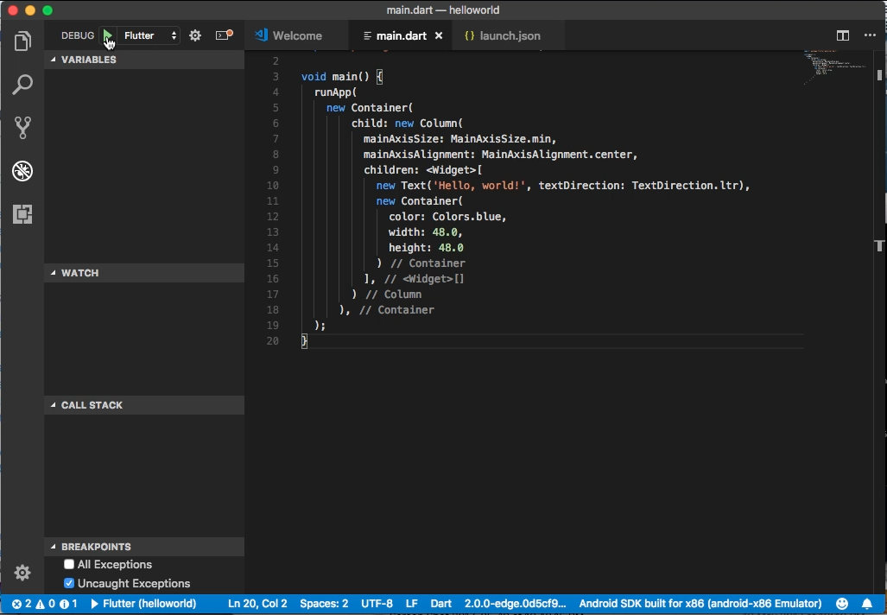
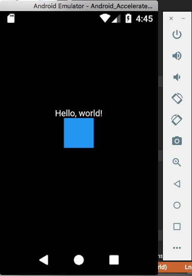

Flutter 的 Column widget 可用來將子元件垂直放置。  

<!-- More -->

<br/>


其建構子如下：  

    Column({Key key, MainAxisAlignment mainAxisAlignment: MainAxisAlignment.start, MainAxisSize mainAxisSize: MainAxisSize.max, CrossAxisAlignment crossAxisAlignment: CrossAxisAlignment.center, TextDirection textDirection, VerticalDirection verticalDirection: VerticalDirection.down, TextBaseline textBaseline, List<Widget> children: const [] })

<br/>


屬性如下：

| Name | Type | Description |
|:-------------:|:-------------:|:-----:|
| children |  List<Widget> | The widgets below this widget in the tree. |
| crossAxisAlignment | CrossAxisAlignment | How the children should be placed along the cross axis. |
| direction | Axis | The direction to use as the main axis. |
| hashCode | int | The hash code for this object. |
| key | Key | Controls how one widget replaces another widget in the tree. |
| mainAxisAlignment | MainAxisAlignment | How the children should be placed along the main axis. |
| mainAxisSize | MainAxisSize | How much space should be occupied in the main axis. |
| runtimeType | Type | A representation of the runtime type of the object. |
| textBaseline | TextBaseline | If aligning items according to their baseline, which baseline to use. |
| textDirection | TextDirection | Determines the order to lay children out horizontally and how to interpret start and end in the horizontal direction. |
| verticalDirection | VerticalDirection | Determines the order to lay children out vertically and how to interpret start and end in the vertical direction. |

<br/>


方法如下：

| Name | Return Type | Description |
|:-------------:|:-------------:|:-----:|
| createElement() | MultiChildRenderObjectElement | RenderObjectWidgets always inflate to a RenderObjectElement subclass. |
| createRenderObject(BuildContext context) | RenderFlex | Creates an instance of the RenderObject class that this RenderObjectWidget represents, using the configuration described by this RenderObjectWidget. |
| debugDescribeChildren() | List<DiagnosticsNode> | Returns a list of DiagnosticsNode objects describing this node's children. |
| debugFillProperties(DiagnosticPropertiesBuilder description) | void ||
| didUnmountRenderObject(RenderObject renderObject) | void | A render object previously associated with this widget has been removed from the tree. The given RenderObject will be of the same type as returned by this object's createRenderObject. |
| getEffectiveTextDirection(BuildContext context) | TextDirection | The value to pass to RenderFlex.textDirection. |
| noSuchMethod(Invocation invocation) | dynamic | Invoked when a non-existent method or property is accessed. |
| toDiagnosticsNode({String name, DiagnosticsTreeStyle style }) | DiagnosticsNode | Returns a debug representation of the object that is used by debugging tools and by toStringDeep. |
| toString({DiagnosticLevel minLevel: DiagnosticLevel.debug }) | String | Returns a string representation of this object. |
| toStringDeep({String prefixLineOne: '', String prefixOtherLines, DiagnosticLevel minLevel: DiagnosticLevel.debug }) | String | Returns a string representation of this node and its descendants. |
| toStringShallow({String joiner: ', ', DiagnosticLevel minLevel: DiagnosticLevel.debug }) | String | Returns a one-line detailed description of the object. |
| toStringShort() | String | A short, textual description of this widget. |
| updateRenderObject(BuildContext context, RenderFlex renderObject) | void | Copies the configuration described by this RenderObjectWidget to the given RenderObject, which will be of the same type as returned by this object's createRenderObject. |

<br/>


使用上只要將要垂直放置的元件用陣列的方式設置到 children 屬性即可。  

```dart
import 'package:flutter/material.dart';

void main() {
  runApp(
    new Container(
        child: new Column(
          mainAxisSize: MainAxisSize.min,
          mainAxisAlignment: MainAxisAlignment.center,
          children: <Widget>[
            new Text('Hello, world!', textDirection: TextDirection.ltr),
            new Container(
              color: Colors.blue,
              width: 48.0,
              height: 48.0
            )
          ],
        )
      ),
  );
}
```


 
<br/>


 
<br/>


Link
----
* [Column class - widgets library - Dart API](https://docs.flutter.io/flutter/widgets/Column-class.html)
