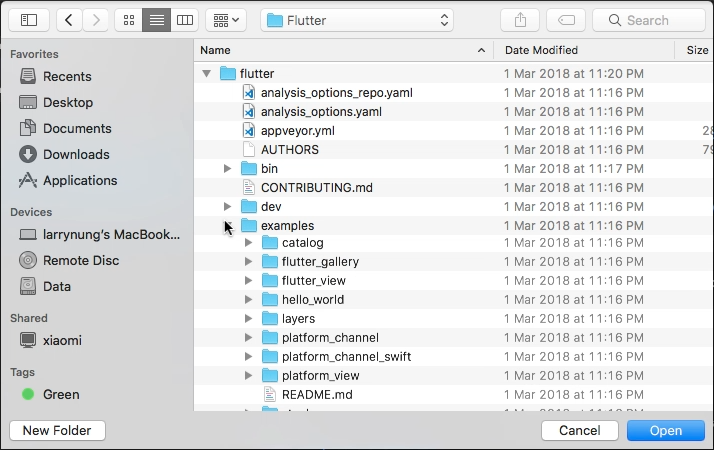
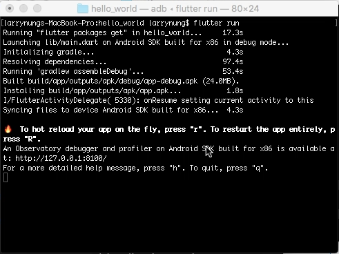
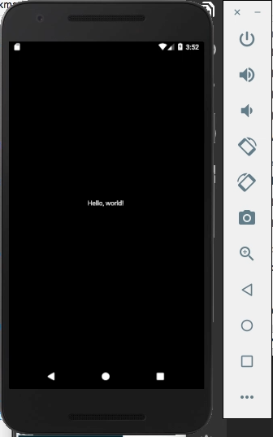
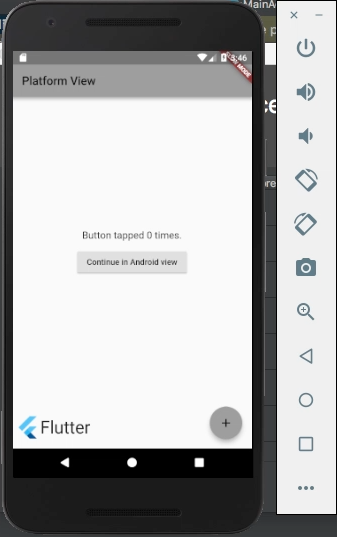
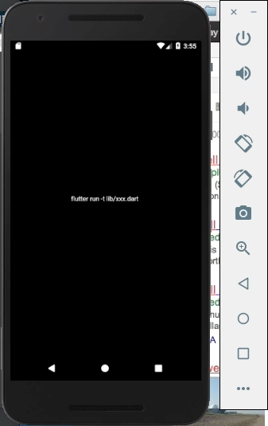
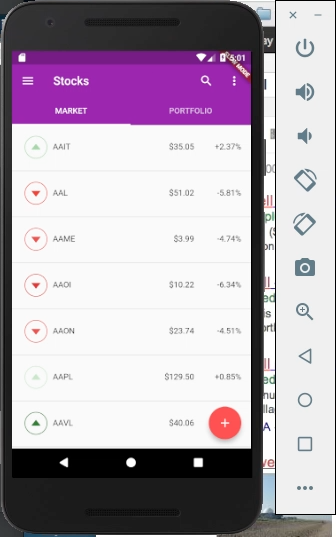
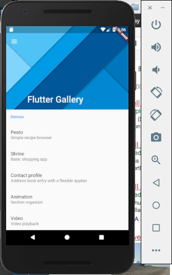
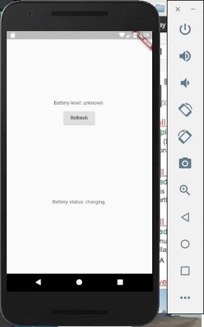
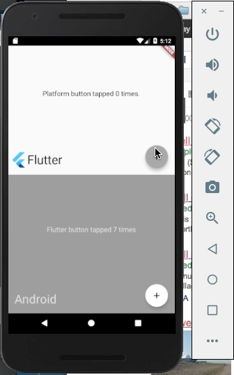

Flutter 安裝目錄下的 examples 目錄附有一些 Flutter 的範例程式，學習時可先從這邊下手。

可先調用命令將範例運行起來操作看看，再對照看程式是怎麼撰寫的。

flutter run

若是將 hello_world 範例運行起來，會看到...

運行 platform_view...

運行 catalog...

運行 stocks...

運行 flutter_gallery...

運行 platform_channel...

運行 flutter_view...

