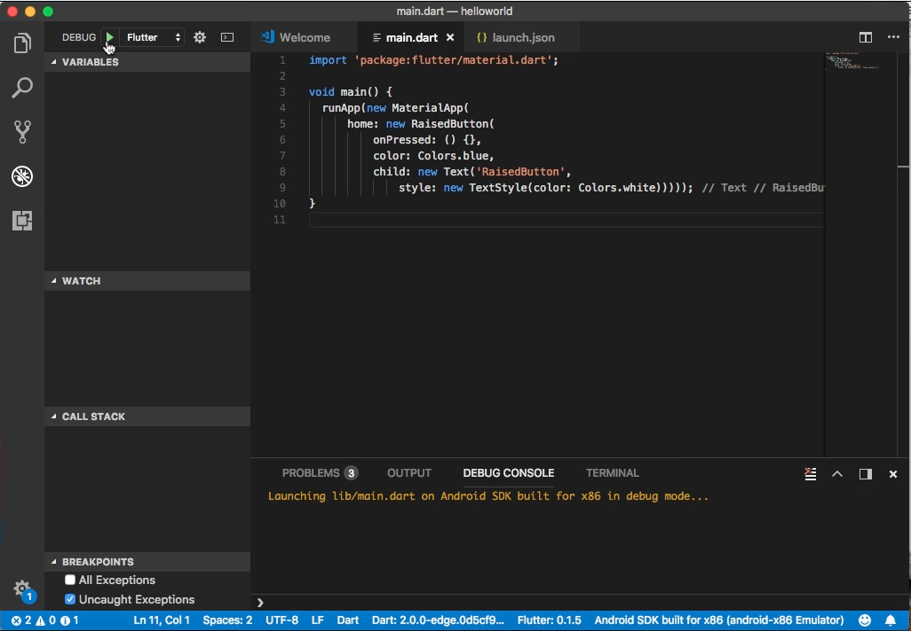
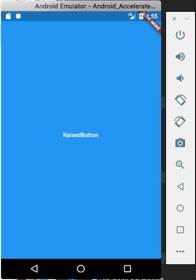
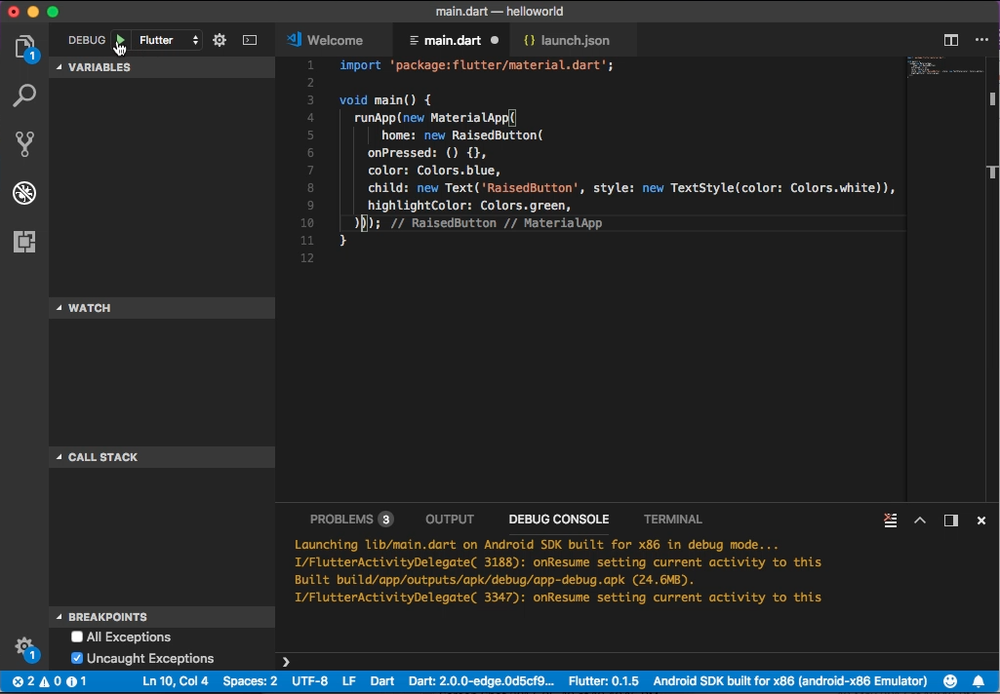
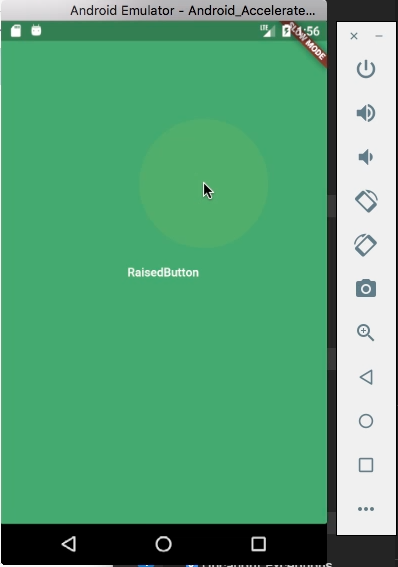

Flutter 的 RaisedButton widget 可以用來做按鈕的呈現。 

<!-- More -->

<br/>


其建構子如下：  

    RaisedButton({Key key, @required VoidCallback onPressed, ValueChanged<bool> onHighlightChanged, ButtonTextTheme textTheme, Color textColor, Color disabledTextColor, Color color, Color disabledColor, Color highlightColor, Color splashColor, Brightness colorBrightness, double elevation: 2.0, double highlightElevation: 8.0, double disabledElevation: 0.0, EdgeInsetsGeometry padding, ShapeBorder shape, Duration animationDuration: kThemeChangeDuration, Widget child })

<br/>


屬性如下：  

| Name | Type | Description |
|:-------------:|:-------------:|:-----:|
| animationDuration | Duration | Defines the duration of animated changes for shape and elevation. |
| child | Widget | The button's label. |
| color | Color | The button's fill color, displayed by its Material, while it is in its default (unpressed, enabled) state. |
| colorBrightness | Brightness | The theme brightness to use for this button. |
| disabledColor | Color | The fill color of the button when the button is disabled. |
| disabledElevation | double | The elevation for the button's Material when the button is not enabled. |
| disabledTextColor | Color | The color to use for this button's text when the button is disabled. |
| elevation | double | The z-coordinate at which to place this button. This controls the size of the shadow below the raised button. |
| enabled | bool | Whether the button is enabled or disabled. |
| highlightColor | Color | The highlight color of the button's InkWell. |
| highlightElevation | double | The elevation for the button's Material when the button is enabled but not pressed. |
| onHighlightChanged | ValueChanged<bool> | Called by the underlying InkWell widget's InkWell.onHighlightChanged callback. |
| onPressed | VoidCallback | Called when the button is tapped or otherwise activated. |
| padding | EdgeInsetsGeometry | The internal padding for the button's child. |
| shape | ShapeBorder | The shape of the button's Material. |
| splashColor | Color | The splash color of the button's InkWell. |
| textColor | Color | The color to use for this button's text. |
| textTheme | ButtonTextTheme | Defines the button's base colors, and the defaults for the button's minimum size, internal padding, and shape. |
| hashCode | int | The hash code for this object. |
| key | Key | Controls how one widget replaces another widget in the tree. |
| runtimeType | Type | A representation of the runtime type of the object. |

<br/>


方法如下：  

| Name | Return Type | Description |
|:-------------:|:-------------:|:-----:|
| build(BuildContext context) | Widget | Describes the part of the user interface represented by this widget. |
| debugFillProperties(DiagnosticPropertiesBuilder description) | void ||
| createElement() | StatelessElement | Creates a StatelessElement to manage this widget's location in the tree. |
| debugDescribeChildren() | List<DiagnosticsNode> | ist of DiagnosticsNode objects describing this node's children. |
| noSuchMethod(Invocation invocation) | dynamic | Invoked when a non-existent method or property is accessed. |
| toDiagnosticsNode({String name, DiagnosticsTreeStyle style }) | DiagnosticsNode | Returns a debug representation of the object that is used by debugging tools and by toStringDeep. |
| toString({DiagnosticLevel minLevel: DiagnosticLevel.debug }) | String | Returns a string representation of this object. |
| toStringDeep({String prefixLineOne: '', String prefixOtherLines, DiagnosticLevel minLevel: DiagnosticLevel.debug }) | String | Returns a string representation of this node and its descendants. |
| toStringShallow({String joiner: ', ', DiagnosticLevel minLevel: DiagnosticLevel.debug }) | String | Returns a one-line detailed description of the object. |
| toStringShort() | String | A short, textual description of this widget. |

<br/>


RaisedButton 元件需在 MaterialApp 下使用，所以會要建立 MaterialApp，然後將 RaisedButton 元件塞給 MaterialApp 的 home 屬性。  

<br/>


RaisedButton 使用上要設定 onPressed 屬性，指定按鈕按下後要觸發的動作，color 屬性可設定按鈕的顏色，child 屬性則是設定按鈕上的標籤。  


```dart
import 'package:flutter/material.dart';

void main() {
  runApp(
    new MaterialApp(
      home: new RaisedButton(
          onPressed: () {},
          color: Colors.blue,
          child: new Text(
            'RaisedButton',
            style: new TextStyle(color: Colors.white)
          )
      )
    )
  );
}
```


 
<br/>


 
<br/>


highlightColor 屬性可設定按鈕按下的顏色。

```dart
import 'package:flutter/material.dart';

void main() {
  runApp(
    new MaterialApp(
      home: new RaisedButton(
        onPressed: () {},
        color: Colors.blue,
        child: new Text(
          'RaisedButton', 
          style: new TextStyle(color: Colors.white)
        ),
        highlightColor: Colors.green,
      )
    )
  );
}
```


 
<br/>


 
<br/>


Link
----
* [RaisedButton class - material library - Dart API](https://docs.flutter.io/flutter/material/RaisedButton-class.html)
