要使用 Flutter CLI 運行 Flutter app，可以調用下列命令。  

<!-- More -->

    Flutter run

 

命令調用後會顯示運行時可供使用的功能。  

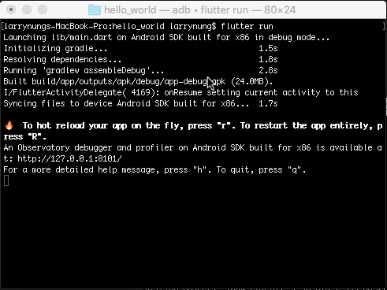
 
 

且 Flutter app 會被運行起來。  

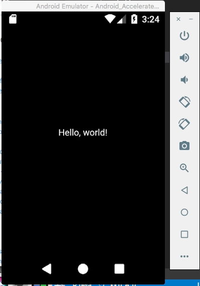
 
 

Flutter app 運行的當中我們可以開啟 http://127.0.0.1:8101，進行 Flutter app 的 profiling。  

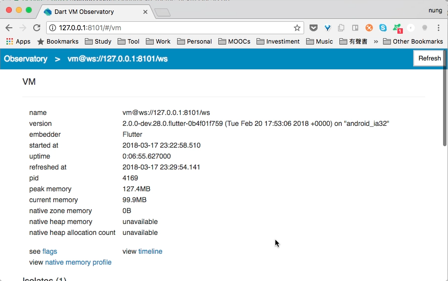
 
 

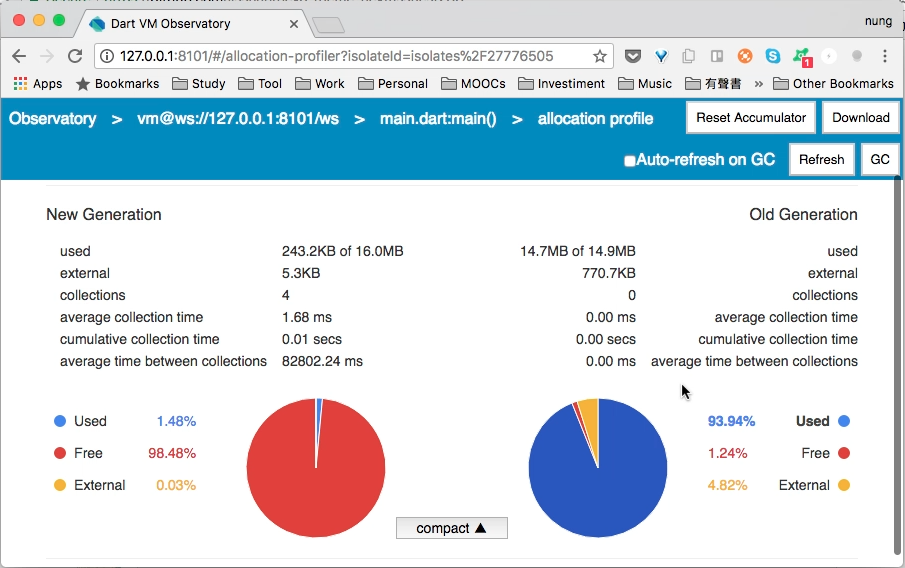
 
 

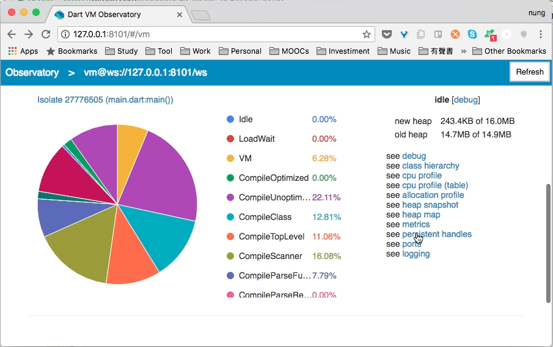
 
 

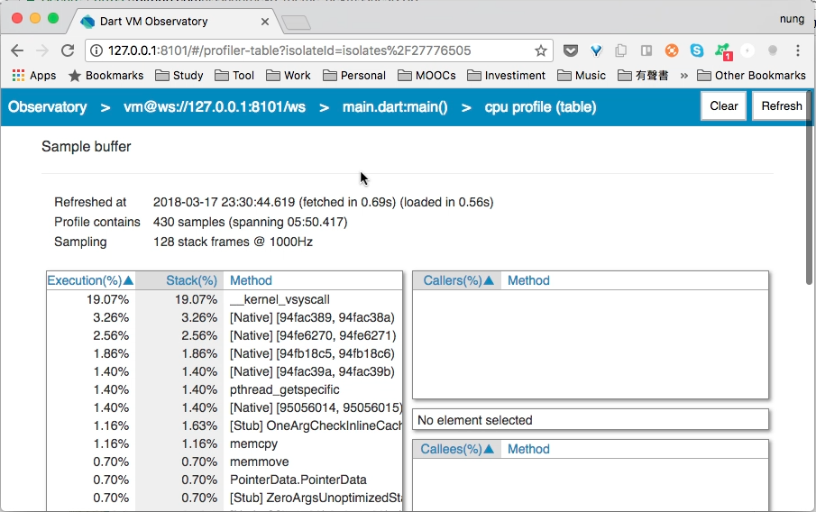
 
 

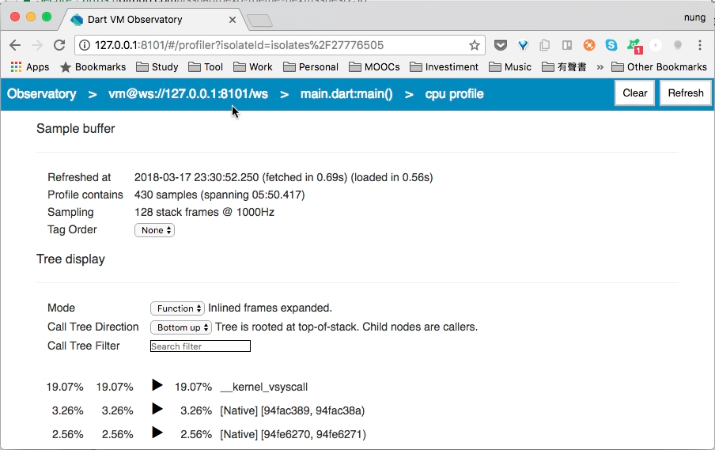
 
 

如果開發中要進行 app 的重載，可以使用 r 進行 hot reload，或是按下 R 進行 app 的重載。  

 

像是這邊筆者將正在運行中的程式做個簡單的修改。  

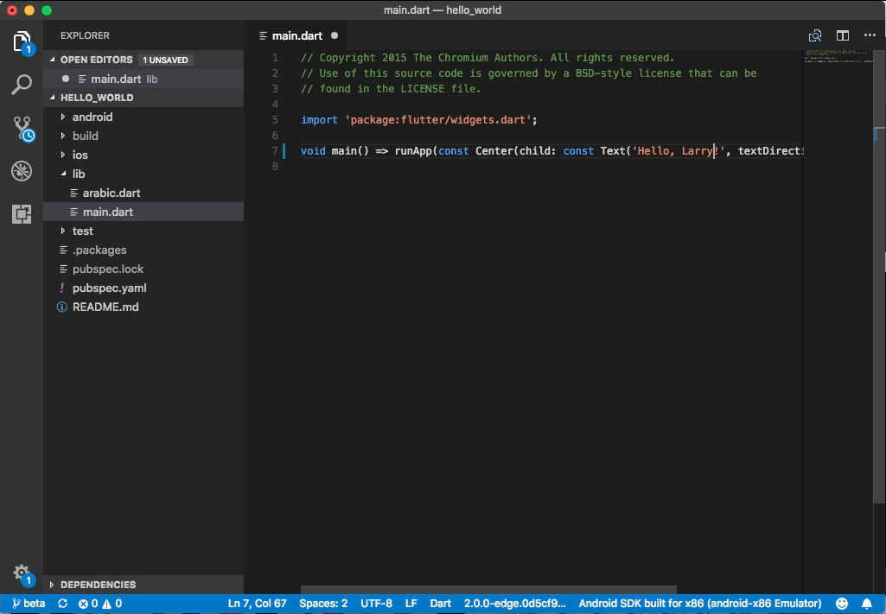
 
 

按下 R 將 app 重載，Flutter 只花了 748 ms 就完成了重載的動作。  

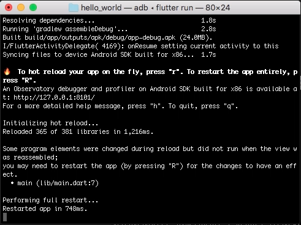
 
 

 
 

如果要查看更多支援的操作，可以按下 h，會將更進階操作功能顯示出來。  

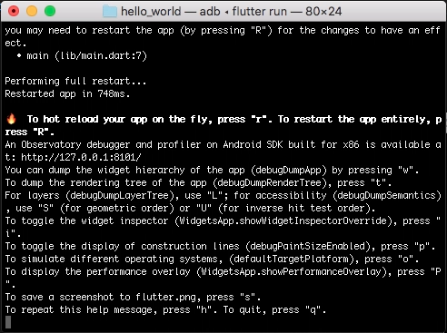
 
 

像是按下 w 可以看到 app 的 widget 的階層架構。  

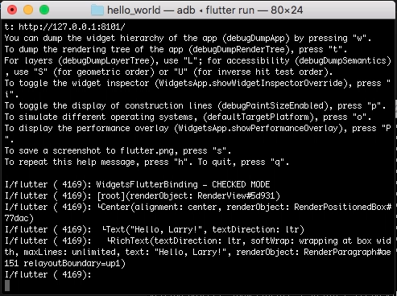
 
 

按下 t 可以看到 app 的 rendering tree。  

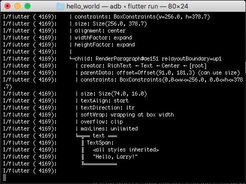
 
 

按下 L 可以查看 app 的 layout。  

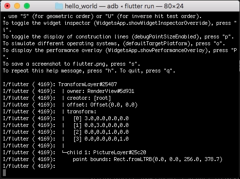
 
 

按下 p 可以顯示 construction lines。  

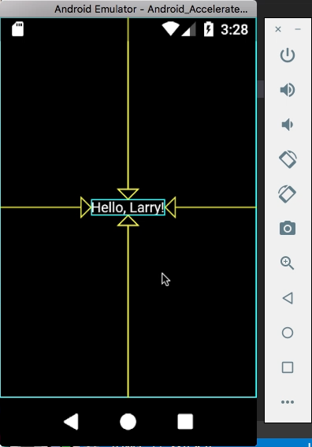
 
 

按下 s 可以擷取畫面。  

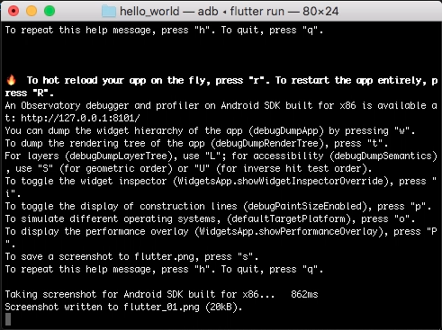
 
 

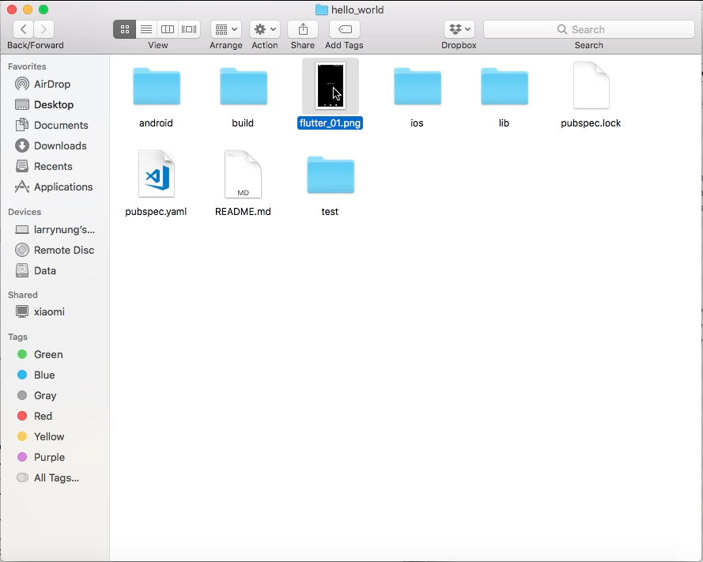
 
 
