要使用 Flutter CLI 運行 Flutter app，可以調用下列命令。

Flutter run

命令調用後會顯示運行時可供使用的功能。

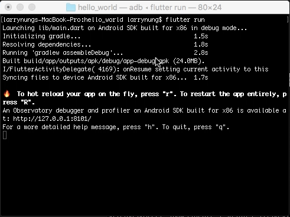

且 Flutter app 會被運行起來。

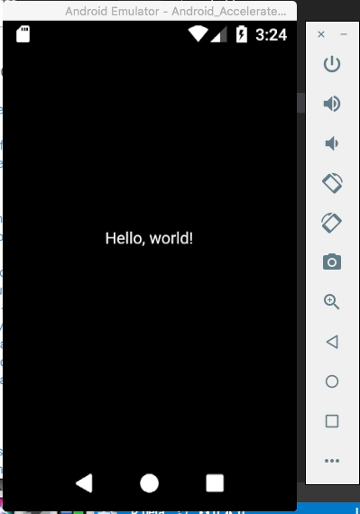

Flutter app 運行的當中我們可以開啟 http://127.0.0.1:8101，進行 Flutter app 的 profiling。

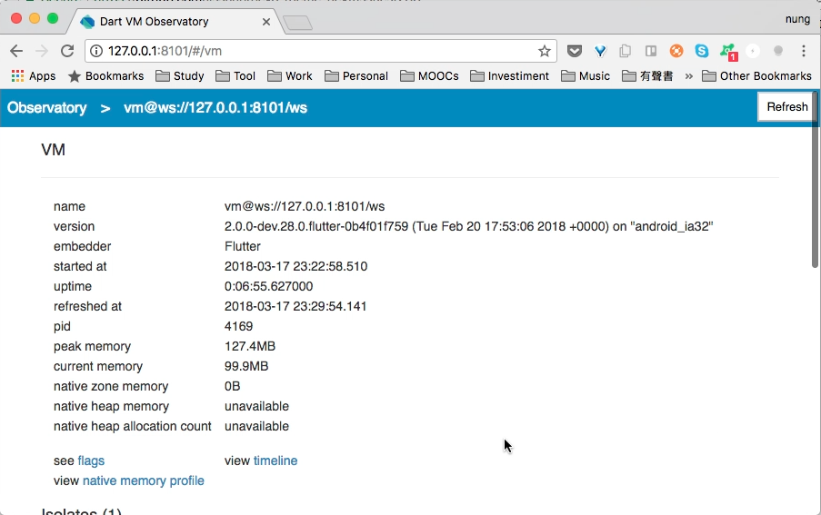

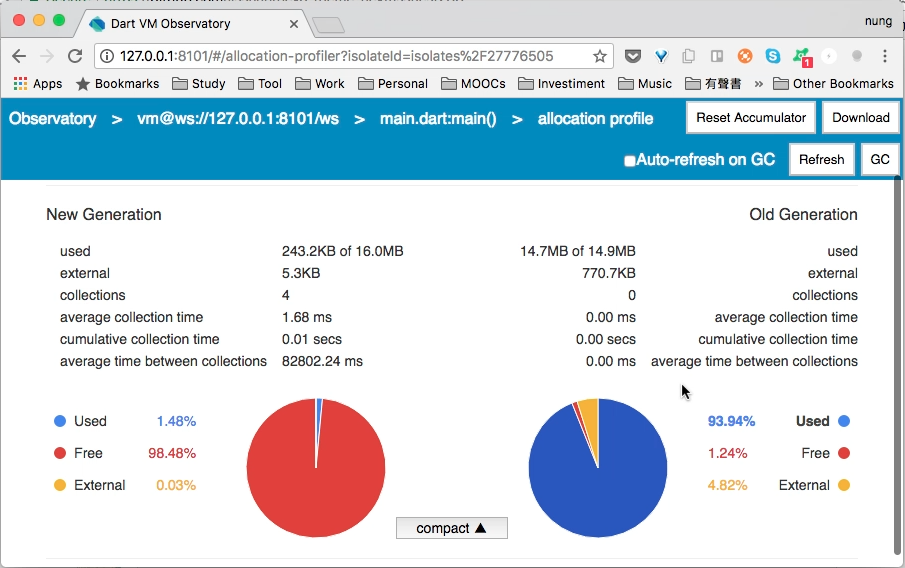

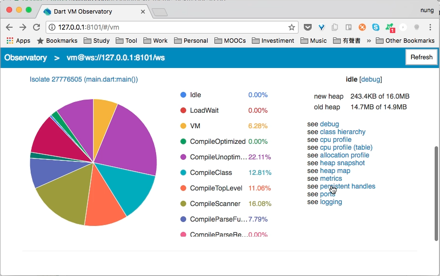

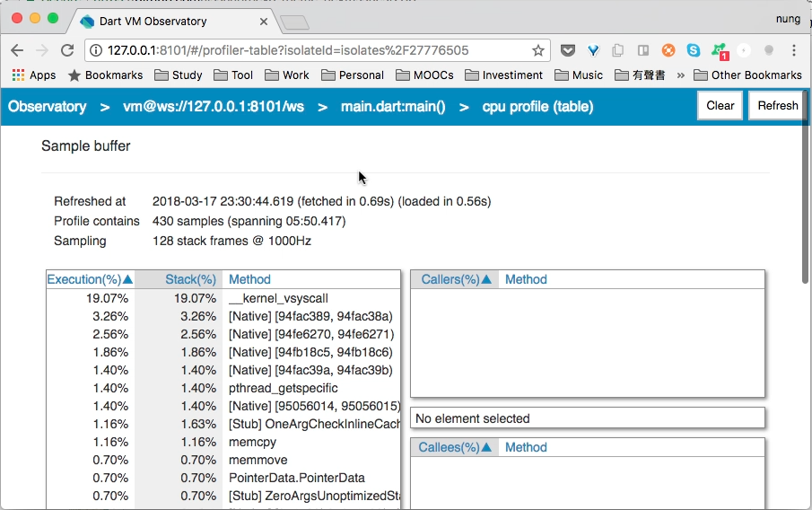

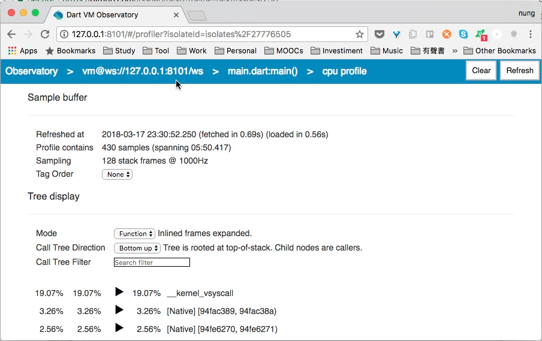

如果開發中要進行 app 的重載，可以使用 r 進行 hot reload，或是按下 R 進行 app 的重載。

像是這邊筆者將正在運行中的程式做個簡單的修改。

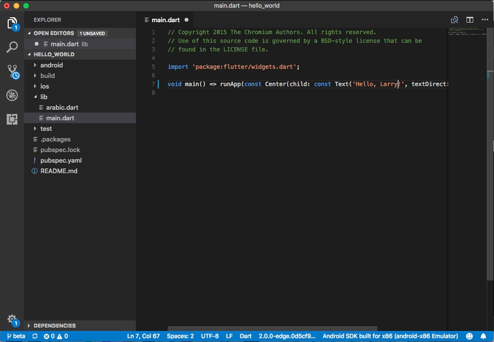

按下 R 將 app 重載，Flutter 只花了 748 ms 就完成了重載的動作。

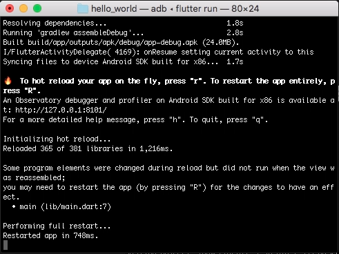

如果要查看更多支援的操作，可以按下 h，會將更進階操作功能顯示出來。

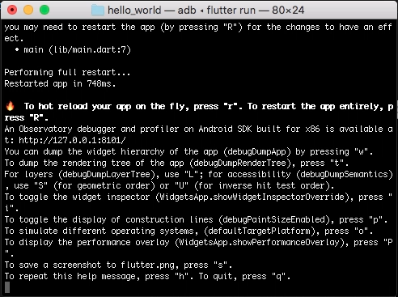

像是按下 w 可以看到 app 的 widget 的階層架構。

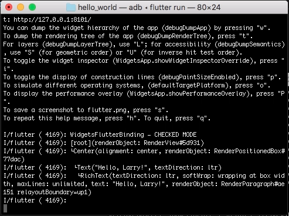

按下 t 可以看到 app 的 rendering tree。

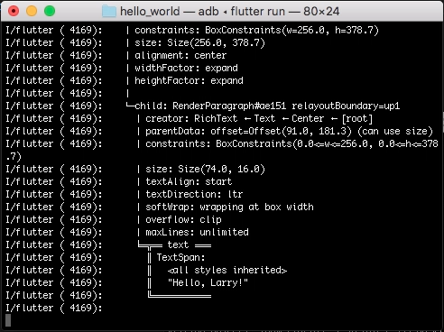

按下 L 可以查看 app 的 layout。

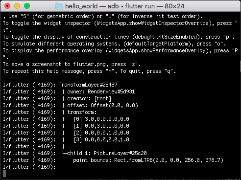

按下 p 可以顯示 construction lines。

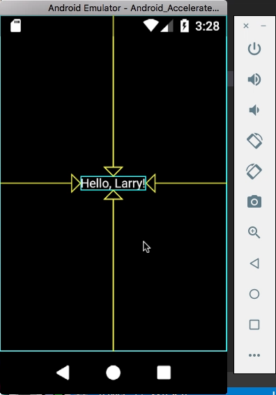

按下 s 可以擷取畫面。

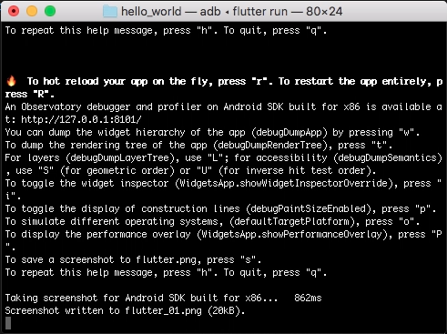

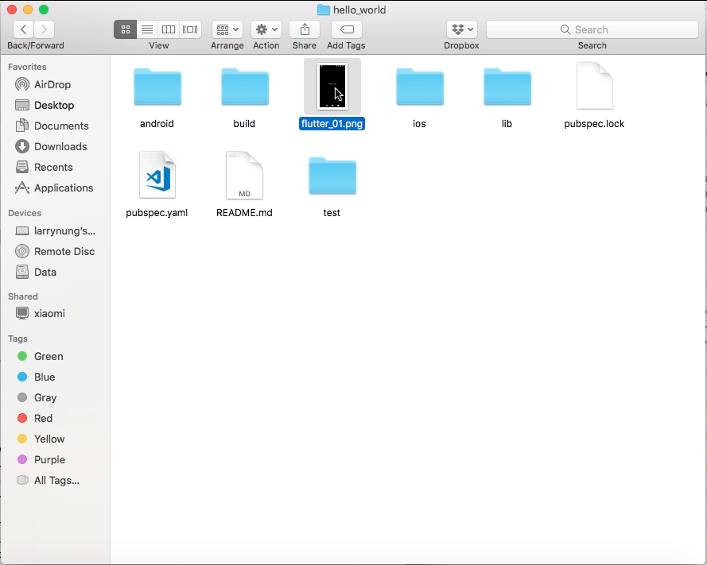