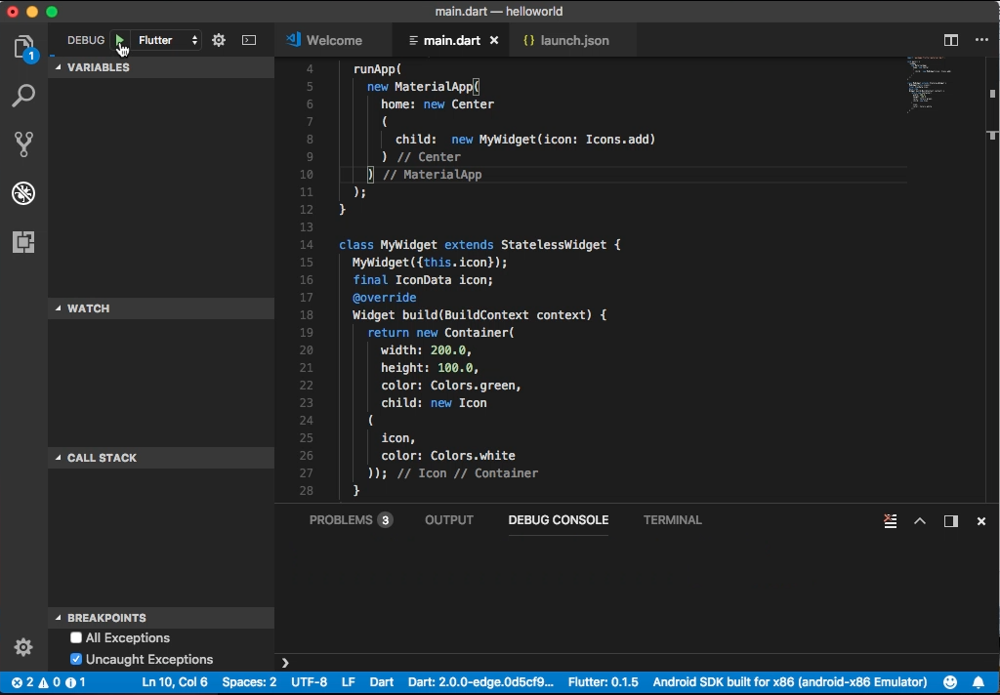
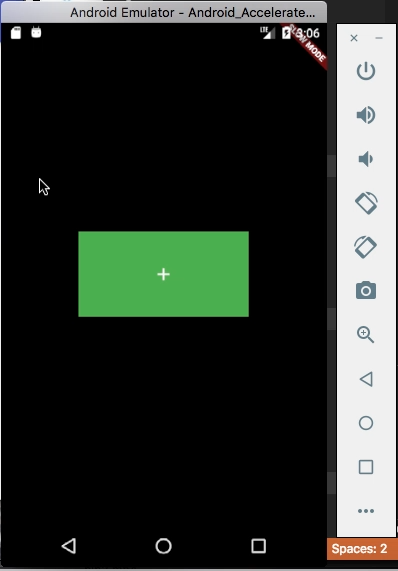

Flutter 的 Stateless widget 指的是無狀態的 widget。  

<!-- More -->

<br/>


使用時會建立一個繼承自 StatelessWidget 的子類別，然後複寫處理 build 方法，在該方法描述要怎樣建立該 widget。  

```dart
...
class MyWidget extends StatelessWidget {
  ...
  @override
  Widget build(BuildContext context) {
    ...
  }
}
...
```

<br/>


像是下面這邊筆者就試著建立了一個簡單的 widget，用 Container widget 與 Icon widget 搭配，簡單的做了類似於 Button 的效果，並允許由 widget 外部注入去決定要呈現的 icon。    

```dart
import 'package:flutter/material.dart';

void main() {
  runApp(
    new MaterialApp(
      home: new Center
      (
        child:  new MyWidget(icon: Icons.add)
      )
    )
  );
}

class MyWidget extends StatelessWidget {
  MyWidget({this.icon});
  final IconData icon;
  @override
  Widget build(BuildContext context) {
    return new Container(
      width: 200.0,
      height: 100.0,
      color: Colors.green,
      child: new Icon
    (
      icon, 
      color: Colors.white
    ));
  }
}
```



 
<br/>


 
<br/>
