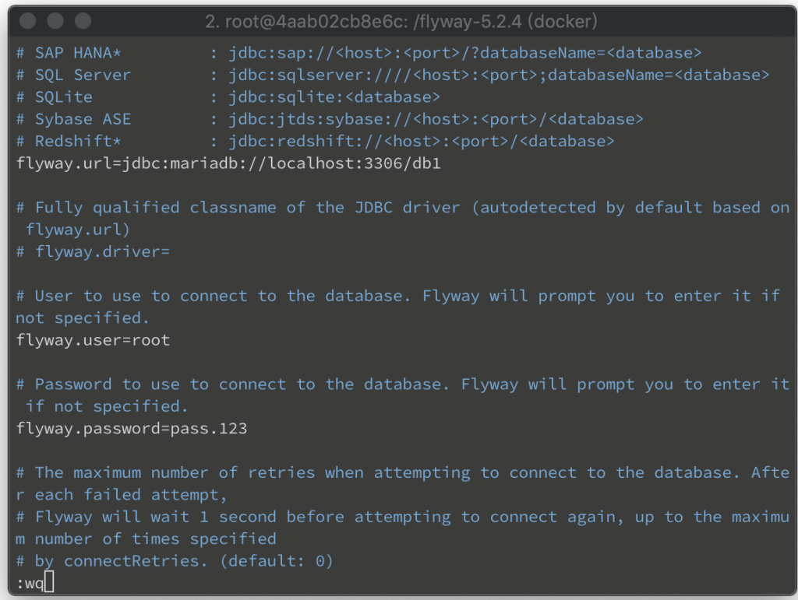

Flyway 要連結 MariaDB，可開啟 Flyway 設定檔。  

<!-- More -->

    vim conf/flyway.conf

 

設定 MariaDB 的位置與帳密。位置部分可遵循下列格式:  

    jdbc:mariadb://host:port/database

 

設定上會像下面這樣:  

    flyway.url=jdbc:mariadb://localhost:3306/db1
    flyway.user=root
    flyway.password=pass.123

