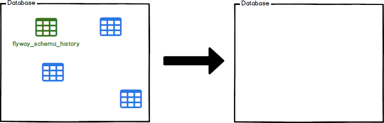

Flyway 的 Clean 功能能將資料庫內所有東西都清除，不論是 Table、View、還是 Procedure。  

<!-- More -->

 

通常用在測試 Migration 時。  

 

像是這邊有一個已經 Migration 過的資料庫。

 

Clean 以後...

    flyway clean

 

資料庫內的資料都會被清掉。  

 

我們就可以調整 Migration，重新將 Migration migrate 到資料庫，反覆操作，藉此將 Migration 調到我們預期的效果。  
