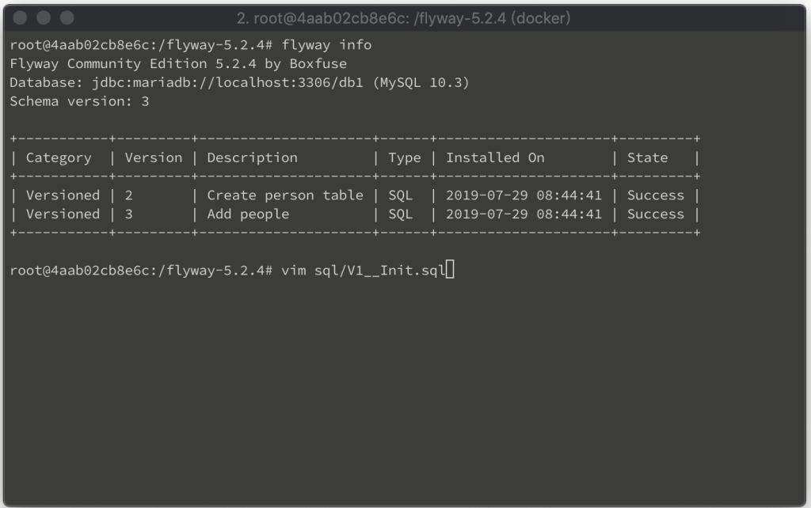
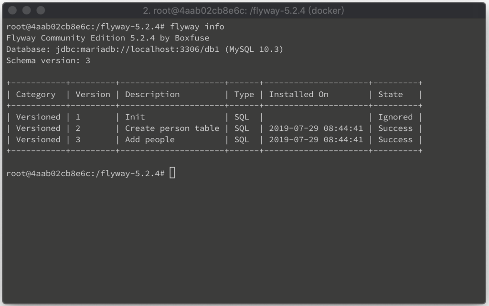
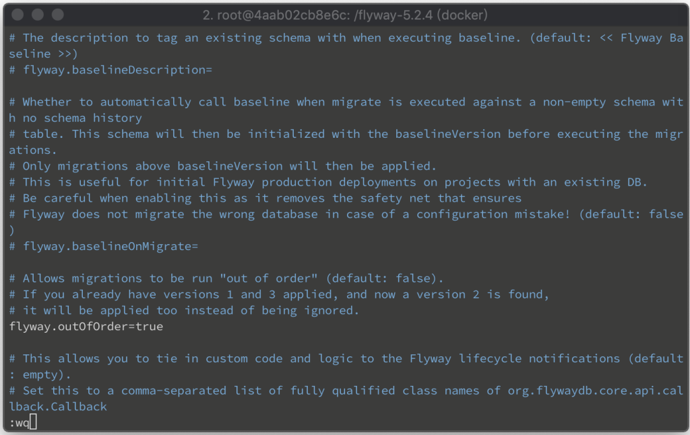
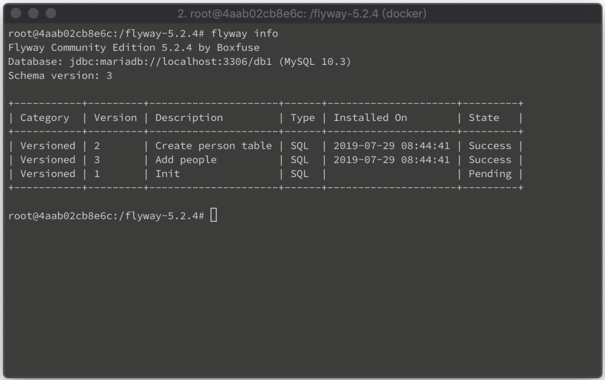
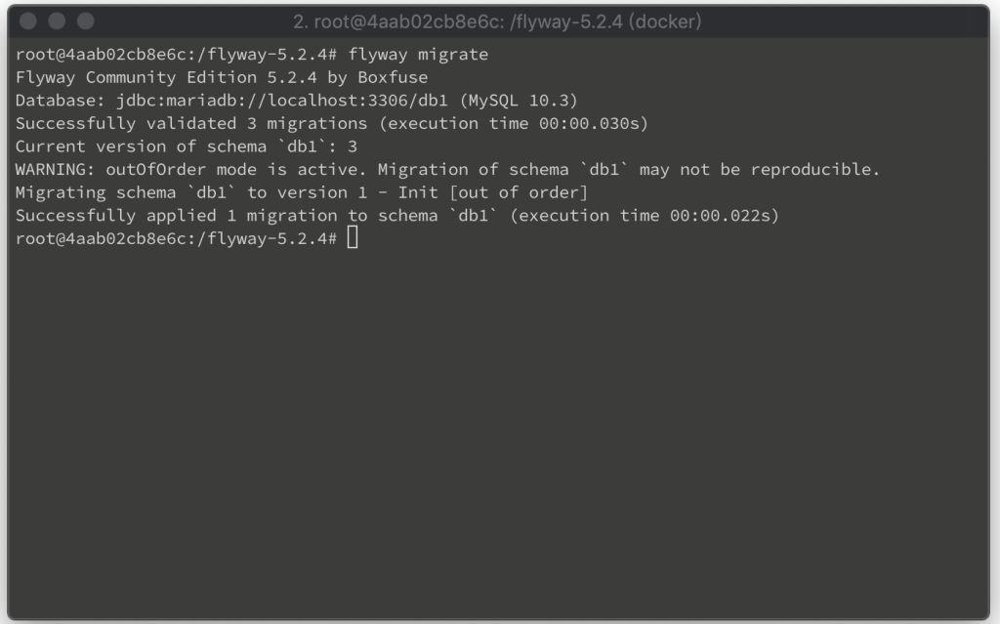
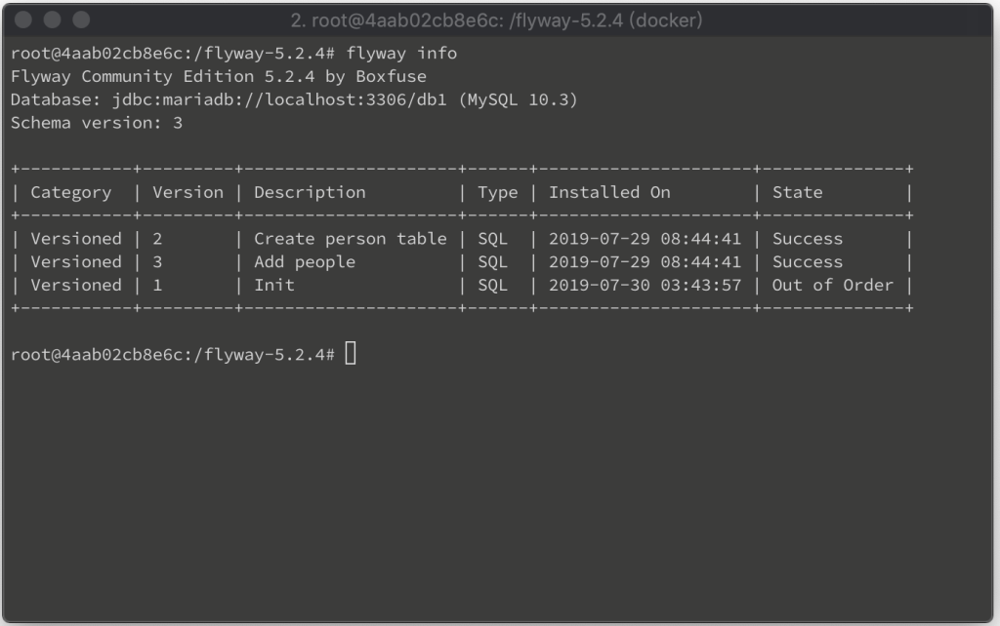

在使用 Flyway 時，預設 Migration 是會被限制只允許照順序套用的。  

<!-- More -->

 

像是筆者這邊套上 V2 與 V3 的 Migration 後再準備 V1 的 Migration。  

 

因為已經套到了 V3，所以較低版本的 V1 會無法套用，顯示為 Ignore 狀態。  

 

如過要讓低於當前版本的 Migration 可被套用，可開啟 Flyway 設定檔，將 flyway.outOfOrder 設計值設為 true。  

    flyway.outOfOrder=true

 

設定後就不會因為 Migration 版本低於當前版本而被 Ignore。  

 

也能被 Migrate 到資料庫。  

 

只是狀態會是 Out of Order，不會是 Success。  

