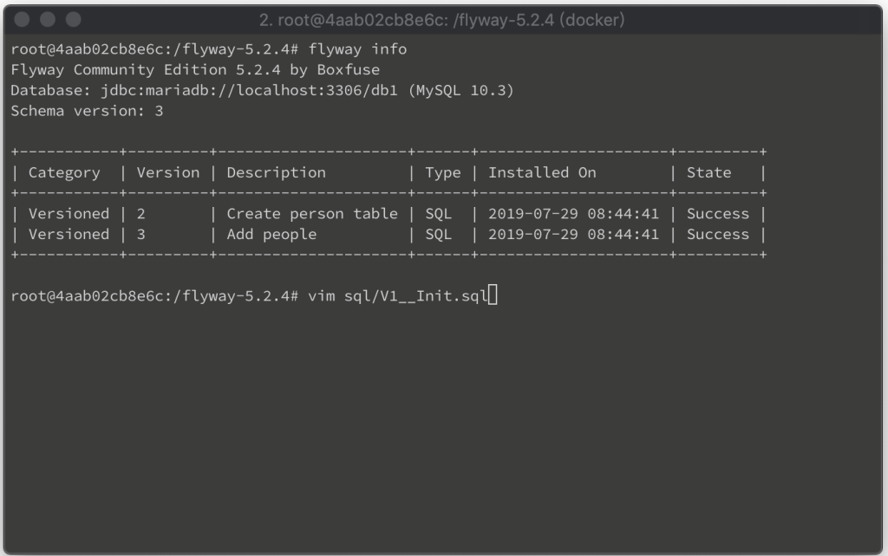
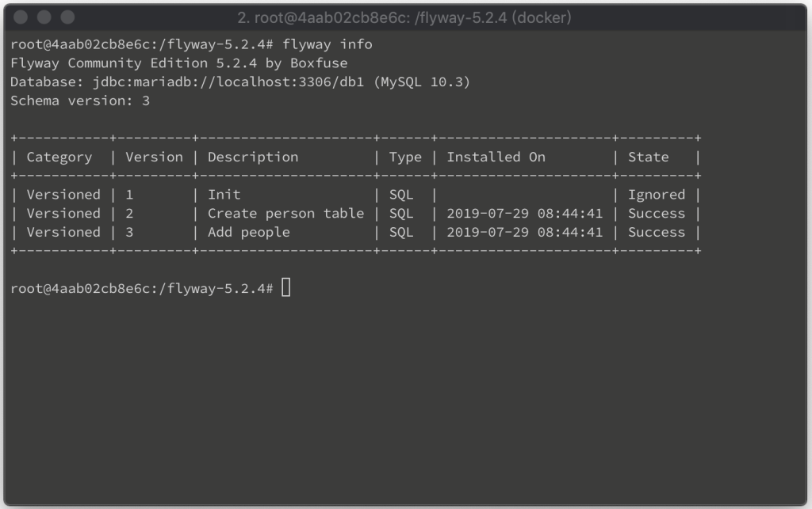
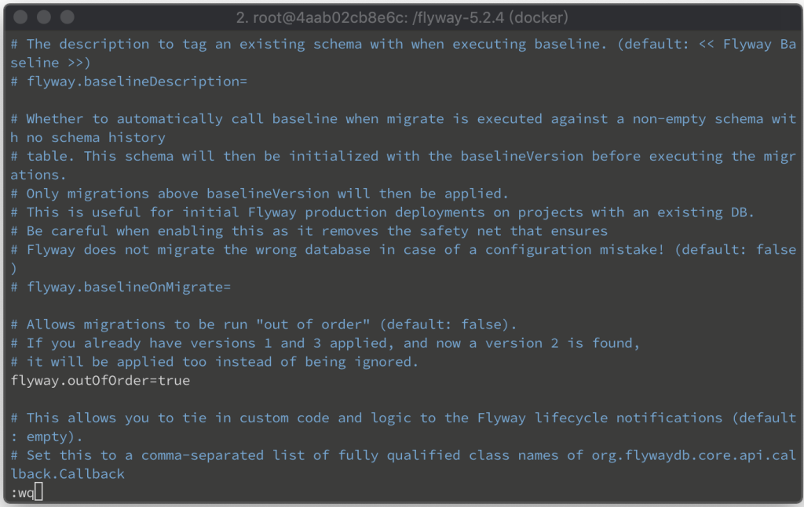
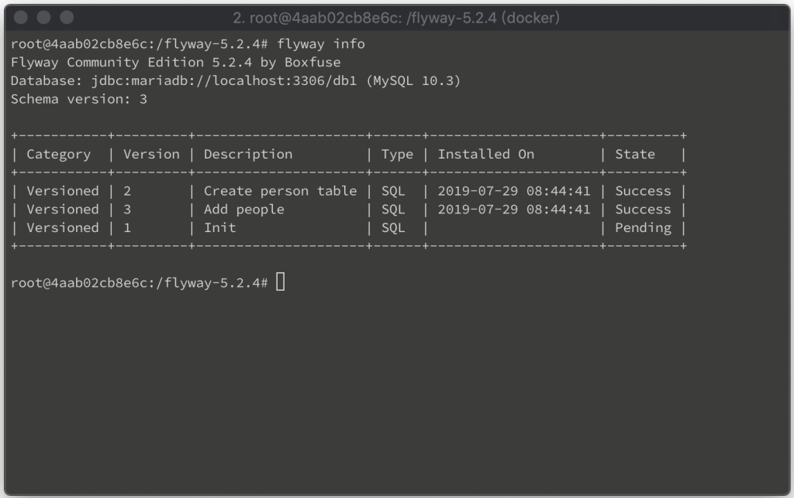
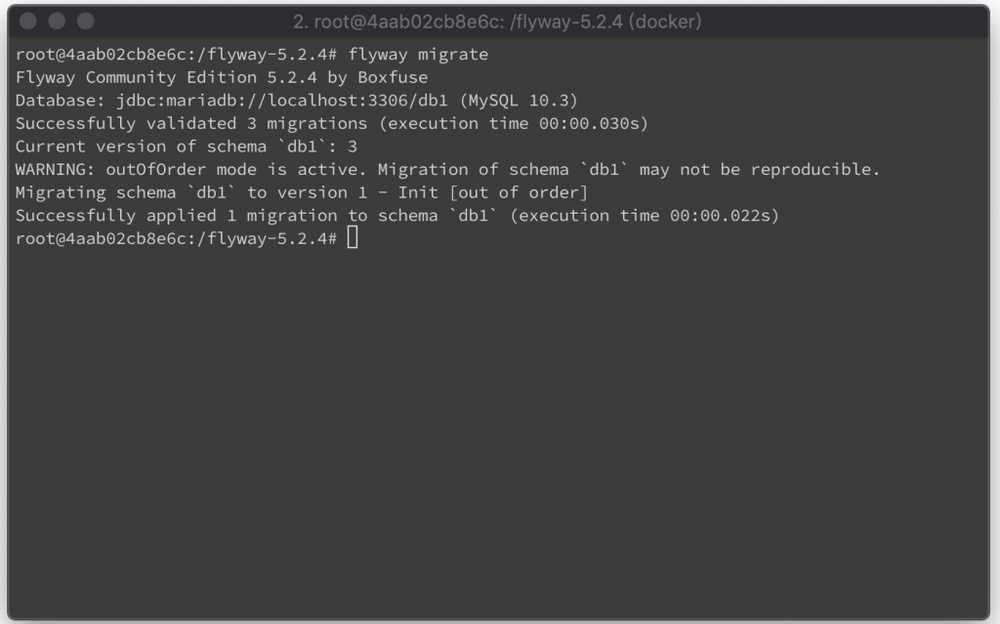
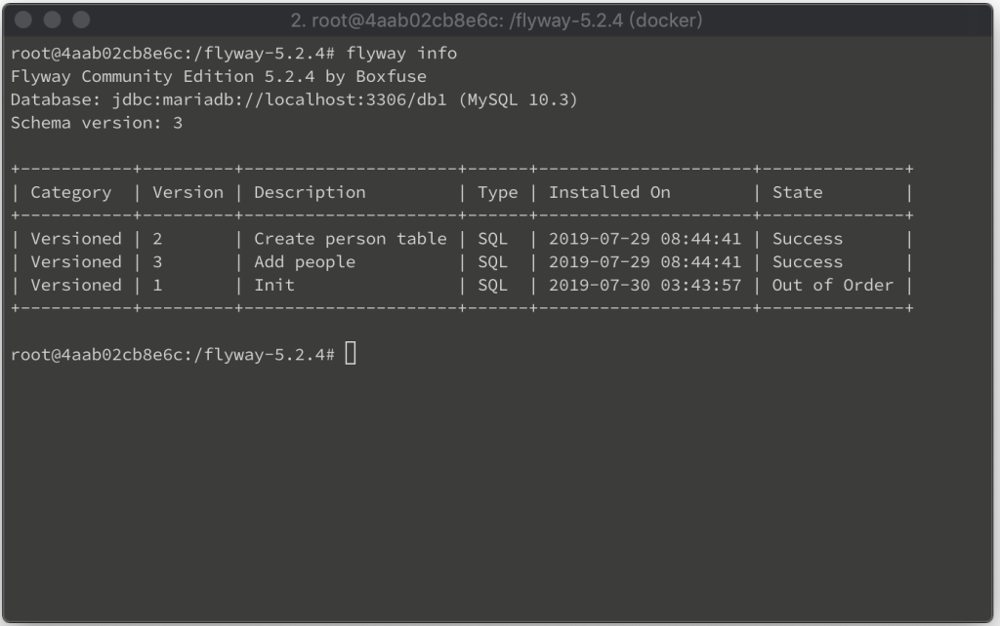

在使用 Flyway 時，預設 Migration 是會被限制只允許照順序套用的。

像是筆者這邊套上 V2 與 V3 的 Migration 後再準備 V1 的 Migration。

因為已經套到了 V3，所以較低版本的 V1 會無法套用，顯示為 Ignore 狀態。

如過要讓低於當前版本的 Migration 可被套用，可開啟 Flyway 設定檔，將 flyway.outOfOrder 設計值設為 true。

flyway.outOfOrder=true

設定後就不會因為 Migration 版本低於當前版本而被 Ignore。

也能被 Migrate 到資料庫。

只是狀態會是 Out of Order，不會是 Success。

