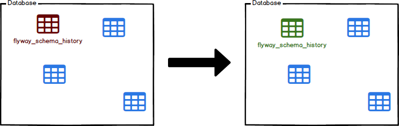
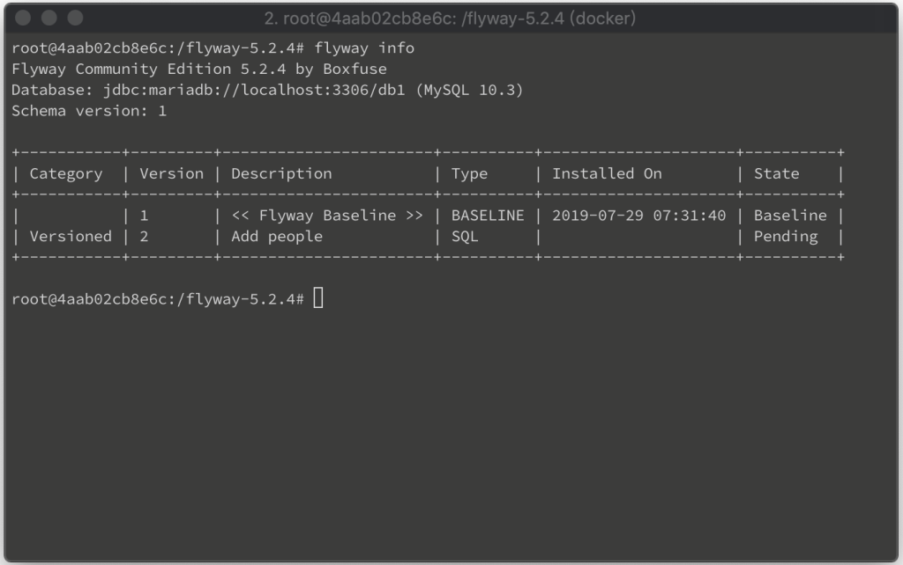
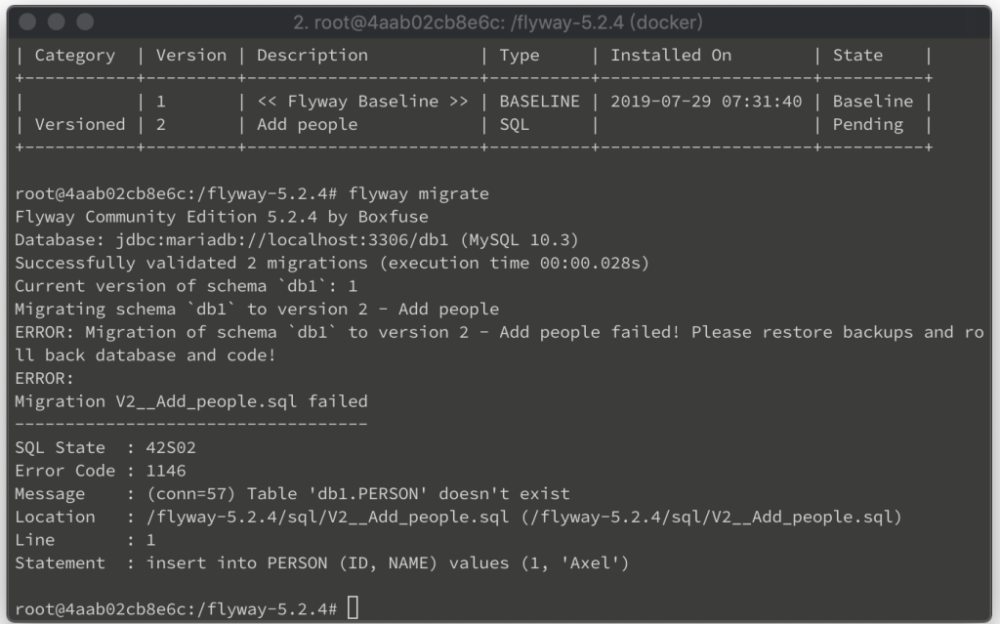
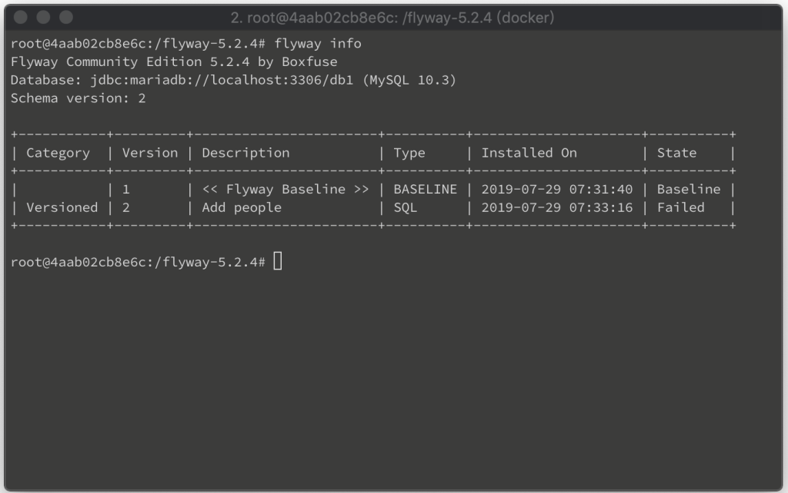
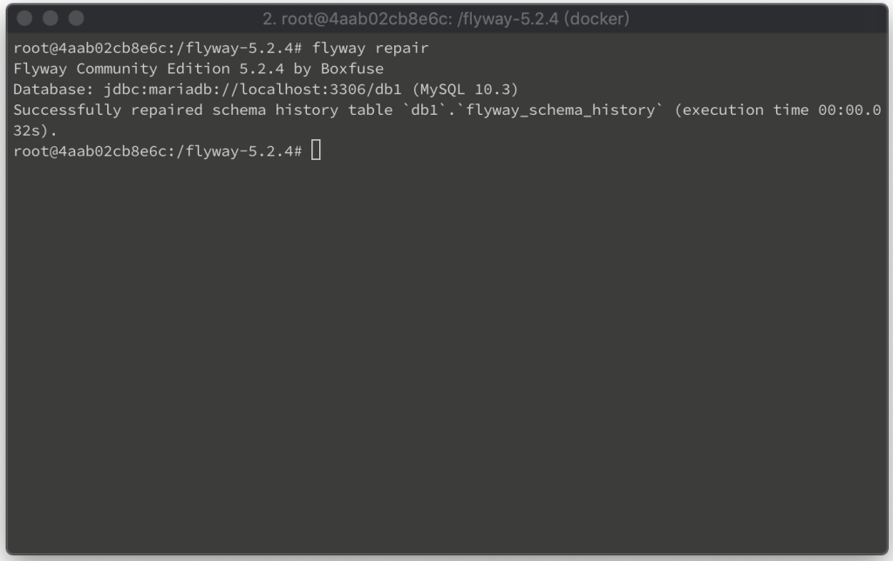
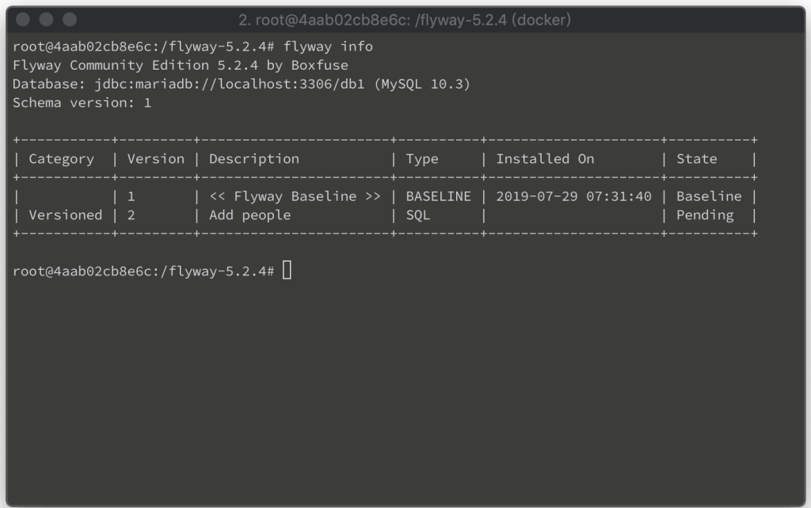

Flyway 的 Repair 功能可用來修復 Flyway 存放在資料庫內的資料。

像是 Migrate 發生錯誤，可用來清楚錯誤狀態。或是重新套用 Migration，去修復 Migration type/description/checkchecksum。

像是這邊筆者的資料庫狀態如下...

因為沒有造資料表所以塞資料的 Migration migrate 時會出錯。

這時資料庫內的 Migration 的狀態會是 Failed。

這時使用 Repair 功能...

flyway repair

資料庫內的 Migration 會回到 Pending 狀態。

