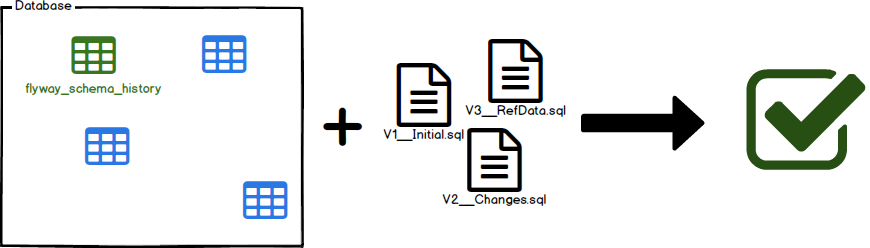
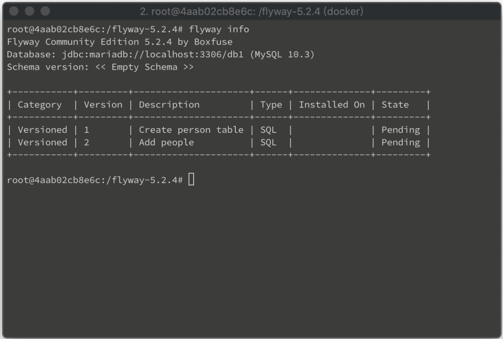
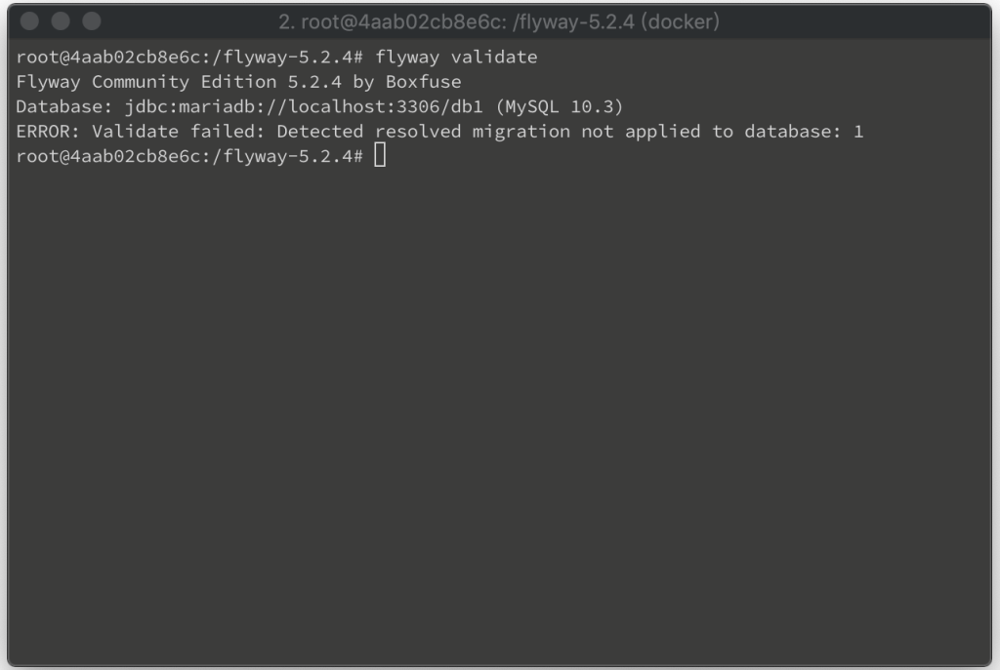
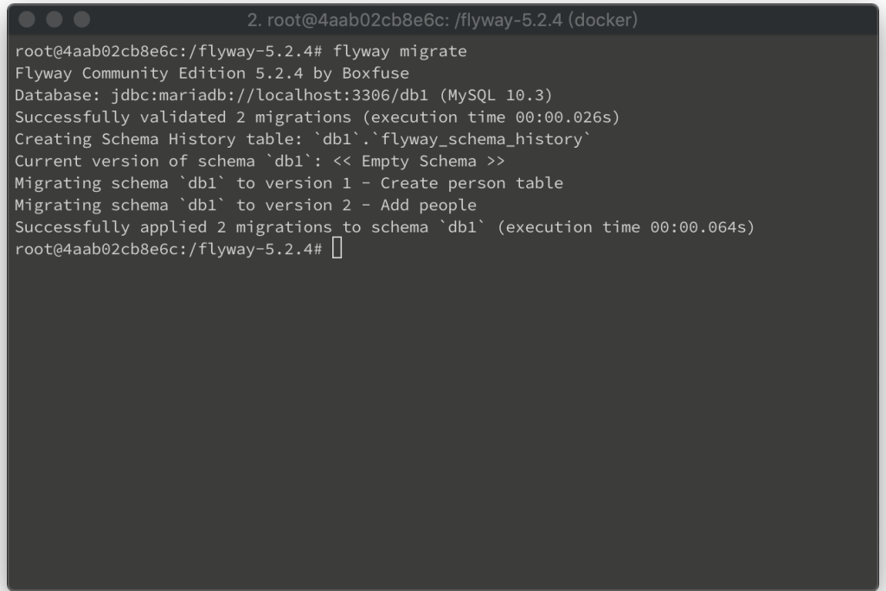
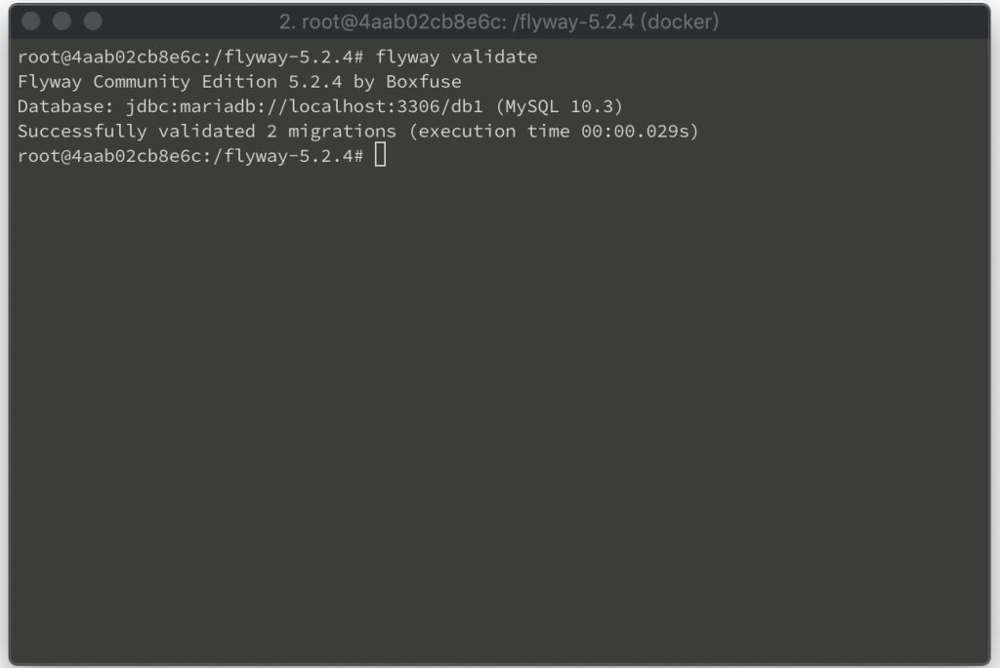

Flyway 的 Validate 可依據資料庫的 Migrate 資料與本地的 Migration 資訊做些驗證。  

<!-- More -->

 

如果資料庫的 Migrate 資料與本地的 Migration 比對，Migration 的名字、類型、Checksum 不同，驗證錯誤。  

 

如果資料庫的 Migrate 資料在本地已找不到對應的 Migration，驗證錯誤。  

 

如果本地的 Migration 還未 Migrate 到資料庫，驗證錯誤。  

 

像是這邊筆者這邊本地的 Migration 未 Migrate 到資料庫。  

 

驗證會錯誤。  

    flyway validate

 

將 Migration migrate 到資料庫。

    flyway migrate

 

驗證就會通過了。  

    flyway validate

