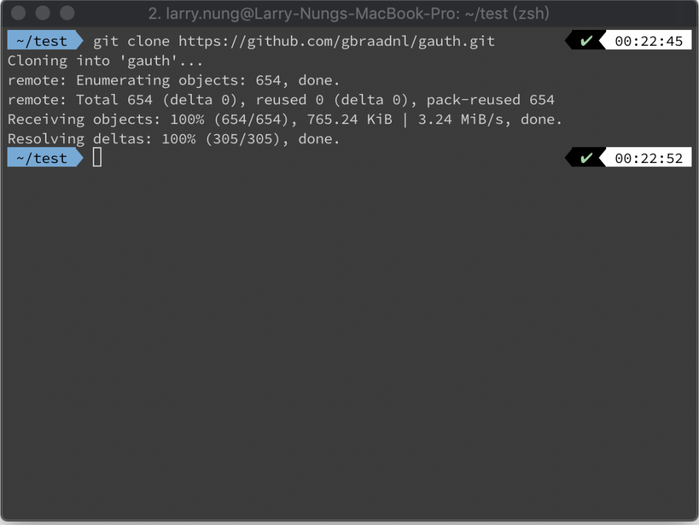
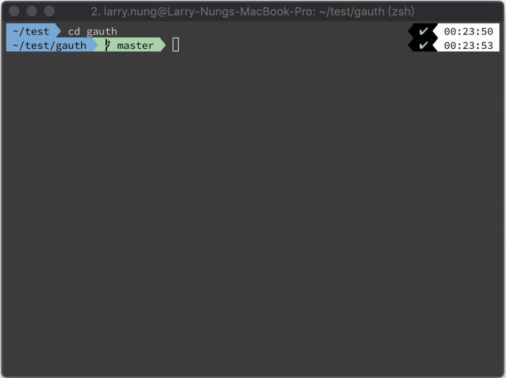
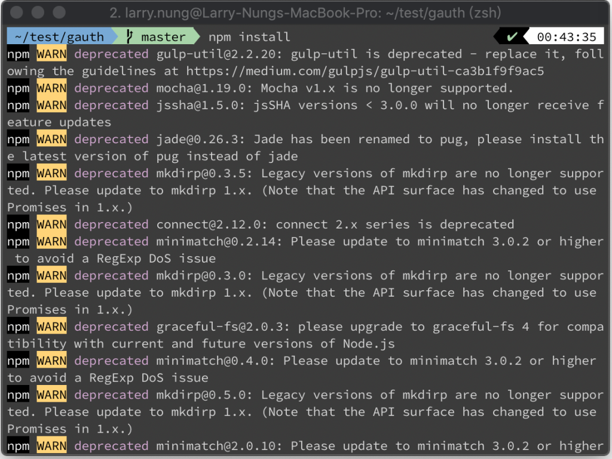
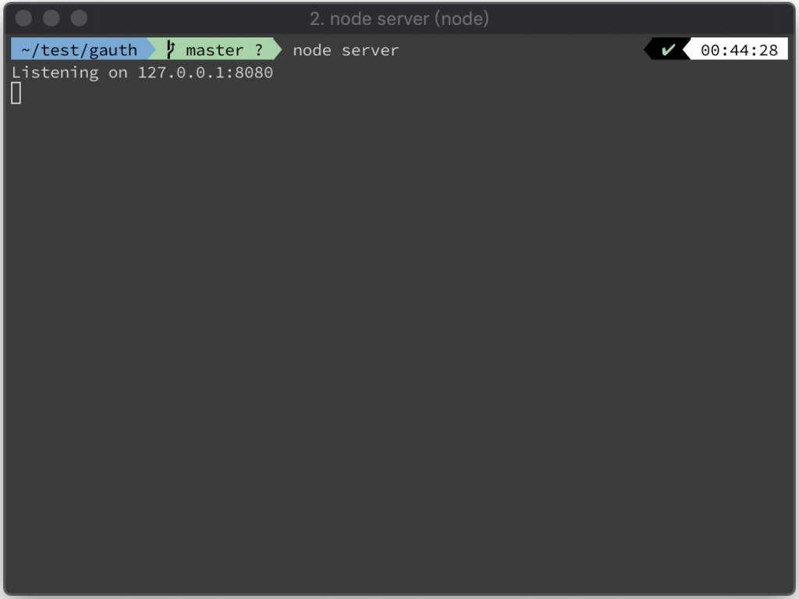
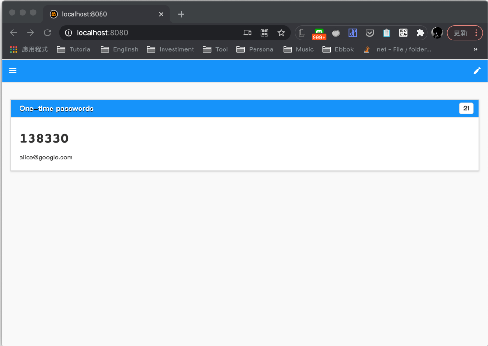

要起 gauth 服務供二階段認證使用，可將 gauth 程式碼下載下來。  

<!-- More -->

    git clone https://github.com/gbraadnl/gauth.git

 

切換到 gauth 程式碼目錄。  

    cd gauth

 

安裝 gauth 所需的 npm 套件。  

    npm install

 

然後透過 node 將 gauth 服務起起來。  

    node server

 

服務起來後用瀏覽器連至 8080 port，即可開始使用 gauth 來做二階段認證。  

    http://localhost:8080/

 

Link
====
* [GitHub - gbraad/gauth](https://github.com/gbraad/gauth/)
