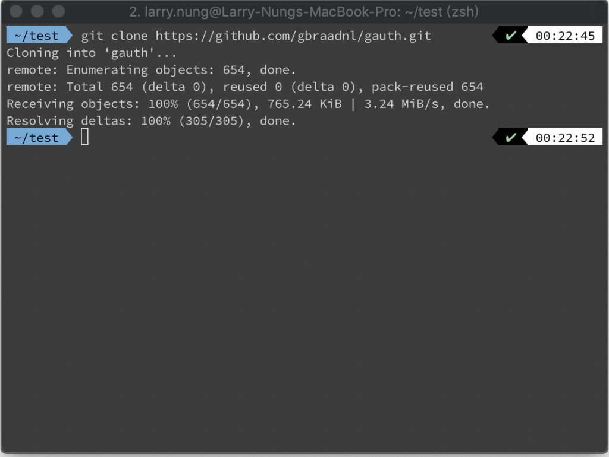
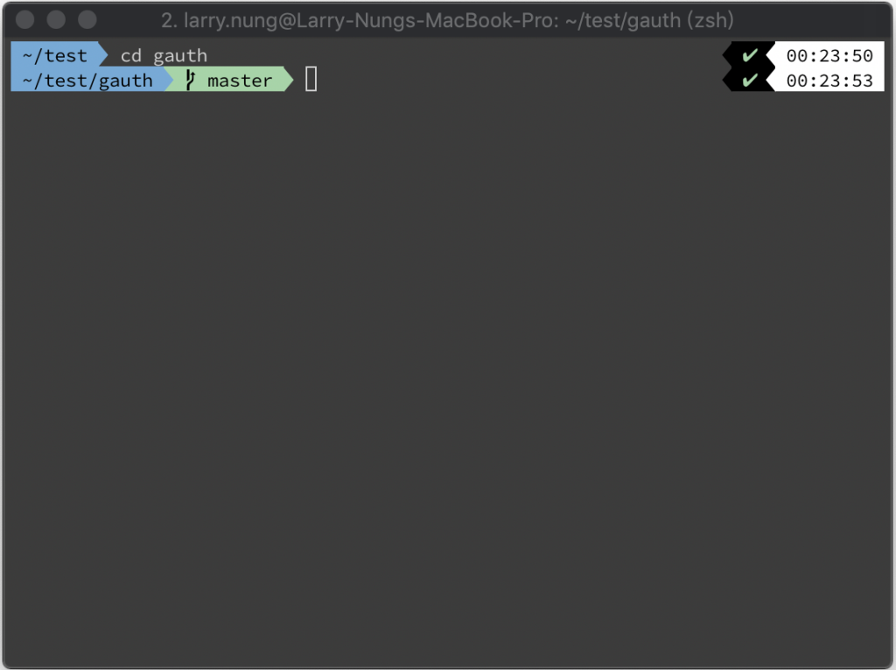
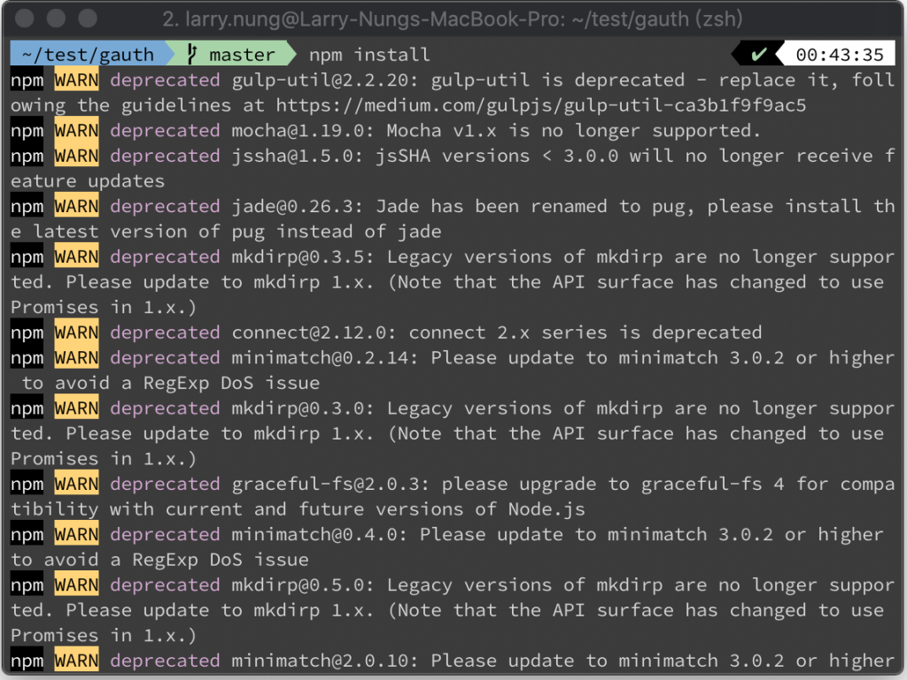
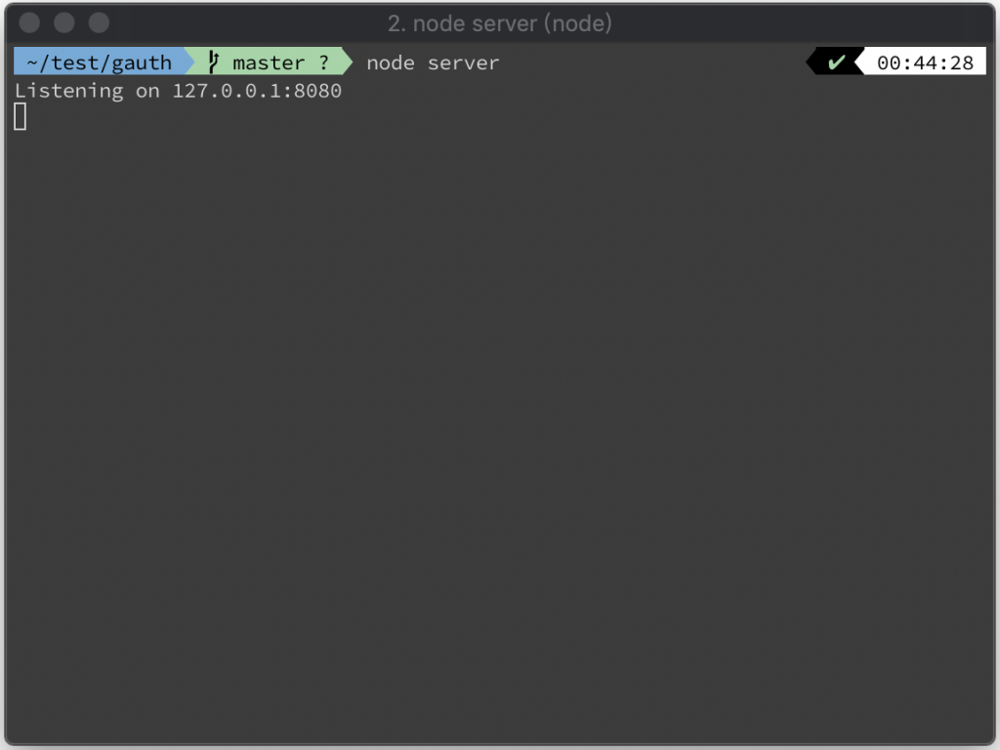
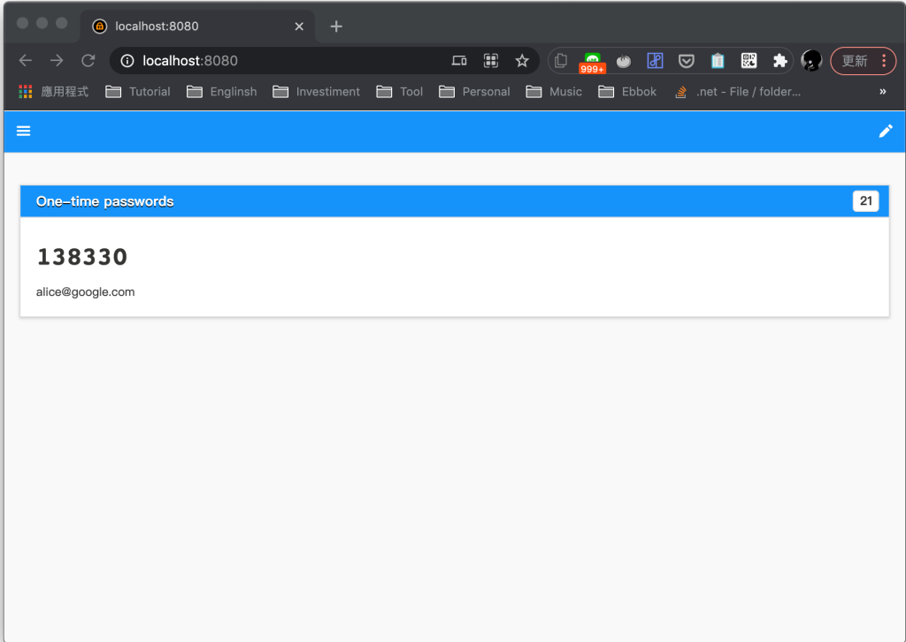

要起 gauth 服務供二階段認證使用，可將 gauth 程式碼下載下來。

git clone https://github.com/gbraadnl/gauth.git

切換到 gauth 程式碼目錄。

cd gauth

安裝 gauth 所需的 npm 套件。

npm install

然後透過 node 將 gauth 服務起起來。

node server

服務起來後用瀏覽器連至 8080 port，即可開始使用 gauth 來做二階段認證。

http://localhost:8080/

Link
====
* [GitHub - gbraad/gauth](https://github.com/gbraad/gauth/)