dotnet dev-certs 提供 https 命令可供自產 HTTPS 開發憑證。  

<!-- More -->

    dotnet dev-certs --help

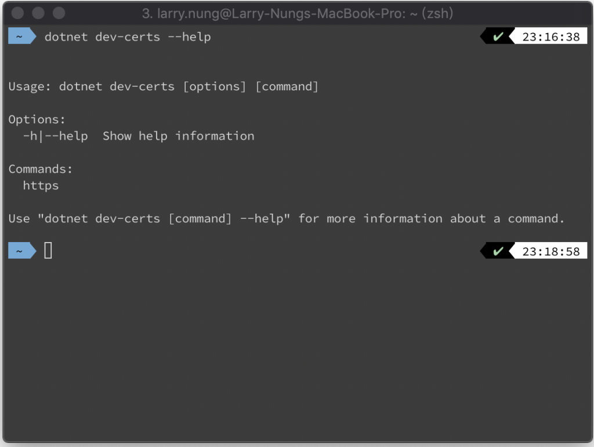

 

使用方式如下圖所示。  

    dotnet dev-certs https --help

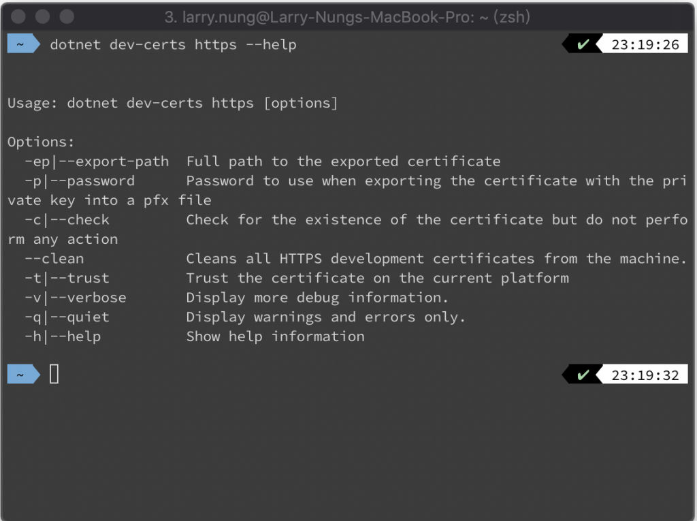

 

最簡單的就是不帶任何參數直接使用 dotnet dev-certs 的 https 命令去產生並安裝 HTTPS 開發憑證。  

    dotnet dev-certs https

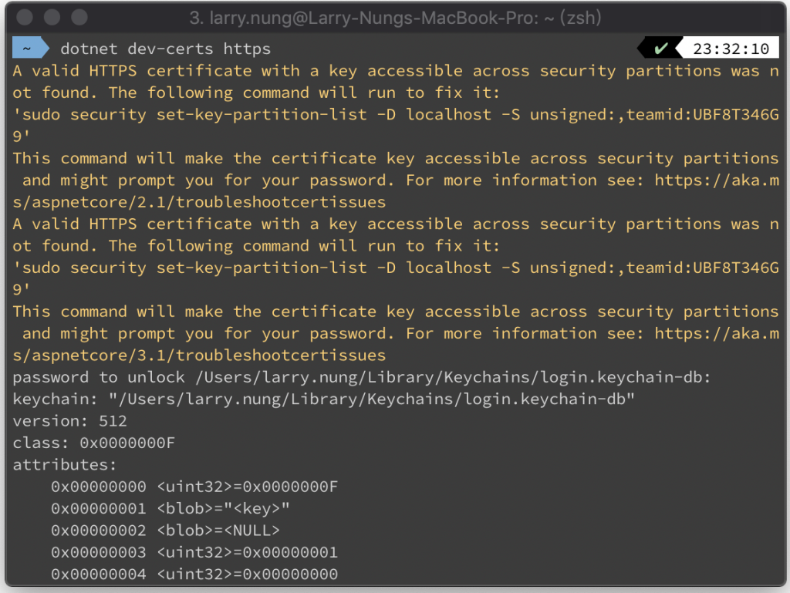

 

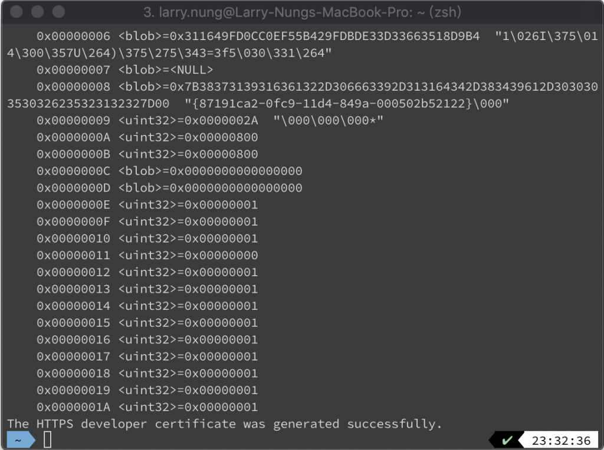

 

產生完可以用 dotnet dev-certs 的 https 命令加帶 --check 參數確認。  

    dotnet dev-certs https --check

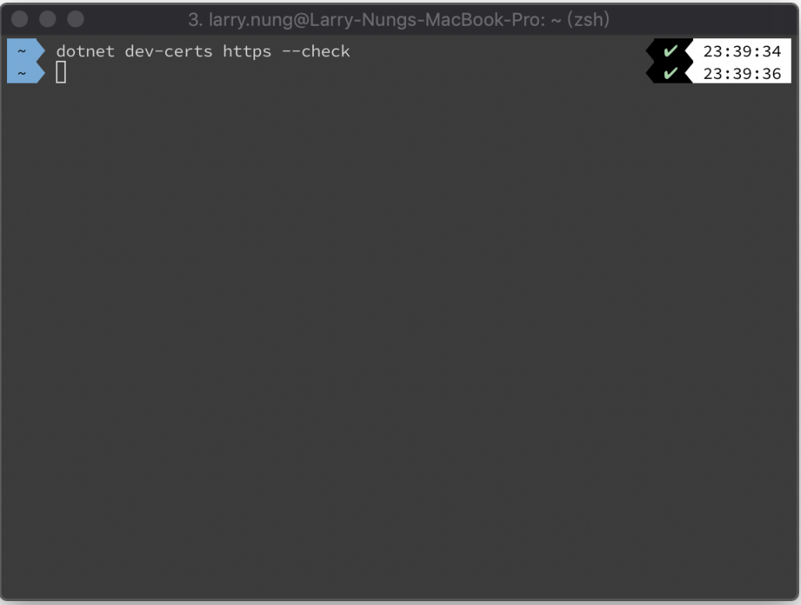

 

狀態碼為 0 即表示成功。  

    echo $?

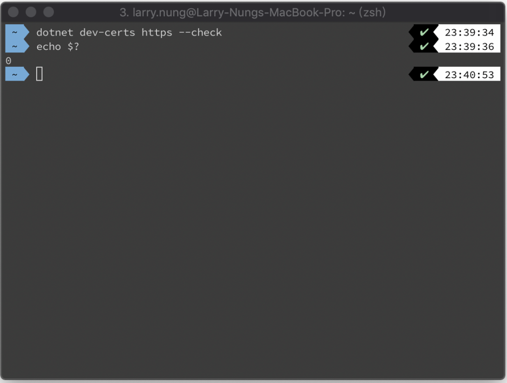

 

若要移除安裝的 HTTPS 開發憑證，可使用 dotnet dev-certs 的 https 命令並加帶 --clean 參數。  

    dotnet dev-certs https --clean

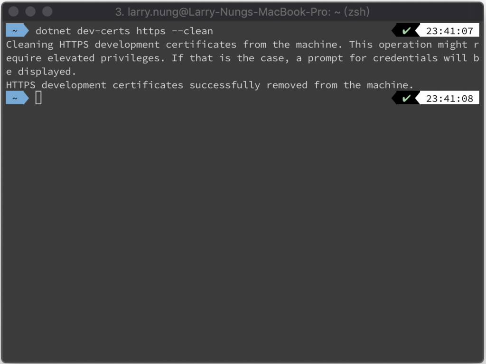

 

再次確認 HTTPS 開發憑證的安裝狀態。  

    dotnet dev-certs https --check

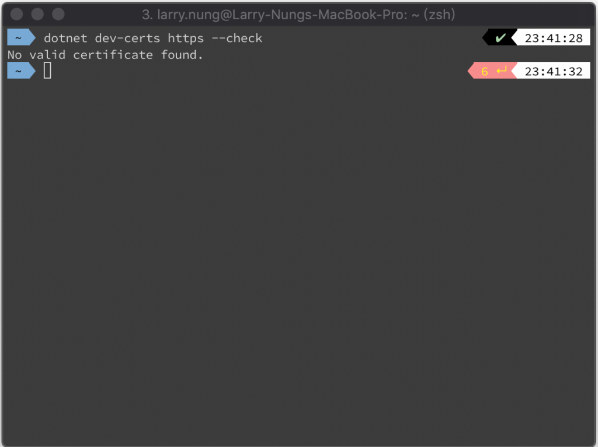

 

這時就會拿到狀態碼 6，表示並未安裝 HTTPS 開發憑證。  

    echo $?

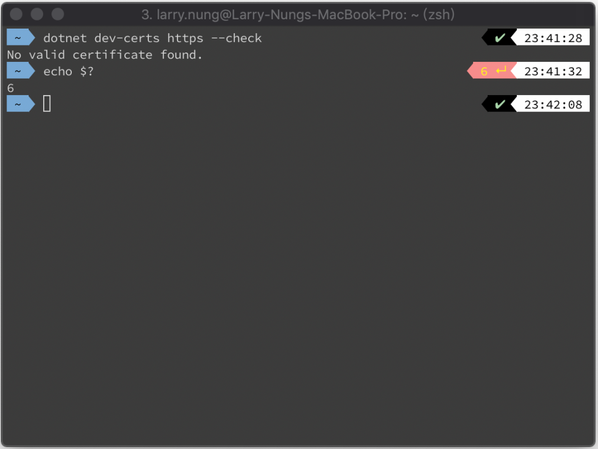

 

如要匯出 HTTPS 開發憑證，可使用 dotnet dev-certs 的 https 命令，加帶 -ep 參數指定匯出的 HTTPS 開發憑證所要存放的檔案位置，加帶 -p 參數指定匯出的 HTTPS 開發憑證私鑰密碼。  

    dotnet dev-certs https -ep $file -p $password

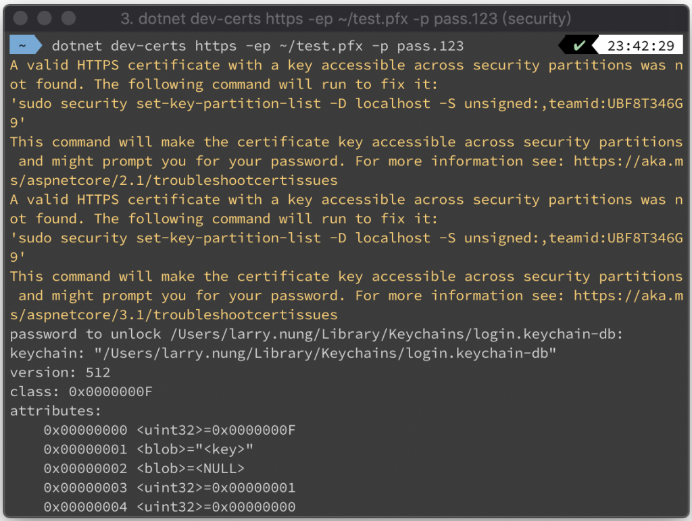

 

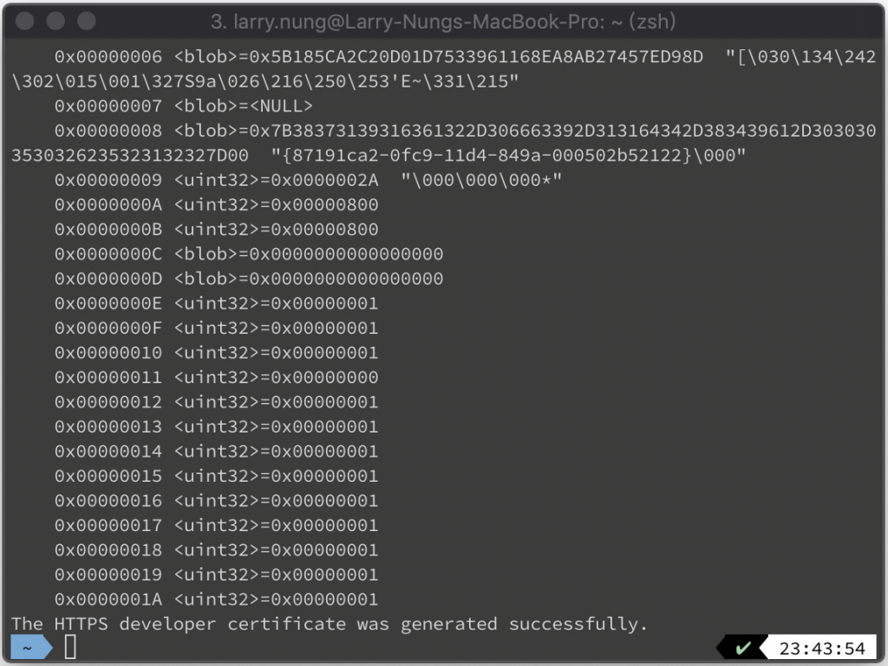

 

匯出後 HTTPS 開發憑證會被放置在指定的位置。  

    ls $file

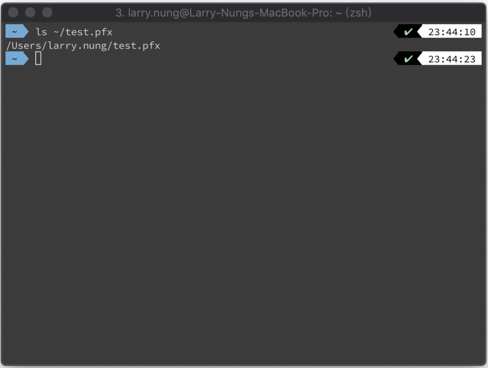

 

Link
====
* [如何使用 .NET Core 2.1 內建的 dev-certs 命令管理開發環境的自簽憑證 | The Will Will Web](https://blog.miniasp.com/post/2018/08/04/Configuring-HTTPS-using-NET-Core-SDK-21)
* [Generate Self-Signed Certificates Overview - .NET | Microsoft Docs](https://docs.microsoft.com/en-us/dotnet/core/additional-tools/self-signed-certificates-guide)
