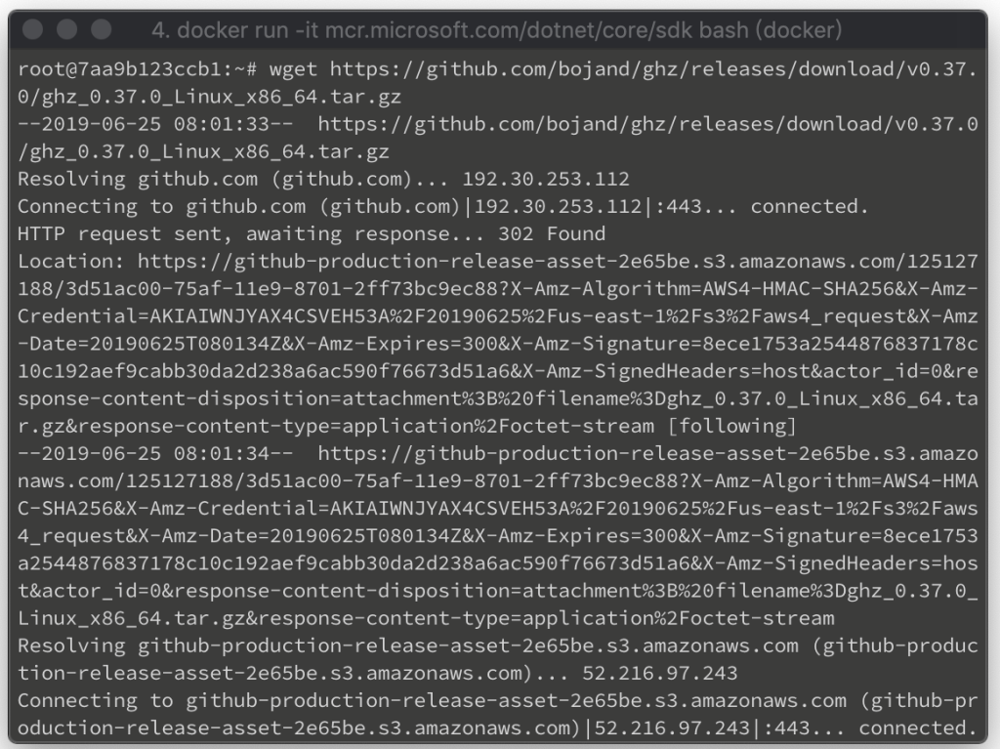
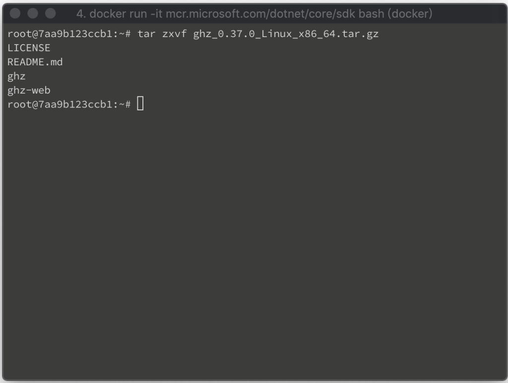
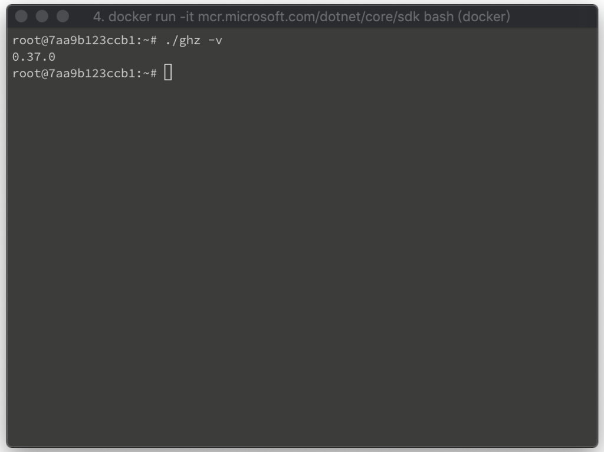

要在 Linux 安裝 ghz，可到 [Release page](https://github.com/bojand/ghz/releases) 找到要使用的版本，然後下載下來。  

<!-- More -->

    wget $url

 

下載後解壓縮。  

    tar zxvf $file

 

就可以開始使用了。  

    ghz -v

 

Link 
====
* [ghz - Simple gRPC benchmarking and load testing tool](https://ghz.sh/)
