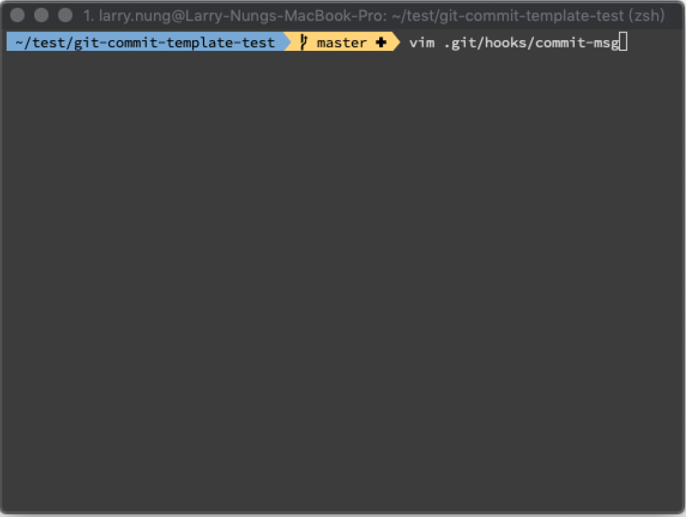
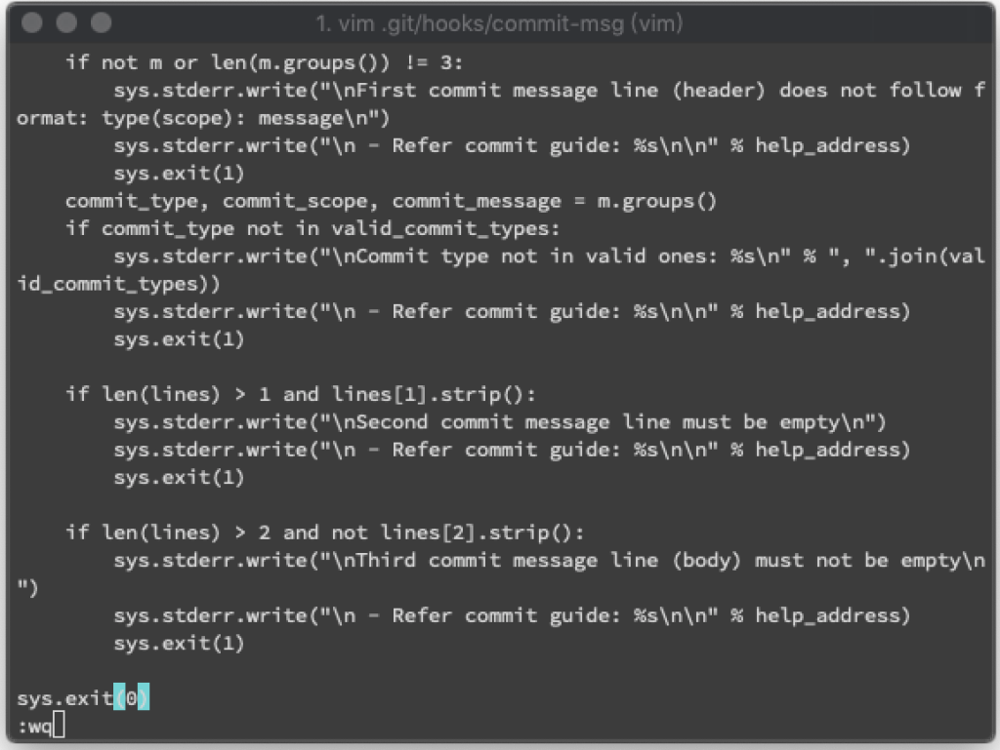
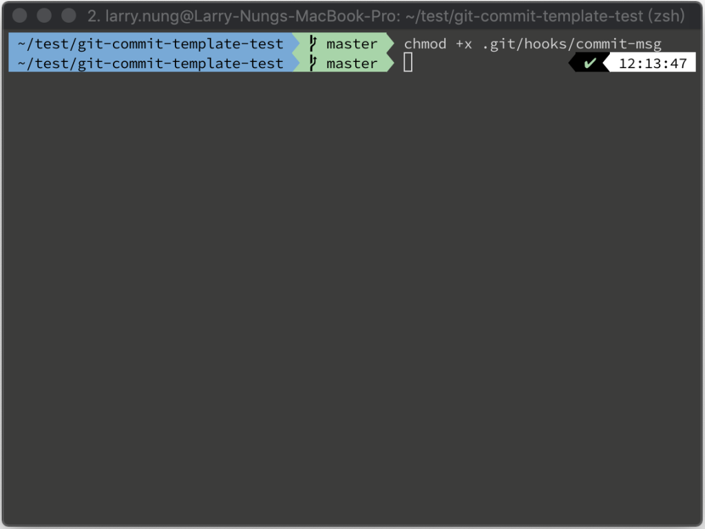
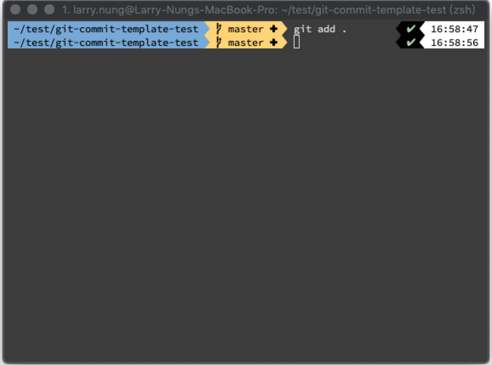
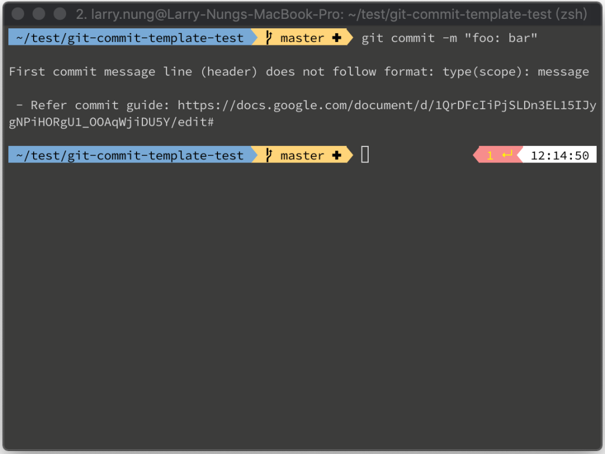
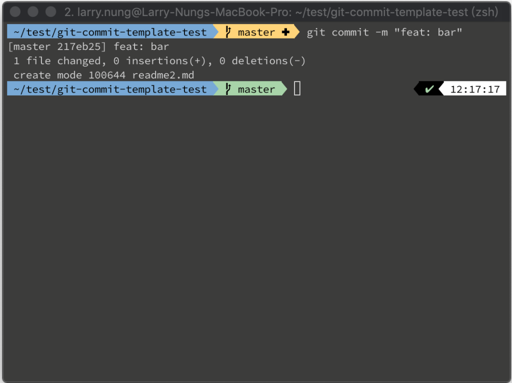

要在 git commit 時去驗證 commit message，可在 commit 的 hook 加掛驗證的處理。  

<!-- More -->

<br>


編輯 .git/hooks/commit-msg。

    vim .git/hooks/commit-msg



<br>


加入驗證程式後存檔離開。這邊筆者使用 [如何使用 git commit template 與 git hooks     管理團隊的 git log | AllenHsu的技術手扎](htt    ps://allen-hsu.github.io/2017/07/02/git-message-template-and-githook/) 提供的驗證程式做了些微的調整，用以檢查 commit message 符合 Angular commit style。

```python
#!/usr/bin/env python
"""
Git commit hook:
 .git/hooks/commit-msg
 Check commit message according to angularjs guidelines:
  * https://docs.google.com/document/d/1QrDFcIiPjSLDn3EL15IJygNPiHORgU1_OOAqWjiDU5Y/edit#
"""
import sys
import re
valid_commit_types = ['feat', 'fix', 'docs', 'style', 'refactor', 'test', 'chore', ]
commit_file = sys.argv[1]
help_address = 'https://docs.google.com/document/d/1QrDFcIiPjSLDn3EL15IJygNPiHORgU1_OOAqWjiDU5Y/edit#'
with open(commit_file) as commit:
    lines = commit.readlines()
    if len(lines) == 0:
        sys.stderr.write("
Empty commit message
")
        sys.stderr.write("
 - Refer commit guide: %s

" % help_address)
        sys.exit(1)
    # first line
    line = lines[0]
    m = re.search('^(.*): (.*)$', line)
    if not m or len(m.groups()) != 2:
        sys.stderr.write("
First commit message line (header) does not follow format: type: message
")
        sys.stderr.write("
 - Refer commit guide: %s

" % help_address)
        sys.exit(1)
    commit_type, commit_message = m.groups()
    if commit_type not in valid_commit_types:
        sys.stderr.write("
Commit type not in valid ones: %s
" % ", ".join(valid_commit_types))
        sys.stderr.write("
 - Refer commit guide: %s

" % help_address)
        sys.exit(1)
    if len(lines) > 1 and lines[1].strip():
        sys.stderr.write("
Second commit message line must be empty
")
        sys.stderr.write("
 - Refer commit guide: %s

" % help_address)
        sys.exit(1)
    if len(lines) > 2 and not lines[2].strip():
        sys.stderr.write("
Third commit message line (body) must not be empty
")
        sys.stderr.write("
 - Refer commit guide: %s

" % help_address)
        sys.exit(1)
sys.exit(0)
```



<br>


修改 commit-msg 的權限。

    chmod +x .git/hooks/commit-msg



<br>


然後將修改加入實際 commit 做個測試。

    git add .



<br>


可以看到 commit message 不符合規範的話會被擋下。  

    git commit -m "foo: bar"



<br>


只有符合規範的 commit message 可被 commit 進去。  

    git commit -m "feat: bar"



<br>


Link
=====
* [如何使用 git commit template 與 git hooks 管理團隊的 git log | AllenHsu的技術手扎](https://allen-hsu.github.io/2017/07/02/git-message-template-and-githook/)
