要在電子書閱讀軟體上閱讀 GitBook 上的電子書，可以透過 GitBook 提供 Open Publication Distribution System (OPDS) 服務。  

<!-- More -->

 

像是若使用的是靜讀天下，可切至線上書庫。  

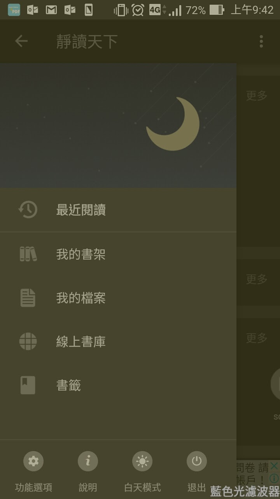

 

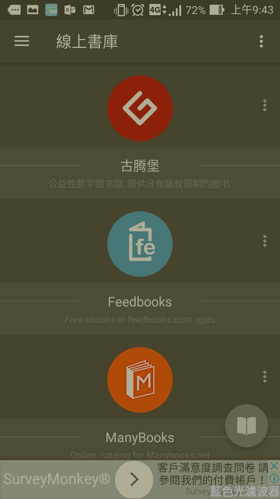

 

點選增加新書庫。  

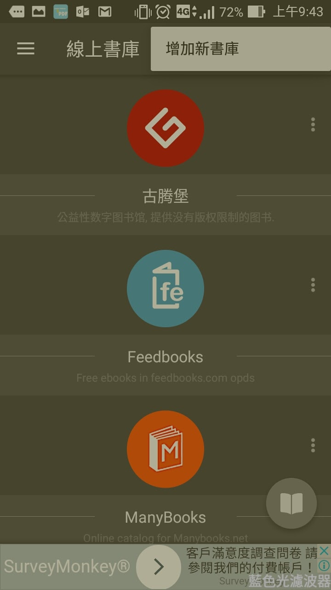

 

帶入 Open Publication Distribution System (OPDS) 位置 https://www.gitbook.com/api/opds/catalog.atom，按下確定按鈕新增書庫。  

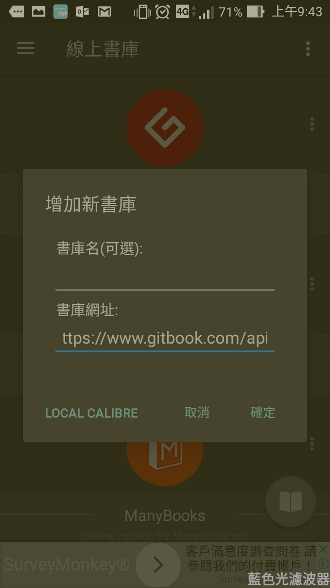

 

GitBook 即會被加入線上書庫。  

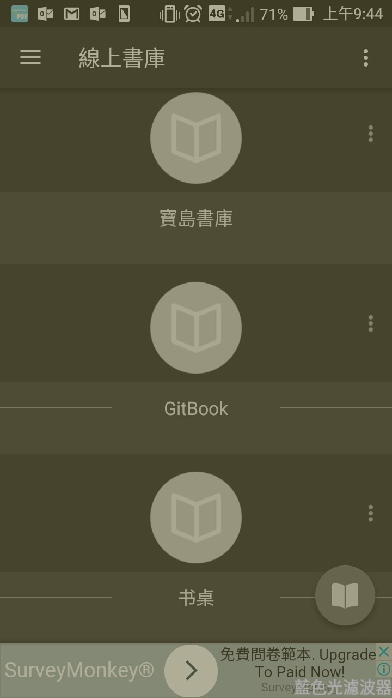

 

點選 GitBook 線上書庫瀏覽。  

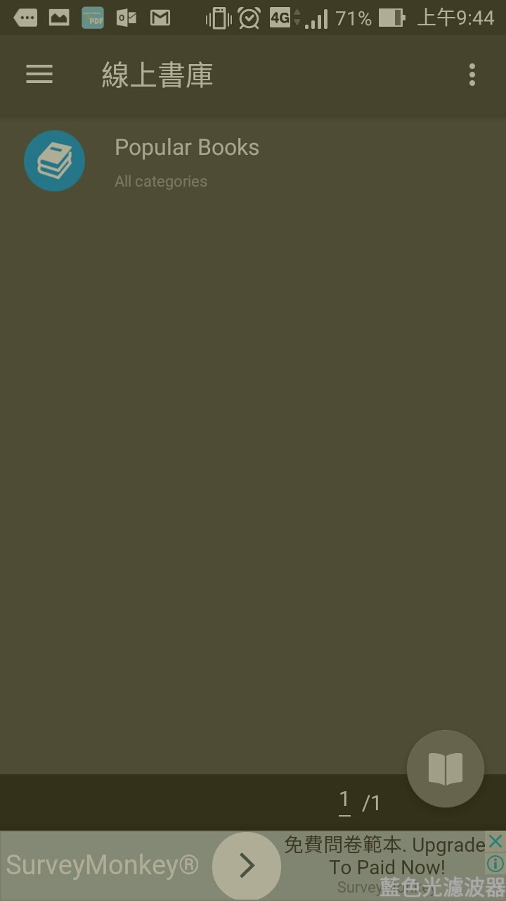

 

找尋想要下載閱讀的電子書。  

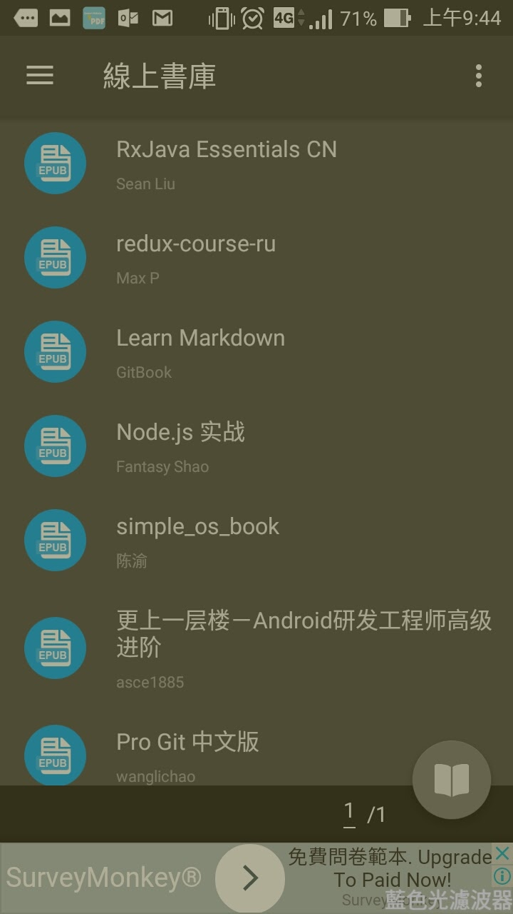

 

點進去後點選下載按鈕。  

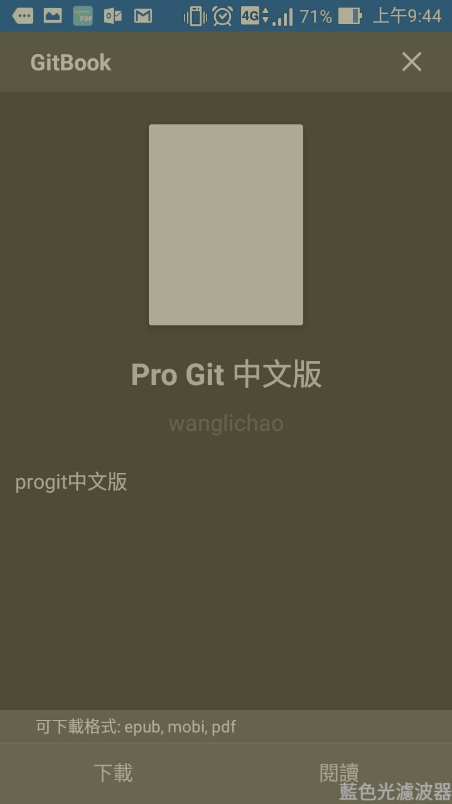

 

選取下載的電子書格式。  

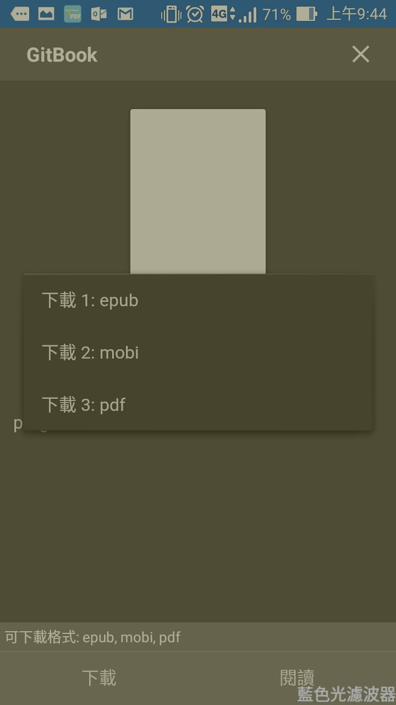

 

下載後如果有設定匯入，電子書會被自動匯入到我的書架。  

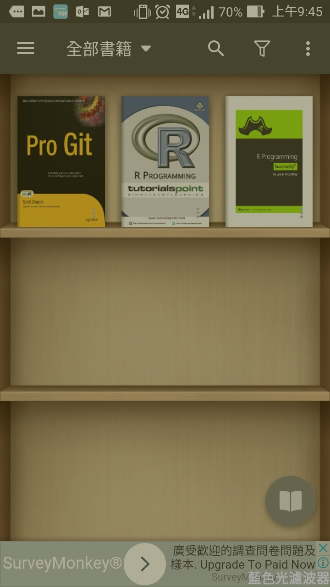

 

點選書架上的書即可直接瀏覽。  

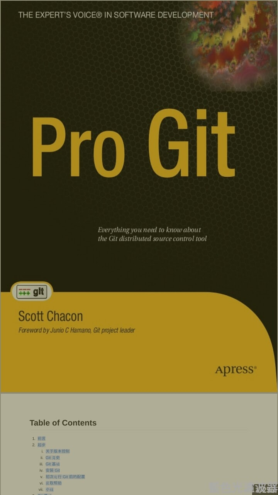

 

Link
----
* [Browse GitBook from your favorite reading application · GitBook](https://www.gitbook.com/blog/features/opds)
* [OPDS | gitbook-api-guide](https://wastemobile.gitbooks.io/gitbook-api-guide/content/opds/index.html)
