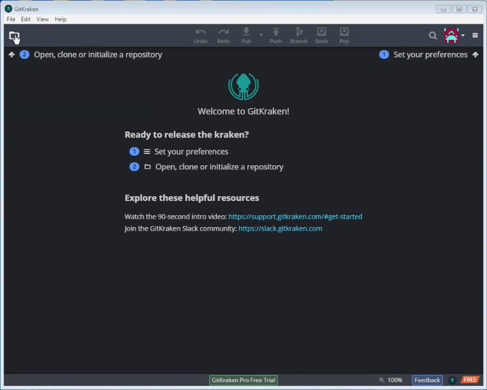
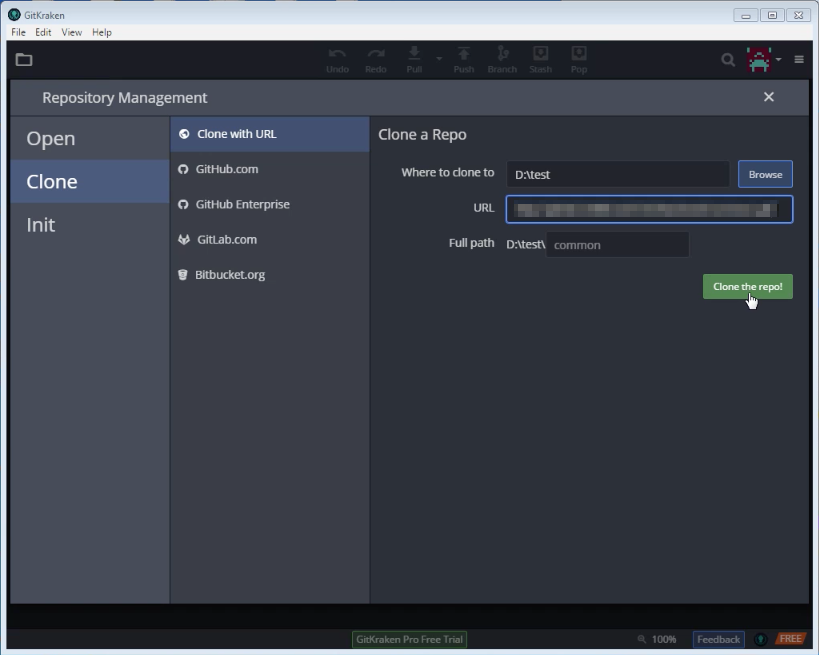
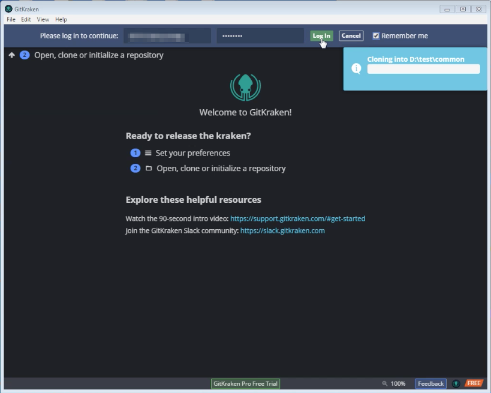
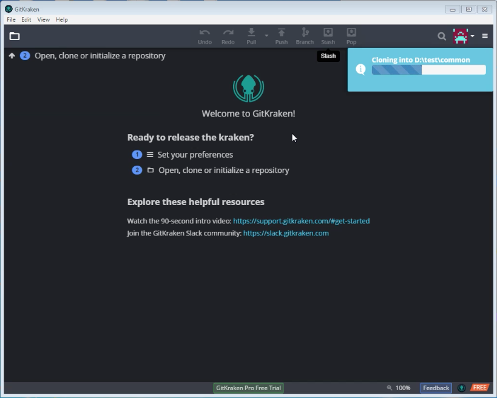
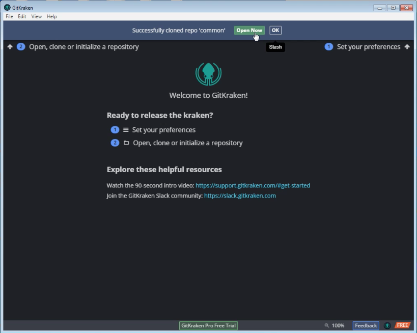
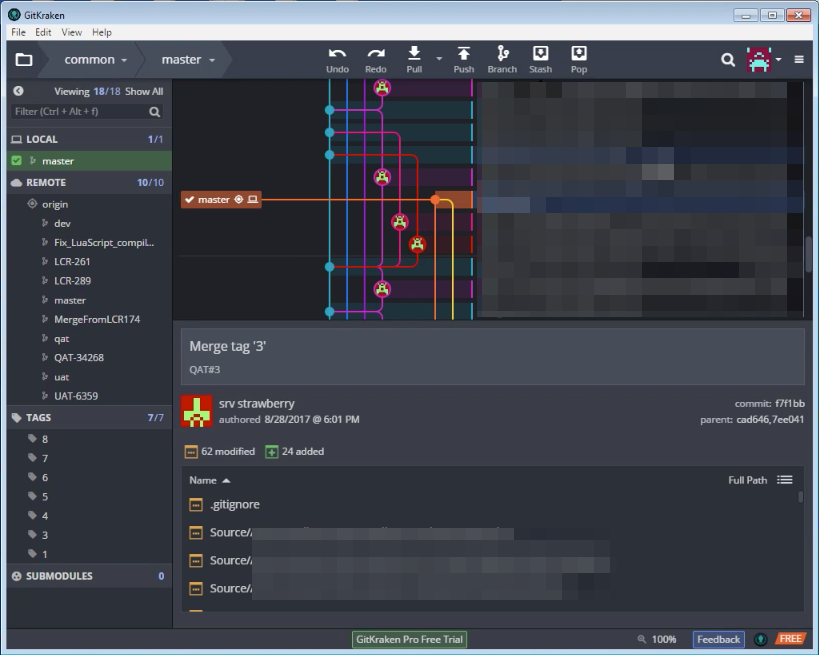

要使用 GitKraken 將 Repository clone 下來，可點選 GitKraken 左上方的資料夾圖示。  

<!-- More -->

 

切到 Clone 頁籤，選取 Clone with URL，帶入 Repository url 與要 Clone 到的位置，點選 Clone the repo! 按鈕。  

 

輸入 Repository 帳密後按下 Log In 按鈕。  

 

GitKraken 即會開始 Clone repository 到指定的位置。  

 

Clone 完可點選 Open Now 按鈕直接開啟。  

 

 
