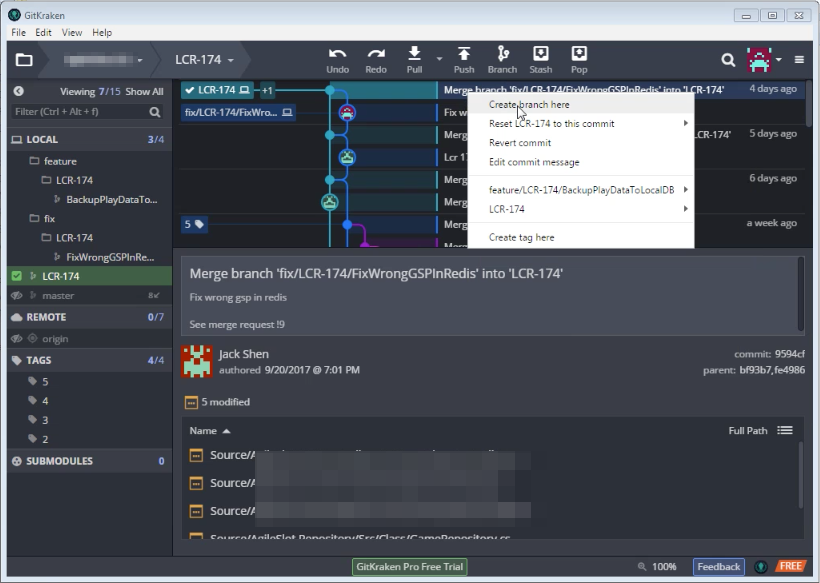
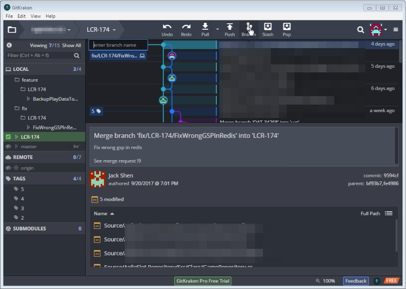
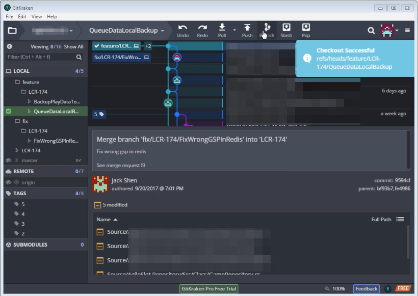

使用 GitKraken 建立分支，可在 Tag、Repository、commit 上按下滑鼠右鍵，點選 Create branch here 選單選項。 

<!-- More -->

 

或是按下上方工具列的 Branch 按鈕，按下後會要求輸入新分支的名稱。  

 

輸入心分支的名稱後按下 Enter。  

 

GitKraken 即會建立並切換至指定的分支。  

 
