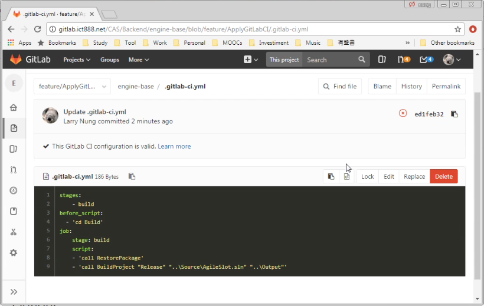
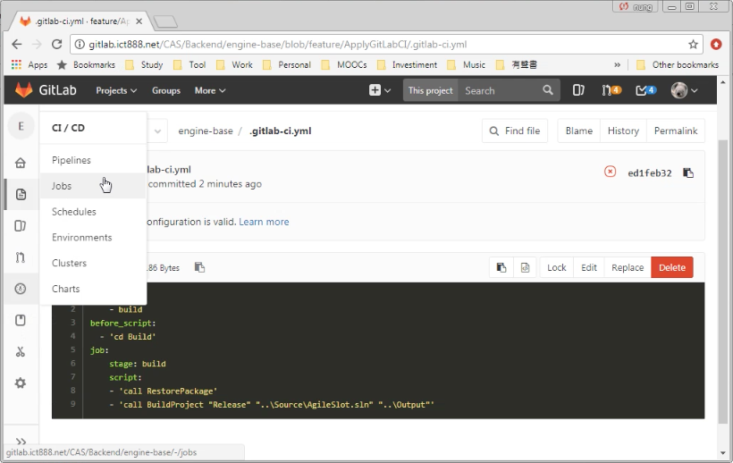
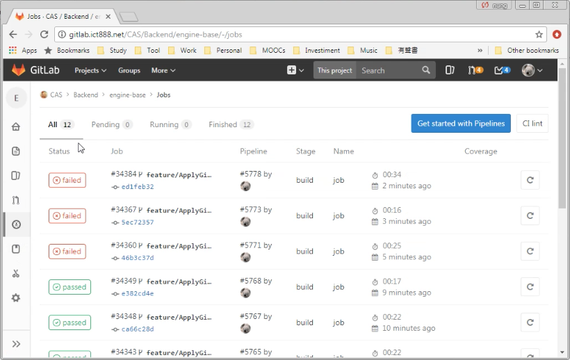
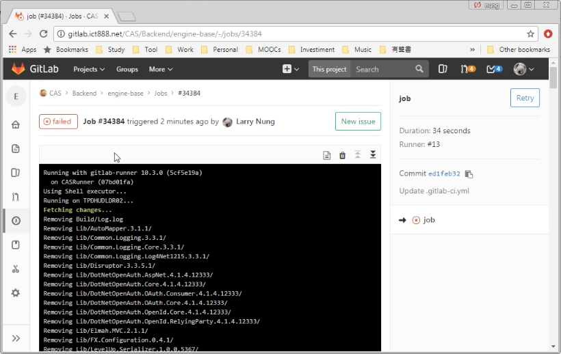

GitLab Runner 設定好後，可以開始使用 GitLab CI 來建置我們的專案。  

<!-- More -->

<br/>


只要在 Repository 中加入 GitLab CI 的設定檔 (.gitlab-ci.yml)，在設定檔中設定要如何建置專案即可。像是 .NET 程式的話，就是在這設定檔中指定使用 MSBuild 來建置專案。  

```yml
stages:
    - build
job:
    stage: build
    script: '"C:\Windows\Microsoft.NET\Framework644.0.30319\msbuild.exe" "Project.sln"'
```

<br/>


因為筆者已經有現成的批次檔，所以設定檔這邊只是很單純的調用批次檔。  


 
<br/>


設定檔設置並放置到 Repository 後，當程式碼 Commit 到 GitLab 時即會觸發建置的動作，建置後可切換至 [GitLab | CI/CD | Jobs]。    


 
<br/>


查閱運行的情況。  


 
<br/>


如果要運行的細部結果，可在 Job 的紀錄上點擊，做進一步的查閱。  


 
<br/>


Link
====
* [gitlab - Using GitLabCI with C# - Stack Overflow](https://stackoverflow.com/questions/33524766/using-gitlabci-with-c-sharp)
