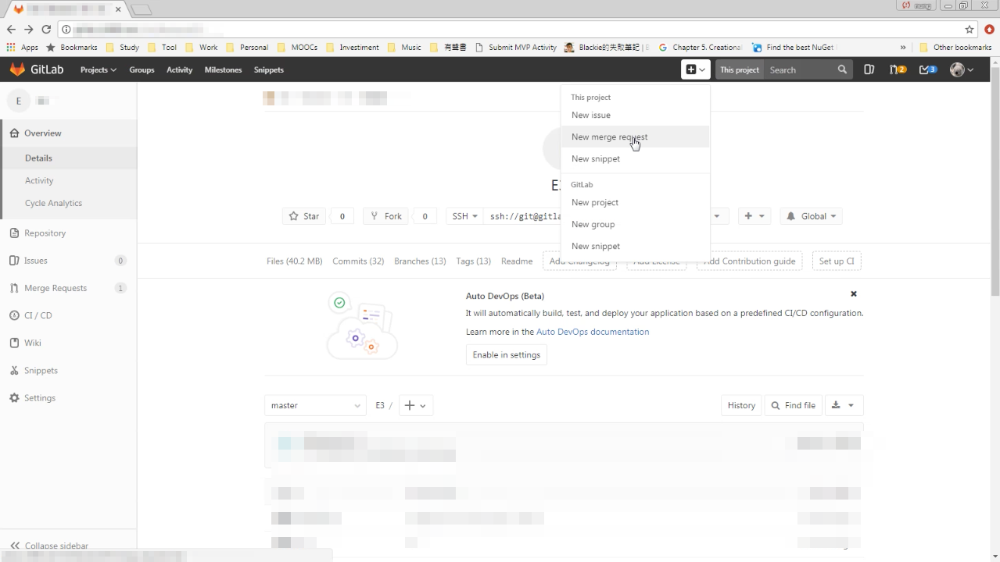
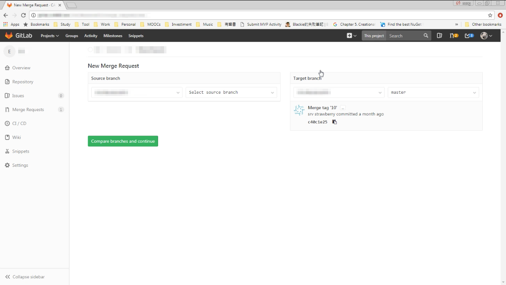
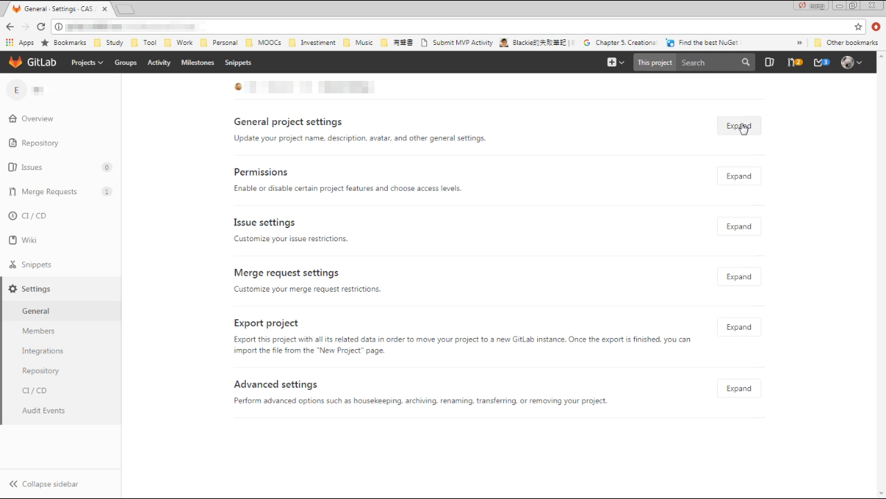
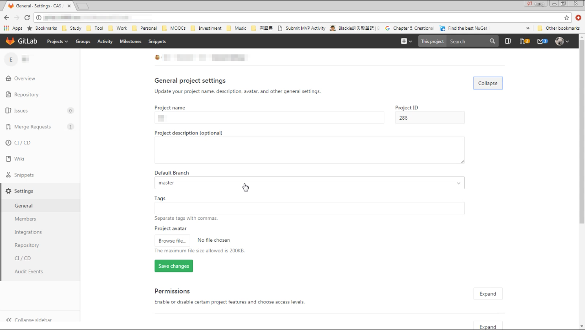
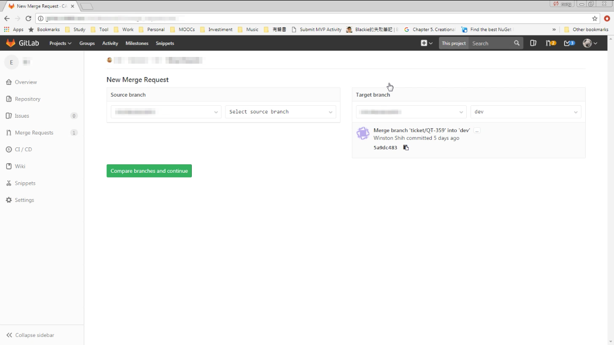

GitLab 在建立 Merge Request 時，Target branch 會幫我們自動帶入預設的 branch，也就是 master branch。  

<!-- More -->

 
 

 
 

在某些情境這樣的設定並不恰當，也可能會增加操作錯誤的風險。  

 

這時我們可以開啟專案的 General project settings。  

 
 

將 Default Branch 從預設的 master。  

 
 

切換至其它更為適當的 Branch。  

 
 

這樣設定完後新開的 Merge Request 所帶出的 Target branch 就會是我們指定的 Branch。  

 
 
