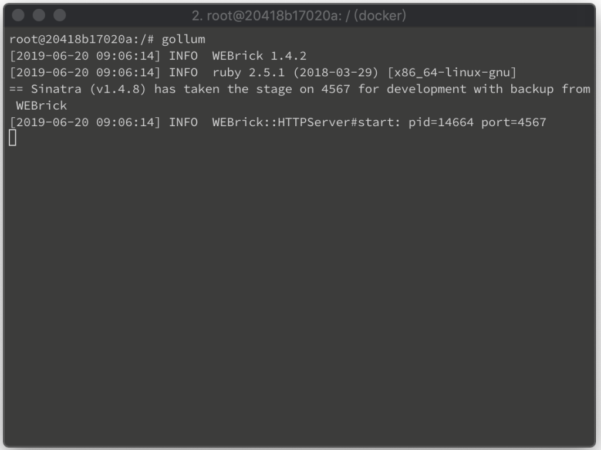
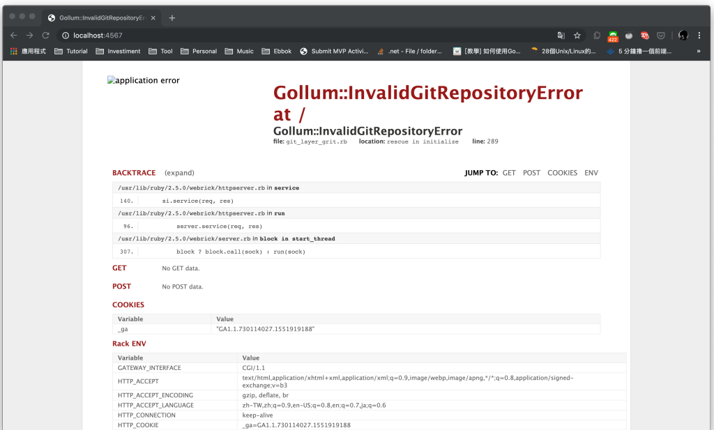
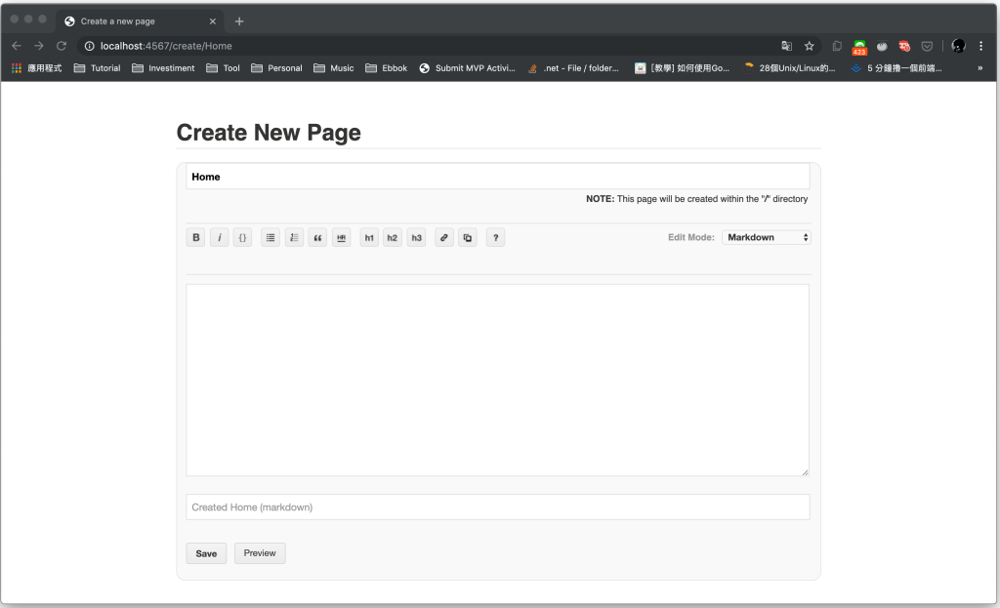

gollum 安裝好後，可到 wiki 的 git repository 目錄下，調用命令啟動 gollum 服務。  

<!-- More -->

    gollum

 

服務預設監聽 4567 埠，服務啟動後可透過瀏覽器訪問 http://localhost:4567。  

 

因為 gollum 服務依賴 git 去做版控，如果在非 git 目錄下啟動服務，透過瀏覽器訪問會看到如下的錯誤頁面。這時可查驗一下當前所在的目錄位置，如果位置無誤只是還未使用 git 控管，可初始 git 後再次嘗試。  

 

正常應該要看到像下面這樣的頁面，可以直接透過gollum 在本地管理 wiki。  

